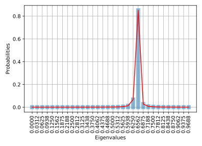
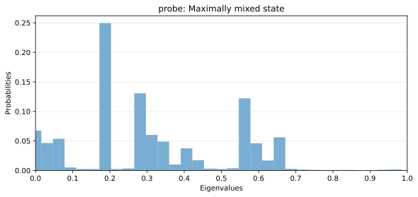
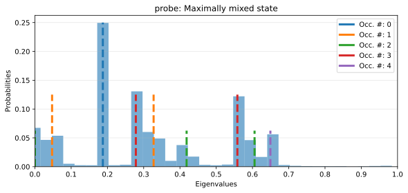
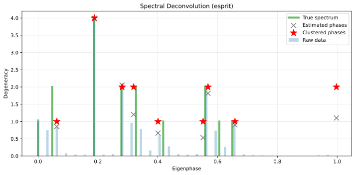
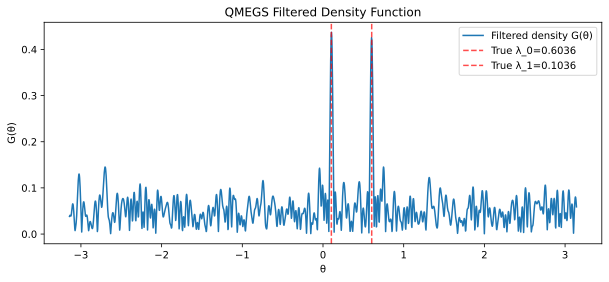
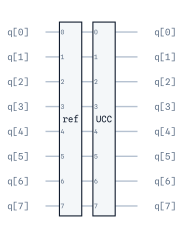
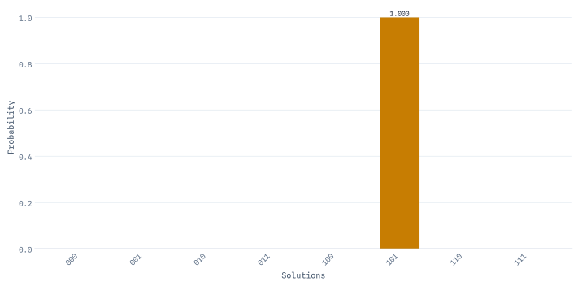

Algorithms
=================

The algorithms module is split into two main submodules. On the one hand, ``PrimitiveAlgorithms`` handle
fundamental quantum operations such as expectation values, overlaps, transition amplitudes, and sampling.
On the other hand, ``CompositeAlgorithms`` provide black-box implementations of complete quantum
algorithms that orchestrate multiple primitives. This section covers both types of algorithms.

Primitive Algorithms
---------------------

Primitive Algorithms are the building blocks for quantum computation in OpenQARP. They encapsulate single
quantum measurement operations and automatically detect the appropriate computation target based on
the input arguments (bra, ket, and operator). The :code:`.target` attribute indicates which type
of computation is being performed.

The following table describes the available targets and their corresponding ``PrimitiveAlgorithms``:

.. list-table::
   :header-rows: 1
   :widths: 20 35 45

   * - Target
     - Formula
     - Available PrimitiveAlgorithm
   * - Sampling
     - Raw measurement distribution :math:`P(\mathbf{x}) = |\langle \mathbf{x} | \psi \rangle|^2`
     - Sampler
   * - Expectation value
     - :math:`\langle \psi | O | \psi \rangle` or :math:`|\langle \psi | O | \psi \rangle|^2`
     - StateVector, HadamardTest, TermwiseHadamardTest, MirrorTest (squared), SWAPTest (squared), InterferometricTest, CuttingPrimitive, PauliAveraging
   * - Overlap
     - :math:`\langle \phi | \psi \rangle` or :math:`|\langle \phi | \psi \rangle|^2`
     - StateVector, HadamardTest, MirrorTest (squared), SWAPTest (squared), TermwiseSWAPTest (squared)
   * - Transition amplitude
     - :math:`\langle \phi | O | \psi \rangle` or :math:`|\langle \phi | O | \psi \rangle|^2`
     - StateVector, HadamardTest, MirrorTest (squared), SWAPTest (squared)

**Target Detection**

The :code:`PrimitiveAlgorithm` automatically determines the target based on the provided arguments:

- **Sampling**: Only :code:`ket` is provided (no bra or operator)
- **Expectation value**: :code:`ket` and :code:`operator` provided, :code:`bra` equals :code:`ket` or is omitted
- **Overlap**: :code:`bra` and :code:`ket` provided, no :code:`operator`
- **Transition amplitude**: All three (:code:`bra`, :code:`operator`, :code:`ket`) are provided

Now, we list one by one, each of the approaches available in OpenQARP:

Sampler
^^^^^^^^

The :code:`Sampler` primitive is used to execute a quantum circuit and collect raw measurement statistics. Unlike other
primitives that compute specific targets (expectation values, overlaps, etc.), the Sampler simply runs the circuit and
returns the measurement outcome distribution. This is particularly useful for algorithms that require raw measurement
data, such as Quantum Phase Estimation (QPE), where the phase information is encoded in the measurement frequencies.

.. math::

   P(\mathbf{x}) = |\langle \mathbf{x} | \psi \rangle|^2

The Sampler automatically sets the target to :code:`Target.SAMPLING` since only a :code:`ket` block is provided
(no bra or operator).

The following code demonstrates how to use the :code:`Sampler` to collect measurement statistics from a quantum circuit:

.. code-block:: python

    from qarp.algorithms import Sampler
    from qarp.blocks import SimpleBlock
    from qarp.engines import QarpEngine

    # Create a simple circuit that prepares a Bell state
    block = SimpleBlock(2, name="bell")
    block.h(0)
    block.cx(0, 1)

    # Create and build the Sampler
    sampler = Sampler(ket=block, n_shots=1000).build()

    # Run the Sampler to collect measurement statistics
    my_engine = QarpEngine()
    my_engine.build([sampler])

    result = my_engine.run()
    print("Measurement distribution:", result[0])
    # Expected output: approximately SamplingDistribution({(0, 0): 0.5, (1, 1): 0.5})

The :code:`Sampler` returns a :class:`~qarp.SamplingDistribution`: a read-only mapping from measurement outcomes
(LSB-first bit tuples over :code:`measured_qubits`) to their probabilities, normalised by the number of shots.  It
reads like a dictionary and iterates in ascending order of the integer :math:`\sum_i b_i 2^i` its bits encode.
:code:`to_dict()` returns a plain, mutable :code:`dict`.

The same data is available as two aligned read-only arrays, which is the fast path for wide distributions: under
:code:`n_shots=qarp.EXACT` a dense 22-qubit state has millions of outcomes, and building a tuple for each costs far
more than computing them.

.. code-block:: python

    dist = result[0]
    dist.outcomes           # array([0, 3]): the integers of (0, 0) and (1, 1)
    dist.probabilities      # about array([0.5, 0.5]), up to shot noise
    dist.n_bits_measured    # 2
    dist.probability_of(3)  # the probability of (1, 1): lookup by packed integer, 0.0 if absent

StateVector
^^^^^^^^^^^^
While statevector simulation is not exactly an algorithm, it does fit the concept of ``PrimitiveAlgorithm`` described before,
and is a useful tool for proof of concept calculations and for checking results you obtain from devices or other
measurement approaches. The API for the StateVector object is very simple:

The reason that the StateVector object does not take a shots argument in the constructor is that the number of shots
is ill-defined as no practical measurement circuits are generated, and for the same reason a device argument is equally
redundant.

Reusing the ``block`` prepared above, and given a qubit operator, we can instantiate the StateVector
algorithm object.

.. code-block:: python

    from qarp.algorithms import StateVector
    from qarp.operators import QubitOperator

    ham = QubitOperator("Z0 Z1")
    sv = StateVector(bra=block, operator=ham, ket=block)

In the previous example, the same block was provided for both bra and ket attributes. Thus, an expectation value will be 
computed using StateVector approach. To carry on the computation, an engine is needed. Please, check ``qarp.engines`` 
doc pages to see a more detailed example.

The observable is never materialised as a matrix.  On ``QarpEngine`` the
contraction ``⟨bra|H|ket⟩`` runs in C++ (``QarpSimulator.transition``): the
Pauli terms are grouped by their X/Y flip pattern and the whole sum is
evaluated in one pass over the two statevectors, so a 2000-term molecular
Hamiltonian at 20 qubits costs about 0.1 s on a laptop.  Z-only observables
(Ising / MaxCut costs) use a cached diagonal instead.  A simulator that only
provides ``statevector`` (the GPU engine's host path, third-party backends)
falls back to the numpy sweep ``qarp.algorithms._primitives.state_vector.pauli_expectation``
with the same result.

(Termwise) HadamardTest
^^^^^^^^^^^^^^^^^^^^^^^^^

The Hadamard test is a well known approach for evaluating various terms of interest, and the first of the algorithms that 
accepts a shot-based simulation as part of the approach. Here we can find :code:`HadamardTest` and its termwise approach
:code:`TermwiseHadamardTest` which can handle a Hamiltonian with more than one term.

This approach is able to estimate the real or imaginary part of the expectation value of a unitary operator with respect 
to a quantum state. It is particularly useful for computing overlaps and transition amplitudes between quantum states. 
The method involves preparing an ancillary qubit in a superposition state using a Hadamard gate, entangling it with the 
target quantum system via controlled operations, and then measuring the ancilla to extract the desired information. 

.. math::

   \text{Re}(\langle \psi | U | \psi \rangle), \quad \text{Im}(\langle \psi | U | \psi \rangle)

Since OpenQARP is built in a blockwise structure, the inputs of this :code:`PrimitiveAlgorithm` requires :code:`Block` objects. 
OpenQARP provides functionalities for transforming a :code:`QubitOperator` into a Block structure. They are called
:code:`Factories`. The following code uses :code:`HadamardTest` to compute the expectation value of a system, where the
original Hamiltonian is encoded as a :code:`QubitOperator`.

.. code-block:: python

    from qarp.factories import PauliBlockFactory
    from qarp.algorithms import HadamardTest
    from qarp.blocks import SimpleBlock
    from qarp.operators import QubitOperator
    from qarp.engines import QarpEngine

    ham = QubitOperator("Z0 Z1 Z2")
    ham_block = PauliBlockFactory.from_qubit_operator(ham, n_qubits=4)
    block = SimpleBlock(4, name="ghz")
    block.h(0)
    block.cx(0, 1)
    block.cx(1, 2)
    block.cx(2, 3)

    meas = HadamardTest(bra=block, operator=ham_block[0], ket=block).build()

    # Run the HadamardTest to compute the expectation value of the above operator on the GHZ state.
    my_engine = QarpEngine()
    my_engine.build([meas])

    result = my_engine.run()
    print("Result:", result[0])

However, in some cases a Hamiltonian is composed of more than one term with different coefficients. The following code
showcases such a case, in which a :code:`TermwiseHadamardTest` is more convenient.

.. code-block:: python

    from qarp.algorithms import TermwiseHadamardTest
    from qarp.blocks import SimpleBlock
    from qarp.operators import QubitOperator
    from qarp.engines import QarpEngine

    ham = QubitOperator("Z0 Z1 Z2") + .5 * QubitOperator("X2 X3")
    block = SimpleBlock(4, name="ghz")
    block.h(0)
    block.cx(0, 1)
    block.cx(1, 2)
    block.cx(2, 3)

    # Pass the QubitOperator straight to TermwiseHadamardTest: it expands the
    # terms into per-term blocks and weights each by its coefficient magnitude
    # (here 1.0 and 0.5).  Building the blocks yourself and passing them as a
    # list instead would require handing over the magnitudes via ``coefficients=``.
    meas = TermwiseHadamardTest(bra=block, operator=ham, ket=block).build()

    # Run the TermwiseHadamardTest to compute the expectation value
    # of the above combination of operators on the GHZ state.
    my_engine = QarpEngine()
    my_engine.build([meas])

    result = my_engine.run()
    print("Result:", result[0])

Note that both :code:`HadamardTest` and :code:`TermwiseHadamardTest` allow you to set a custom :code:`Device` and a given
number of shots for the shot simulation. It is also worth noting that the default behavior if a :code:`QubitOperator`
object is passed as the operator argument to the :code:`TermwiseHadamardTest` then the :code:`PauliBlockFactory` is
called under the hood.

(Termwise) SWAPTest
^^^^^^^^^^^^^^^^^^^^^^^^

The SWAP Test is a quantum algorithm used to estimate the **squared overlap** between two quantum states, which is particularly
useful for determining their similarity. It operates by preparing a controlled SWAP operation between two quantum registers and an
ancillary qubit, followed by a Hadamard transformation and measurement of the ancilla. The probability of measuring the 
ancilla in the zero state is directly related to the squared overlap of the input states. Here we can find 
:code:`SWAPTest` and its termwise approach :code:`TermwiseSWAPTest` which can handle multiple bra states simultaneously.

.. math::

   |\langle \phi | \psi \rangle|^2, \quad |\langle \phi | U | \psi \rangle|^2

**Key Features:**

- **Overlap estimation**: Compute :math:`|\langle \phi | \psi \rangle|^2` between two quantum states
- **Transition amplitude**: When an :code:`operator` is provided, computes :math:`|\langle \phi | U | \psi \rangle|^2`
- **Hardware friendly**: Only requires controlled-SWAP operations and single-qubit measurements
- **Shot-based**: Supports execution on real quantum devices with configurable shots

In OpenQARP, the SWAP Test is implemented as a ``PrimitiveAlgorithm`` that can be applied to expressions such as ``Overlap`` 
and ``TransitionAmplitude``. This method is especially valuable in scenarios where direct access to the full state vector 
is limited, and it enables efficient evaluation of quantum state fidelity on both simulators and real quantum devices.

The following code shows an example of computing the overlap between two quantum states using :code:`SWAPTest`:

.. code-block:: python

    from qarp.algorithms import SWAPTest
    from qarp.blocks import SimpleBlock
    from qarp.engines import QarpEngine

    block1 = SimpleBlock(4, name="block1")
    block1.h(0)
    block1.cx(0, 1)
    block1.cx(1, 2)
    block1.cx(2, 3)

    block2 = SimpleBlock(4, name="block2")
    block2.h(0)
    block2.h(1)
    block2.cx(0, 1)
    block2.cx(1, 2)
    block2.cx(2, 3)

    meas = SWAPTest(bra=block1, ket=block2, n_shots=10000).build()

    # Run the SWAPTest between block1 and block2.
    my_engine = QarpEngine()
    my_engine.build([meas])

    result = my_engine.run()
    print("Squared overlap:", result[0])

To compute a transition amplitude squared :math:`|\langle \phi | U | \psi \rangle|^2`, provide an :code:`operator`:

.. code-block:: python

    from qarp.algorithms import SWAPTest
    from qarp.blocks import SimpleBlock
    from qarp.factories import PauliBlockFactory
    from qarp.operators import QubitOperator

    bra = SimpleBlock(4, name="bra")
    bra.h(0)
    bra.cx(0, 1)
    bra.cx(1, 2)
    bra.cx(2, 3)

    ket = SimpleBlock(4, name="ket")
    ket.x(0)
    ket.x(1)

    # Define a unitary operator
    op = QubitOperator("X0 X1")
    op_block = PauliBlockFactory.from_qubit_operator(op, n_qubits=4)[0]

    meas = SWAPTest(bra=bra, operator=op_block, ket=ket).build()

`TermwiseSWAPTest` extends this functionality to handle multiple bra states at once, computing the sum of
squared overlaps:

.. code-block:: python

    from qarp.algorithms import TermwiseSWAPTest
    from qarp.blocks import SimpleBlock
    from qarp.engines import QarpEngine

    block1 = SimpleBlock(4, name="block1")
    block1.h(0)
    block1.cx(0, 1)
    block1.cx(1, 2)
    block1.cx(2, 3)

    block2 = SimpleBlock(4, name="block2")
    block2.h(0)
    block2.h(1)
    block2.cx(0, 1)
    block2.cx(1, 2)
    block2.cx(2, 3)

    block3 = SimpleBlock(4, name="block3")
    block3.h(0)
    block3.h(1)
    block3.cx(0, 1)
    block3.cx(1, 2)
    block3.cx(2, 3)

    meas = TermwiseSWAPTest(bra=[block1, block2], ket=block3).build()

    # Run the TermwiseSWAPTest to compute the sum of the overlaps
    # between block1 with block3 and block2 with block3.
    my_engine = QarpEngine()
    my_engine.build([meas])

    result = my_engine.run()
    print("Result:", result[0])

Note that both :code:`SWAPTest` and :code:`TermwiseSWAPTest` allow you to set a custom :code:`Device` and a given
number of shots for the shot simulation.

Also, :code:`TermwiseSWAPTest` allows a set of coefficients to be passed as weights for each term.

.. code-block:: python

    coeffs = [0.3, 0.8]
    meas = TermwiseSWAPTest(bra=[block1, block2], ket=block3, coefficients=coeffs).build()

    # Run the TermwiseSWAPTest to compute the weighted overlaps.
    my_engine = QarpEngine()
    my_engine.build([meas])

    result = my_engine.run()
    print("Result:", result[0])

MirrorTest
^^^^^^^^^^^^^^

The Mirror Test is a quantum measurement technique used to estimate the squared magnitude of overlaps or expectation values, 
such as │⟨ψ|O|ψ⟩│² or │⟨ϕ|ψ⟩│². Unlike the Hadamard or SWAP Tests, which provide direct access to real or imaginary components, 
the Mirror Test focuses on computing the absolute square of complex amplitudes. This is achieved by constructing a mirrored 
quantum circuit that duplicates the original computation and interferes the two paths to extract the desired quantity. 

.. math::

   |\langle \psi | O | \psi \rangle|^2, \quad |\langle \phi | \psi \rangle|^2, \quad |\langle \phi | O | \psi \rangle|^2

In OpenQARP, the Mirror Test is implemented as a ``PrimitiveAlgorithm`` and is particularly useful in scenarios where the squared
value of a quantum observable is of interest, such as fidelity estimation or transition probability analysis.

The following code showcases an example in which we compute the square of the expectation value of a quantum system.

.. code:: python

    from qarp.factories import PauliBlockFactory
    from qarp.algorithms import MirrorTest
    from qarp.blocks import SimpleBlock
    from qarp.operators import QubitOperator
    from qarp.engines import QarpEngine

    ham = QubitOperator("Z0 Z1 Z2")
    ham_block = PauliBlockFactory.from_qubit_operator(ham, n_qubits=4)
    block = SimpleBlock(4, name="ghz")
    block.h(0)
    block.cx(0, 1)
    block.cx(1, 2)
    block.cx(2, 3)

    meas = MirrorTest(bra=block, operator=ham_block[0], ket=block).build()

    # Run the MirrorTest to compute the squared expectation value of the above operator on the GHZ state.
    my_engine = QarpEngine()
    my_engine.build([meas])

    result = my_engine.run()
    print("Result:", result[0])

Note that when running :code:`meas` in an :code:`Engine`, the returned result will be the square of the expectation value.

InterferometricTest
^^^^^^^^^^^^^^^^^^^^^^^^

The Interferometric Test is a quantum measurement technique that leverages interference patterns to extract information 
about quantum states and operators. It is particularly suited for evaluating expectation values and transition amplitudes 
by encoding the computation into an interferometric setup, where the phase differences between quantum paths reveal the 
desired quantities. This method is advantageous in scenarios requiring high precision or when working with hardware that 
supports interferometric operations.

Unlike the SWAP Test or Mirror Test which compute squared quantities, the Interferometric Test can estimate the
**complex expectation value** directly, providing both real and imaginary parts:

.. math::

   \text{Re}(\langle \psi | O | \psi \rangle), \quad \text{Im}(\langle \psi | O | \psi \rangle)

**Key Features:**

- **Complex value estimation**: Can compute both real and imaginary parts of expectation values
- **Configurable components**: Choose which parts to estimate via :code:`real=True/False` and :code:`imaginary=True/False`
- **Flexible sampling backend**: Uses either :code:`MirrorTest` or :code:`SWAPTest` as the underlying sampling algorithm
- **Reference state**: Currently uses the all-zero state as reference (requires ket to be orthogonal to it)

The following code shows the expectation value computation using the Interferometric Test:

.. code-block:: python

    from qarp.factories import PauliBlockFactory
    from qarp.algorithms import InterferometricTest, MirrorTest
    from qarp.blocks import ComputationalBasisStateBlock
    from qarp.operators import QubitOperator
    from qarp.engines import QarpEngine

    # Define a Hamiltonian and convert to block
    ham = QubitOperator("Z0 Z1 Z2")
    ham_block = PauliBlockFactory.from_qubit_operator(ham, n_qubits=4)

    # Prepare a computational basis state (must not be all-zeros)
    block = ComputationalBasisStateBlock([0, 1, 1, 1])

    # Build the InterferometricTest
    meas = InterferometricTest(
        bra=block,
        operator=ham_block[0],
        ket=block,
        real=True,
        imaginary=True,
        sampling_algorithm=MirrorTest()
    ).build()

    # Run the InterferometricTest
    my_engine = QarpEngine()
    my_engine.build([meas])

    result = my_engine.run()
    print("Result:", result[0])  # Returns complex value

You can also use the :code:`SWAPTest` as the underlying sampling algorithm:

.. code-block:: python

    from qarp.algorithms import InterferometricTest, SWAPTest

    meas = InterferometricTest(
        bra=block,
        operator=ham_block[0],
        ket=block,
        sampling_algorithm=SWAPTest()
    ).build()

.. note::

    The :code:`InterferometricTest` requires the :code:`ket` state to be a :code:`ComputationalBasisStateBlock`
    and must **not** be the all-zero state, as this serves as the reference state for the interferometric measurement.

CuttingPrimitive
^^^^^^^^^^^^^^^^^^^^^^^^

The :code:`CuttingPrimitive` implements gate-cutting techniques. It is engine-agnostic.
See the ``qarp.cutting`` documentation for the full pipeline and the standalone
:class:`~qarp.cutting.QPDDecomposition` path.

Pauli Averaging
^^^^^^^^^^^^^^^^^^^

:code:`PauliAveraging` allows you to compute expectation values :math:`\langle \psi | O |
\psi \rangle` while taking advantage of a qarpx-native commuting-Pauli grouping to reduce
the total number of measurement circuits and shots required. The default strategy,
:code:`FullyCommuting`, groups by general commutation; :code:`QubitWiseCommuting` is
available through the :code:`grouping` argument.

.. code-block:: python

    from qarp.algorithms import PauliAveraging
    from qarp.operators import QubitOperator
    from qarp.engines import QarpEngine
    from qarp.blocks import ComputationalBasisStateBlock

    state_block = ComputationalBasisStateBlock([1, 1, 0, 1])
    op = QubitOperator("Z0 Z1")  - QubitOperator("Z2 Z3") + QubitOperator("Z0 Y1 X3")
    m = PauliAveraging(bra=state_block, operator=op, ket=state_block)
    engine = QarpEngine()
    engine.build([m])
    engine.run()

Classical Shadows
^^^^^^^^^^^^^^^^^

``PauliShadow`` runs one *state-agnostic* randomized-measurement campaign and lets
you estimate many observables from that single dataset, at a cost set by each
observable's *shadow norm* rather than by the number of observables or qubits
(Huang–Kueng–Preskill, 2020).  It is an ordinary primitive — ``engine.run`` returns
the bound operator's expectation — and it also exposes the raw snapshots as a
reusable :code:`shadow.dataset` for estimating further observables without
re-collecting.

For a single, fixed Hamiltonian, :code:`PauliAveraging` is more shot-efficient;
reach for shadows when you want many/unknown local observables from one campaign.

.. code-block:: python

    from qarp.algorithms import PauliShadow
    from qarp.blocks import SimpleBlock
    from qarp.engines import QarpEngine
    from qarp.operators import QubitOperator

    ket = SimpleBlock(2)
    ket.h(0)
    ket.cx(0, 1)

    shadow = PauliShadow(QubitOperator("Z0 Z1"), ket, n_settings=2000, seed=0)
    engine = QarpEngine(seed=1)
    engine.build([shadow])
    zz = engine.run()[0]                       # <Z0 Z1>

    est = shadow.dataset.estimator()           # reuse the same campaign ...
    xx = est.expval("X0 X1").value             # ... for another observable, no re-run

The estimator uses median-of-means; each :code:`expval` returns a
:code:`ShadowEstimate` carrying the value and :code:`error`, the accuracy
half-width :math:`\varepsilon = \sqrt{34\,\hat{V}/N}` of Huang–Kueng–Preskill
Theorem 1 — the :math:`\varepsilon` for which
:math:`\Pr[\,|\text{value} - \text{true}| \ge \varepsilon\,] \le \delta` at the
:code:`delta` that fixed the batch count, with :math:`\hat{V}` the empirical
single-setting variance and :math:`N` the per-batch size.  It is a worst-case
bound carrying the paper's own deliberately loose constant 34, so it typically
sits several times above the scatter you observe between repeats: read it as a
guarantee, not as a standard error.  Only the random-Pauli ensemble ships today;
matchgate and global-Clifford ensembles are planned as additional kernels.

Composite Algorithms
---------------------

Composite algorithms are higher-level workflows that combine quantum circuits, primitive measurements, and classical
post-processing. Depending on the method, a workflow may include an optimization loop, iterative refinement, repeated
sampling, or several stages of circuit construction and execution.

Concrete composite algorithms inherit from :code:`CompositeAlgorithm` and provide two main operations:

- :code:`build()` constructs and configures the circuits, primitives, and other resources required by the algorithm.
- :code:`run()` executes the workflow and returns or stores its algorithm-specific result.

Constructor options and return values are specific to each algorithm. Many algorithms accept an execution
:code:`engine` or a measurement :code:`primitive`, while variational methods may additionally accept an
:code:`optimizer`, a :code:`gradient` option, or verbosity controls. Their defaults and compatibility requirements
are not uniform, so consult the relevant algorithm section or API reference rather than assuming that an option is
shared by every composite algorithm.

Amplitude Amplification
^^^^^^^^^^^^^^^^^^^^^^^

Amplitude amplification increases the probability of measuring a designated
good subspace. Given a preparation :math:`A` with initial good-state
probability :math:`\sin^2(\theta)`, one amplification iterate changes that
probability according to

.. math::

    P_k(\mathrm{good}) = \sin^2((2k + 1)\theta),

after :math:`k` iterations. OpenQARP implements the phase-exact iterate

.. math::

    Q = A R_0 A^\dagger O_\mathrm{good},

where :math:`R_0 = 2|0\ldots0\rangle\langle0\ldots0| - I` and the caller's
oracle must implement exactly
:math:`O_\mathrm{good} = I - 2\Pi_\mathrm{good}`. The algorithm requires an
explicit non-negative iteration count; it does not infer one from an opaque
oracle.

This convention follows `Brassard, Hoyer, Mosca, and Tapp, Quantum Amplitude
Amplification and Estimation <https://arxiv.org/abs/quant-ph/0005055>`_,
Eq. (1). Their operator is
:math:`Q=-A S_0 A^{-1}S_\chi`, with
:math:`S_0=I-2|0\rangle\langle0|`. Since OpenQARP's ``ReflectionBlock`` is
:math:`R_0=-S_0`, this becomes exactly
:math:`Q=A R_0 A^\dagger O_\mathrm{good}`. The success-probability expression
above follows their Eqs. (5) and (8).

The following one-qubit example starts with good-state probability
:math:`1/4` and reaches probability one after a single iterate:

.. code-block:: python

    import numpy as np
    import qarp

    from qarp.algorithms import AmplitudeAmplification, Sampler
    from qarp.blocks import PhaseShiftBlock, SimpleBlock

    theta = np.pi / 6
    state_preparation = SimpleBlock(1, name="A")
    state_preparation.ry(0, 2 * theta)

    # diag(1, -1): mark |1> as good.
    oracle = PhaseShiftBlock(np.pi, name="O_good")

    amplification = AmplitudeAmplification(
        state_preparation,
        oracle,
        n_iterations=1,
        good_states=[1],
        primitive=Sampler(n_shots=qarp.EXACT),
    ).build()

    distribution = amplification.run()
    print(distribution)
    print(amplification.success_probability)
    # {(1,): approximately 1.0}
    # 1.0

Sampler bit tuples are LSB-first. ``good_states`` instead uses ordinary
full-register integer labels; it is optional reporting metadata and does not
construct or alter the oracle. If it is omitted, ``success_probability``
remains ``None``.

Existing blocks are sufficient for common phase oracles:
``PhaseShiftBlock(pi)`` marks a one-qubit :math:`|1\rangle`, while
X-conjugated ``MCZ`` gates can mark chosen computational-basis labels on wider
registers.

The oracle contract is a *promise, not a validated property*: OpenQARP checks the
oracle's type and register width, but proving that an arbitrary unitary equals
:math:`I - 2\Pi_\mathrm{good}` would require building its dense matrix, which
is exponential in the register width. The phase convention is therefore the
caller's responsibility. The one pitfall worth memorising is that a raw
``ReflectionBlock`` about the good subspace has the opposite sign,
:math:`2\Pi-I=-(I-2\Pi)`, and must be composed with a ``gphase(pi)`` block
before it can serve as a good-state oracle:

.. code-block:: python

    import numpy as np

    from qarp.blocks import CompositeBlock, ReflectionBlock, SimpleBlock

    n_qubits = 2
    sign_flip = SimpleBlock(n_qubits, name="MinusIdentity")
    sign_flip.gphase(np.pi)
    # I - 2|0..0><0..0| : marks the all-zeros state as good.  Conjugate the
    # reflection to relocate the mark.
    oracle = CompositeBlock([sign_flip, ReflectionBlock(n_qubits)], n_qubits)

Omitting the sign adjustment does not change standalone measurement
probabilities — sampling is blind to a global phase — but the iterate then
equals :math:`-Q`, and the minus becomes a *relative* phase once a later
algorithm controls the iterate: every eigenphase read by quantum amplitude
estimation is silently shifted by one half.

Quantum Amplitude Estimation
^^^^^^^^^^^^^^^^^^^^^^^^^^^^

Canonical quantum amplitude estimation (QAE) estimates the initial
good-state probability without measuring the state register. For

.. math::

    A|0\rangle = \sqrt{1-a}|\psi_\mathrm{bad}\rangle
                 + \sqrt{a}|\psi_\mathrm{good}\rangle,

write :math:`a=\sin^2(\theta)`. The phase-exact amplification iterate has
relevant eigenphases :math:`\pm 2\theta`. QAE applies phase estimation to
that iterate, and an estimation-register label :math:`y` gives

.. math::

    \widetilde a(y) = \sin^2\left(\frac{\pi y}{2^m}\right),

where :math:`m` is the number of estimation qubits. The two conjugate QPE
peaks describe the same amplitude, so OpenQARP folds :math:`y` and
:math:`2^m-y` together before choosing the most probable result.

The following exactly representable example estimates
:math:`a=\sin^2(\pi/8)`:

.. code-block:: python

    import numpy as np
    import qarp

    from qarp.algorithms import AmplitudeEstimation
    from qarp.algorithms import Sampler
    from qarp.blocks import PhaseShiftBlock, SimpleBlock

    theta = np.pi / 8
    state_preparation = SimpleBlock(1, name="A")
    state_preparation.ry(0, 2 * theta)
    oracle = PhaseShiftBlock(np.pi, name="O_good")

    estimation = AmplitudeEstimation(
        state_preparation,
        oracle,
        n_ancilla=3,
        primitive=Sampler(n_shots=qarp.EXACT),
    ).build()

    estimate = estimation.run()
    print(estimate)
    print(estimation.folded_distribution)

The block layout is estimation register first, state register second. Sampler
keys are LSB-first, while ``phase_bin`` is the corresponding ordinary integer
label. ``distribution`` retains the raw QPE probabilities;
``folded_distribution`` combines conjugate bins, and ``result_probability``
is the selected folded bin's complete probability mass.

The oracle must implement exactly
:math:`O_\mathrm{good}=I-2\Pi_\mathrm{good}`. Supplying its negative shifts
all controlled eigenphases by one half and makes QAE estimate the complement
:math:`1-a`. ``AmplitudeEstimationBlock`` is measurement-free and can be
embedded in larger circuits; ``AmplitudeEstimation`` samples only its
estimation register. This implementation is canonical QAE, not iterative,
maximum-likelihood, Bayesian, or noise-aware amplitude estimation.

Grover Search
^^^^^^^^^^^^^

``Grover`` specializes amplitude amplification to uniform preparation over
:math:`N=2^n` basis states. Given a caller-declared number :math:`t` of marked
states, it sets

.. math::

    \theta=\arcsin\sqrt{t/N}, \qquad
    P_k(\mathrm{good})=\sin^2((2k+1)\theta),

and selects the better of the two non-negative integers surrounding the first
continuous optimum :math:`\pi/(4\theta)-1/2`. The smaller count wins a
numerical tie, so dense marked sets can correctly require zero oracle calls.

This four-item example marks integer label 2. OpenQARP bit tuples are LSB-first,
so that label appears as ``(0, 1)``:

.. code-block:: python

    import qarp

    from qarp.algorithms import Grover
    from qarp.algorithms import Sampler
    from qarp.blocks import SimpleBlock

    oracle = SimpleBlock(2, name="O_good")
    oracle.x(0)
    oracle.mcz([0, 1])
    oracle.x(0)

    search = Grover(
        oracle,
        n_marked=1,
        good_states=[2],
        primitive=Sampler(n_shots=qarp.EXACT),
    ).build()

    distribution = search.run()
    print(distribution)
    print(search.most_likely_states)
    print(search.success_probability)

``n_marked`` selects the iteration count but does not define or inspect the
oracle. Optional ``good_states`` contains exactly ``n_marked`` unique integer
labels and is reporting metadata only. When it is omitted,
``success_probability`` remains ``None``. ``predicted_success_probability``
is the analytic probability, whereas ``success_probability`` is the measured
mass on the explicitly supplied labels.

Unknown-count search, including the Boyer--Brassard--Høyer--Tapp retry
schedule, is outside this implementation. The oracle sign convention is the
same phase-exact :math:`I-2\Pi_\mathrm{good}` contract used by amplitude
amplification and QAE.

.. _qpe-section:

Quantum Phase Estimation (QPE)
^^^^^^^^^^^^^^^^^^^^^^^^^^^^^^^

Quantum Phase Estimation estimates the eigenphase :math:`\phi \in [0, 1)` of a unitary operator. If

.. math::

    U |\psi\rangle = e^{2\pi i\phi} |\psi\rangle,

then QPE takes a circuit that prepares :math:`|\psi\rangle` and returns a binary approximation to :math:`\phi`
with high probability. QPE therefore measures an eigenphase, not a Hamiltonian energy directly. For the common
choice :math:`U=e^{-iHt}`, an energy :math:`E` maps to
:math:`\phi=(-Et/2\pi)\bmod 1`; the sign, evolution time, and phase wrapping must be accounted for when converting
the measured phase back to an energy.

The QPE circuit prepares an ancilla register in superposition, applies controlled powers of :math:`U`, and uses
an inverse quantum Fourier transform to encode the phase in the ancilla measurement probabilities.

The following example runs QPE with OpenQARP.

.. warning::

    The unitary supplied to QPE must be phase-exact. A global phase that is irrelevant in an uncontrolled circuit
    becomes a relative phase when the unitary is placed under control and shifts the QPE result. Do not use a
    synthesis method that preserves the target unitary only up to global phase unless that phase is calibrated.

.. note::

    The :code:`QPEBlock` documentation includes an example of building the underlying circuit without running the
    complete algorithm.

.. code-block:: python

    from qarp.blocks import TrotterBlock
    from qarp.blocks import SimpleBlock
    from qarp.operators import JordanWigner
    from qarp.operators.models import fermi_hubbard
    from qarp.algorithms import QPE, dirichlet_kernel_squared
    from qarp.engines import QarpEngine
    from qarp.operators import FullyCommuting
    from qarp.operators.functions import eigenspectrum

    import numpy as np

    # QPE parameters
    n_qubits = 4
    n_ancilla = 5

    # Trotterization parameters
    time = 2 * np.pi
    n_trotter_steps = 4
    trotter_order = 2
    grouping = FullyCommuting()

    qham = JordanWigner().encode_operator(fermi_hubbard((2,), t=0.14, U=0.231))
    eigs = eigenspectrum(qham)
    if eigs[0] < 0:
        # Shift the spectrum to be nonnegative. For this model it then lies in [0, 1).
        qham = qham + abs(eigs[0]) + np.finfo(float).eps
    eigs = eigenspectrum(qham)
    assert eigs[0] >= 0 and eigs[-1] < 1

    # TrotterBlock implements exp(-iHt). Negating H gives exp(+iHt), so with
    # time=2*pi, the QPE phase equals the corresponding shifted energy modulo 1.
    circ_unitary = TrotterBlock(
        operator=-qham,
        n_qubits=n_qubits,
        steps=n_trotter_steps,
        time=time,
        order=trotter_order,
        grouping=grouping,
    ).build()

    # Build the circuit that prepares the eigenstate |1111>.
    # Its shifted energy, and therefore the target phase, is approximately 0.6494.
    circ_state = SimpleBlock(n_qubits, name="Eigenstate")
    for i in range(n_qubits):
        circ_state.x(i)
    circ_state.build()

    # Create and build the QPE algorithm with reproducible sampling.
    qpe = QPE(
        circ_state,
        circ_unitary,
        n_ancilla,
        engine=QarpEngine(n_shots=10_000, seed=0),
    ).build()

    # Sample the QPE circuit.
    qpe.run()
    # Access the most probable phase bin.
    res = qpe.result
    # Access the probability of that bin.
    prob = qpe.result_probability

    # The phase should be close to 0.6494 because we probed the |1111> state.
    print(f"The phase is {res:.4f} with probability {prob:.4f}")
    # >>> The phase is 0.6562 with probability 0.8516

``qpe.result`` is the most probable ancilla outcome divided by :math:`2^{n_\mathrm{ancilla}}`. It is therefore
restricted to a grid with spacing :math:`2^{-n_\mathrm{ancilla}}`, while ``qpe.result_probability`` is the
probability assigned to that grid point.

For an ideal, isolated eigenphase, ``estimate_phase`` can fit the squared Dirichlet kernel to the complete QPE
distribution and estimate the peak between adjacent grid points. This fit does not remove finite-shot uncertainty,
noise, Trotter error, or errors caused by imperfect overlap with the target eigenstate. The phase is also periodic,
so fits close to the 0/1 boundary require particular care.

``fit_range`` can restrict the fit to an interval in which the phase is expected. If ``fit_range=None``, the entire
histogram is used and its centroid supplies the initial guess.

.. code-block:: python

    # Restrict the fit when an approximate phase range is known, for example:
    # fit_range = (0.5, 0.7)
    # Use the complete histogram when no suitable range is known.
    fit_range = None

    phi_estim = qpe.estimate_phase(fit_range=fit_range, verbose=True)
    print("The deviation from the true phase is: ", np.abs(phi_estim - eigs[-1]))
    # >>> Fit range: (0, 1)
    # >>> The estimated phase using the Dirichlet kernel is: 0.6494081778695611
    # >>> The deviation from the true phase is:  2.1647961090383034e-05

The sampled distribution and the fitted squared Dirichlet kernel can be plotted together:

.. code-block:: python

    # Plot the distribution.
    fig, ax = qpe.plot(return_fig=True)
    ax.plot(
        qpe.freqs,
        dirichlet_kernel_squared(qpe.freqs, phi_estim, 2**n_ancilla),
        "r",
        label="Dirichlet kernel squared",
    )

.. note::

    Increasing the number of ancilla qubits reduces the phase-bin spacing exponentially, but the controlled-unitary
    ladder uses :math:`2^{n_\mathrm{ancilla}}-1` applications of :math:`U`. Accurate estimation also requires
    substantial overlap between the prepared state and the target eigenstate. If the input is a superposition of
    eigenstates, the measured distribution contains a corresponding mixture of eigenphases.

.. _dos-qpe-section:

Density of States Quantum Phase Estimation (DOS-QPE)
^^^^^^^^^^^^^^^^^^^^^^^^^^^^^^^^^^^^^^^^^^^^^^^^^^^^^^^

Density of States Quantum Phase Estimation (DOS-QPE) applies phase estimation to a mixed probe state rather
than to one prepared eigenstate. The resulting phase distribution approximates the density of eigenphases of
the supplied unitary, weighted by the probe state. For a maximally mixed probe, each eigenstate contributes
equally, so repeated eigenphases appear with weight proportional to their degeneracy. The method is described in
`arXiv:2510.14744 <https://arxiv.org/abs/2510.14744>`_.

OpenQARP prepares the mixed probe by adding a purification register with the same width as the system register. The
system and purification registers are entangled with pairwise CNOT gates, and only the phase-estimation ancillas
are measured. If ``hamming_weight=None``, Hadamard gates prepare a maximally mixed probe over the full Hilbert
space. If a Hamming weight is supplied, a Dicke-state purification restricts the probe to that fixed-particle-number
subspace.

The complete circuit uses three registers:

- :math:`n_\mathrm{ancilla}` phase-estimation qubits;
- :math:`n_\mathrm{qubits}` system qubits on which the controlled unitary acts; and
- :math:`n_\mathrm{qubits}` purification qubits that are not measured.

As in ordinary QPE, DOS-QPE estimates phases :math:`\phi` defined by
:math:`U|\psi\rangle=e^{2\pi i\phi}|\psi\rangle`. For :math:`U=e^{-iHt}`, energies map to
:math:`\phi=(-Et/2\pi)\bmod 1`; DOS-QPE does not automatically undo the sign, time scaling, or phase wrapping.

.. warning::

    The supplied unitary must be phase-exact. A global synthesis error becomes an observable shift when the
    unitary is controlled and therefore shifts every recovered eigenphase.

.. note::

    The :code:`DOSQPEBlock` documentation shows how to construct the underlying circuit directly.

Example: Fermi-Hubbard spectrum
~~~~~~~~~~~~~~~~~~~~~~~~~~~~~~~

.. code-block:: python

    from qarp.blocks import TrotterBlock
    from qarp.operators import JordanWigner
    from qarp.operators.models import fermi_hubbard
    from qarp.algorithms import (
        DOSQPE,
        find_occupation_numbers,
        find_unique_eigs_and_occupation_numbers,
    )
    from qarp.algorithms import SpectrumEstimator
    from qarp.endianness import bits_to_label
    from qarp.engines import QarpEngine
    from qarp.operators import FullyCommuting
    from qarp.operators.functions import eigenspectrum

    import numpy as np

    # DOS-QPE parameters
    n_qubits = 4
    n_ancilla = 5

    # Trotterization parameters
    time = 2 * np.pi
    n_trotter_steps = 4
    trotter_order = 2
    grouping = FullyCommuting()

    # Use None for the full Hilbert space, or an integer for a fixed-Hamming-weight sector.
    hamming_weight = None

    qham = JordanWigner().encode_operator(fermi_hubbard((2,), t=0.14, U=0.231))
    eigs = eigenspectrum(qham)
    if eigs[0] < 0:
        # Shift the spectrum to be nonnegative. For this model it then lies in [0, 1).
        qham = qham + abs(eigs[0]) + np.finfo(float).eps
    eigs = eigenspectrum(qham)
    assert eigs[0] >= 0 and eigs[-1] < 1

    # TrotterBlock implements exp(-iHt). Negating H gives exp(+iHt), so with
    # time=2*pi, the DOS-QPE phases equal the shifted energies modulo 1.
    circ_unitary = TrotterBlock(
        operator=-qham,
        n_qubits=n_qubits,
        steps=n_trotter_steps,
        time=time,
        order=trotter_order,
        grouping=grouping,
    ).build()

    dosqpe = DOSQPE(
        unitary=circ_unitary,
        n_ancilla=n_ancilla,
        hamming_weight=hamming_weight,
        engine=QarpEngine(n_shots=10_000, seed=0),
    ).build()

``run()`` returns the ancilla probability distribution. Its tuple keys are LSB-first, so
``bits_to_label`` converts them to the corresponding integer phase bins. Printing only the most probable bins is
usually more useful than printing the complete :math:`2^{n_\mathrm{ancilla}}`-entry dictionary.

.. code-block:: python

    distribution = dosqpe.run()
    top_bins = sorted(
        (
            (bits_to_label(bits) / 2**n_ancilla, probability)
            for bits, probability in distribution.items()
        ),
        key=lambda item: item[1],
        reverse=True,
    )[:5]
    print([(round(phase, 5), round(probability, 4)) for phase, probability in top_bins])
    # >>> [(0.1875, 0.2495), (0.28125, 0.1307), (0.5625, 0.1221),
    # >>>  (0.0, 0.0674), (0.3125, 0.0602)]

The finite ancilla register broadens an off-grid eigenphase across nearby bins. Degenerate eigenphases contribute
proportionally more probability, which is why the fourfold-degenerate phase near 0.1874 produces the dominant peak.

.. code-block:: python

    # Plot the sampled phase distribution.
    dosqpe.plot()

Increasing the number of ancilla qubits reduces the phase-bin spacing, but also increases the controlled-unitary
ladder exponentially. More ancillas do not remove sampling noise, Trotter error, or phase wrapping.

For validation, the sampled distribution can be compared with the exact spectrum. The following helper functions
collect degenerate energies and label them by occupation number:

.. code-block:: python

    # Evaluate occupation numbers for the exact eigenstates.
    occ_numbers = find_occupation_numbers(qham, n_qubits)

    degeneracy_dict, unique_occ_numbers = find_unique_eigs_and_occupation_numbers(
        eigs,
        occ_numbers,
    )
    unique_eigs = np.array(list(degeneracy_dict))
    degeneracies = np.array(list(degeneracy_dict.values()), dtype=float)
    normalized_degeneracies = degeneracies / degeneracies.sum()

    dosqpe.plot_against_spectrum(
        unique_eigs,
        normalized_degeneracies,
        unique_occ_numbers,
    )

Spectrum estimation
~~~~~~~~~~~~~~~~~~~

:code:`SpectrumEstimator` models the measured distribution as a line spectrum convolved with the QPE kernel. It can
estimate off-grid eigenphases and their degeneracies, but it cannot recover spectral detail that is absent from the
sampled data. Its accuracy remains limited by shot noise, circuit error, phase aliasing, and the number and separation
of spectral lines relative to the ancilla resolution.

The dependency-light ``"esprit"`` mode performs parametric off-grid estimation. The ``"l2"``, ``"l1"``,
``"l2_adaptive"``, ``"l2_relaxed"``, and ``"atomic_norm"`` modes use convex optimization and require the
``[convex-optim]`` extra. The default ``"auto"`` mode evaluates the available candidate estimators and selects the
reconstruction with the best data-fit score.

.. code-block:: python

    estimator = SpectrumEstimator(
        n_qubits=n_qubits,
        n_ancilla=n_ancilla,
        hamming_weight=hamming_weight,
        mode="esprit",
    )
    estimated_phases, estimated_degeneracies = estimator.estimate(
        distribution,
        freqs=dosqpe.freqs,
        integer_degeneracies=True,
    )

    print(np.round(estimated_phases, 4))
    print(estimated_degeneracies)
    # >>> [0.0626 0.188  0.2809 0.3194 0.401  0.5516 0.5681 0.6582 0.9975]
    # >>> [1 4 2 2 1 1 2 1 2]

    estimator.plot(
        distribution=distribution,
        freqs=dosqpe.freqs,
        true_phases=unique_eigs,
        true_degeneracies=degeneracies,
    )

Here the estimator correctly identifies the dominant fourfold-degenerate line, but some nearby or weak lines are
shifted, split, or merged. This is expected for a dense nine-line spectrum reconstructed from only 32 noisy phase
bins; fitted output should not be treated as an exact eigenspectrum.

.. _mmqcels-section:

Multi-modal Multi-level Quantum Complex Exponential Least Squares (MMQCELS)
^^^^^^^^^^^^^^^^^^^^^^^^^^^^^^^^^^^^^^^^^^^^^^^^^^^^^^^^^^^^^^^^^^^^^^^^^^^^^^

MMQCELS estimates several eigenvalues of a Hamiltonian simultaneously from
the complex time-domain signal

.. math::

    Z(t) = \langle \Psi|e^{-iHt}|\Psi\rangle
         = \sum_k p_k e^{-i\lambda_k t}.

It fits the :math:`K` dominant components by minimizing

.. math::

    \mathcal{L}(r, \theta) = \frac{1}{N}\sum_{n=1}^{N}
    \left|Z(t_n) - \sum_{k=1}^{K} r_k e^{-i\theta_k t_n}\right|^2.

The implementation follows Algorithm 2 of `Ding and Lin, Quantum 7, 1136
(2023) <https://quantum-journal.org/papers/q-2023-10-11-1136/>`_. At level
:math:`j`, it draws independent times from the truncated Gaussian in Eq. (3),
supported on :math:`[-\gamma T_j,\gamma T_j]`, with :math:`T_j=2^jT_0`.
Complex amplitudes are eliminated with linear least squares, leaving only
the eigenvalues in the nonlinear optimization.

Only eigenstates with nonzero trial-state weight contribute to :math:`Z(t)`.
Consequently, ``n_dominant_eigenvalues`` selects the number of dominant
signal components, not necessarily the lowest :math:`K` eigenvalues of the
full Hamiltonian. Initial eigenvalue guesses must lie inside
``[lam_min, lam_max]``, which defaults to :math:`[-\pi,\pi]`. The level fit is
a bounded search over that interval, so ``optimizer`` (default
``ScipyOptimizer("L-BFGS-B")``) must honour ``minimize(bounds=...)``: an optimizer
whose ``supports_bounds`` is ``False`` (the gradient-descent family, Rotosolve) is
refused with ``TypeError`` at construction rather than after the dataset is
generated (see :doc:`optimizers`).

Execution modes
~~~~~~~~~~~~~~~

``execution_mode`` is required:

* ``"classical"`` diagonalizes a dense matrix or ``QubitOperator`` once.
* ``"statevector"`` evaluates a symbolic-time ``TrotterBlock`` exactly.
* ``"hadamard"`` evaluates both real and imaginary Hadamard-test quadratures.

In Hadamard mode, ``n_shots=None`` means one shot per quadrature, an integer
requests finite sampling, and ``qarp.EXACT`` evaluates the infinite-shot
protocol. ``n_shots`` is rejected in the other modes rather than silently
ignored.

Parameter modes
~~~~~~~~~~~~~~~

.. list-table::
   :header-rows: 1
   :widths: 20 32 48

   * - Mode
     - Required schedule inputs
     - Meaning
   * - ``standard`` (default)
     - ``T0``, ``N0``, ``Nj``, and exactly one of ``n_levels`` or ``q``
     - Paper schedule. With ``q``, the class computes
       :math:`l=\max\{\lceil\log_2(q/(\epsilon T_0))\rceil,1\}` and evaluates
       :math:`j=0,\ldots,l`, that is, ``l + 1`` levels.
   * - ``error_rate``
     - ``T0``; counts and level count may be overridden
     - Opt-in compatibility preset. It uses
       :math:`J=\lceil\log_2(1/\epsilon)\rceil+1` from the predecessor
       single-mode QCELS paper, ``Nj=round(1/sqrt(epsilon))``, and
       ``N0=max(Nj//2, 1)``. For a sequence-valued ``Nj``, its first entry is
       used to derive ``N0``. The count formula is a historical OpenQARP
       heuristic, not MM-QCELS Theorem 1.

``T0`` is always required because epsilon alone cannot determine a
dimensionful initial time scale. All schedule values are validated when the
class is constructed; missing, conflicting, non-finite, non-integral, or
mode-incompatible inputs raise before circuits or optimizer state are built.
Every evaluated level must use more samples than the requested number of
dominant modes. In standard mode with an explicit ``n_levels``, ``error_rate``
does not alter the schedule; it is used only by the ``q``-derived schedule or
by ``parameter_mode="error_rate"``.

Following QPE's output convention, ``run()`` returns the sorted eigenvalue
array and stores the same array in ``result`` and ``eigenvalues``. Fitted
amplitudes and run diagnostics remain available through ``amplitudes``,
``level_losses``, ``sample_counts``, ``sampled_max_times``,
``sampled_total_times``, and ``optimizer_failed_starts``. The latter counts
discarded optimizer starts at each level; a level for which every start fails
raises instead. ``n_initial_guesses`` counts all level-zero starts, including
``initial_eigenvalues`` when supplied.

Here is a minimal standard-mode setup using the versioned H2 molecular-
integral snapshot. Run it from the repository root. See
``examples/algorithms/composite/mwe_mmqcels.ipynb`` for checked classical,
StateVector, Hadamard, and error-rate-derived runs.

.. code:: python

    from pathlib import Path

    import numpy as np

    from qarp.algorithms import MMQCELS
    from qarp.blocks import ComputationalBasisStateBlock
    from qarp.operators import JordanWigner
    from qarp.operators.integrals import restricted_integrals_to_fermion_operator
    from qarp.operators.onv import onv_from_spatial_occupations

    asset = Path("tests/assets/molecules/h2_0.735_sto3g.npz")
    with np.load(asset) as data:
        fermion_operator = restricted_integrals_to_fermion_operator(
            float(data["constant"]), data["one_electron"], data["two_electron"]
        )

    mapping = JordanWigner()
    qham = mapping.encode_operator(fermion_operator)
    onv = onv_from_spatial_occupations([2, 0])
    state = ComputationalBasisStateBlock(mapping.encode_state(onv)).build()

    algorithm = MMQCELS(
        operator=qham,
        state=state,
        execution_mode="classical",
        T0=1.25,
        N0=120,
        Nj=80,
        n_levels=5,
        n_dominant_eigenvalues=2,
        initial_eigenvalues=[-1.0, 0.5],
        seed=1,
        verbose=False,
    )
    eigenvalues = algorithm.run()
    print(eigenvalues, algorithm.amplitudes)

.. _qmegs-section:

Quantum Multiple Eigenvalue Gaussian filtered Search (QMEGS)
^^^^^^^^^^^^^^^^^^^^^^^^^^^^^^^^^^^^^^^^^^^^^^^^^^^^^^^^^^^^

QMEGS (Quantum Multiple Eigenvalue Gaussian-filtered Search) estimates several eigenvalues of a Hamiltonian from a trial state and a
time-evolution block. It samples the expectation value

.. math::

    Z(t) = \langle \psi | e^{-iHt} | \psi \rangle
         = \sum_k p_k e^{-i\lambda_k t},

where :math:`p_k = |\langle \lambda_k | \psi \rangle|^2`. A filtered density function evaluates candidate eigenvalues and returns the
strongest peaks. The implementation follows `Quantum 8, 1487 (2024) <https://quantum-journal.org/papers/q-2024-10-02-1487/>`_.

The target indices refer to the eigenvalues returned by ``numpy.linalg.eigh`` (ascending order). They are not inferred by QMEGS, so use
``get_overlaps`` to choose states with the largest trial-state weights. A necessary condition is:

.. math::

    p_{\min} = \min_{k\in D} p_k > p_{\mathrm{tail}} = \sum_{k\notin D}p_k.

If this condition fails, ``build()`` raises ``ValueError``. Increasing ``T`` improves resolution but also increases the evolution time and,
for circuit execution, the circuit depth. Decreasing ``eta`` increases the internally calculated sample count.

**Basic Usage:**

The following example demonstrates QMEGS on a simple 2-qubit Hamiltonian:

.. code-block:: python

    import numpy as np
    import qarp
    from qarp.algorithms import get_overlaps
    from qarp.algorithms import QMEGS
    from qarp.blocks import SimpleBlock, SynthesizedTimeEvolutionBlock
    from qarp.operators import QubitOperator
    from qarp.operators.functions import eigenspectrum

    np.random.seed(0)
    
    # Define a 2-qubit Hamiltonian
    hamiltonian = (
        QubitOperator("Z0 X1") + QubitOperator("Y0 Y1") + QubitOperator("X0 X1")
    ) * 0.25
    
    n_qubits = 2
    
    # Create trial state: |0⟩ ⊗ |+⟩
    trial_state = SimpleBlock(n_qubits, name="trial_state")
    trial_state.h(1)
    trial_state.build()
    
    overlaps, eigenvalues = get_overlaps(
        trial_state, hamiltonian, return_eigenvalues=True
    )
    # Select target eigenvalue indices (two with highest overlap)
    sorted_indices = np.argsort(overlaps)[::-1]
    target_indices = sorted_indices[:2].tolist()

    unitary_block = SynthesizedTimeEvolutionBlock(
        n_qubits=n_qubits,
        operator=hamiltonian,
    )
    
    qmegs = QMEGS(
        unitary=unitary_block,
        state=trial_state,
        n_shots=qarp.EXACT,        # Exact analytical signal.
        target_indices=target_indices,
        sigma=1.0,
        eta=0.01,
        T=100,
        mode_dataset="analytical",
    ).build()
    
    # Run and get estimated eigenvalues
    result = qmegs.run()
    print("Exact eigenvalues:", np.round(eigenspectrum(hamiltonian), 8))
    print("Target indices:", target_indices)
    print("Estimated eigenvalues:", np.round(sorted(result), 6))
    print("Exact target eigenvalues:", np.round(sorted(eigenvalues[target_indices]), 6))
    # >>> Estimated eigenvalues: [0.102785 0.60639]
    # >>> Exact target eigenvalues: [0.103553 0.603553]

**Using Trotter Time Evolution:**

For Hamiltonians that require Trotterization, use :code:`TrotterBlock`:

.. code-block:: python

    import qarp
    from qarp.blocks import TrotterBlock

    # Build Trotter unitary
    trotter_unitary = TrotterBlock(
        n_qubits=n_qubits,
        operator=hamiltonian,
        steps=10,
        order=4,
    )

    # Create QMEGS
    qmegs = QMEGS(
        unitary=trotter_unitary,
        state=trial_state,
        n_shots=qarp.EXACT,        # Use statevector simulation
        target_indices=target_indices,
        sigma=1.0,
        eta=0.01,
        T=100,
    ).build()

    result = qmegs.run()

    print("Estimated eigenvalues with Trotter:", sorted(result))

.. note::
    Both ``TrotterBlock`` and ``SynthesizedTimeEvolutionBlock`` implement the standard
    :math:`\exp(-iHt)` convention, so no sign adapter is needed on the QMEGS side.

**Visualizing the Filtered Density Function:**

The filtered density function reveals peaks at eigenvalue locations:

.. code-block:: python

    import matplotlib.pyplot as plt
    
    # Generate dataset and compute filtered density
    qmegs.run()
    
    J = int(np.floor(2 * np.pi * qmegs.T / qmegs.q))
    theta_js = np.array([-np.pi + j * qmegs.q / qmegs.T for j in range(J + 1)])
    G_js = qmegs.filtered_density_function(qmegs.dataset, theta_js, qmegs.n_samples)
    
    # Plot with true eigenvalue markers
    plt.figure(figsize=(10, 4))
    plt.plot(theta_js, G_js, label='Filtered density G(θ)')
    for i, eig in enumerate(eigenvalues[target_indices]):
        plt.axvline(x=eig, color='r', linestyle='--', alpha=0.7,
                    label=f'True λ_{i}={eig:.4f}')
    plt.xlabel('θ')
    plt.ylabel('G(θ)')
    plt.title('QMEGS Filtered Density Function')
    plt.legend()
    plt.show()

**Sampling Mode:**

To use shot-based circuit measurements, select ``mode_dataset="sampling"`` and pass a
sampling primitive and a compatible engine:

**Where ``p_min`` / ``p_tail`` come from:** the algorithm's a-priori inputs (Theorem 1)
are produced by ``overlaps="classical"`` (the default) — an :math:`O(4^n)` diagonalisation of
the Hamiltonian plus one exact trial statevector read through the engine. That is a
classical validation step and is refused with ``CapabilityError`` on a noisy or routed
engine. Pass ``overlaps=(pmin, ptail)`` to supply the two numbers yourself: no spectrum is
computed, the sampling path runs on any engine, and only ``len(target_indices)`` (the number
of eigenvalues to extract) is consulted. ``mode_dataset="analytical"`` synthesises the signal
from the spectrum and therefore requires ``overlaps="classical"``.

.. code-block:: python

    from qarp.engines import QarpEngine
    from qarp.algorithms import HadamardTest
    
    # Create engine and primitive for measurements
    engine = QarpEngine()
    primitive = HadamardTest()
    
    qmegs = QMEGS(
        unitary=unitary_block,
        state=trial_state,
        n_shots=10000,
        target_indices=target_indices,
        mode_dataset="sampling",
        mode_time="rvs",
        engine=engine,
        primitive=primitive,
    ).build()
    
    result = qmegs.run()

    print("Estimated eigenvalues with sampling:", sorted(result))

The default ``StateVector`` primitive is exact, even in sampling mode. Use ``HadamardTest`` to model finite-shot measurements. A real device
engine must support the same primitive and time-dependent unitary block.

**Algorithm Parameters:**

- **sigma** (float): Truncation level for Gaussian filtering. Smaller values concentrate sampling near t=0. Default: 1.0
- **eta** (float): Error tolerance controlling the number of samples. Smaller values require more samples but improve accuracy. Default: 0.01
- **T** (int): Time window for sampling. Larger values provide better eigenvalue resolution but require more circuit depth. Default: 100
- **mode_dataset** (str): ``'analytical'`` computes the signal from the eigendecomposition; ``'sampling'`` executes one circuit per sampled time
- **mode_time** (str): Time sampling method - :code:`'rvs'` for fast scipy sampling or :code:`'rejection_sampling'` for custom filtering functions
- **filtering_function** (callable): Custom acceptance density for ``mode_time='rejection_sampling'``. Defaults to the truncated Gaussian density

**Custom Filtering Functions:**

You can provide a custom filtering function for advanced use cases:

.. code-block:: python

    import qarp

    def custom_filter(t, sigma, T):
        """Custom filtering function."""
        return np.exp(-T * t**2 / 2) * (1 + 0.1 * np.cos(t))

    qmegs = QMEGS(
        unitary=unitary_block,
        state=trial_state,
        n_shots=qarp.EXACT,
        target_indices=target_indices,
        filtering_function=custom_filter,
        mode_time='rejection_sampling',  # Required for custom functions
    ).build()

    result = qmegs.run()

    # A custom filter changes the time distribution and may reduce accuracy.
    print("Estimated eigenvalues with custom filter:", sorted(result))

**Performance Considerations:**

The number of samples required scales as:

.. math::

    N_{\text{samples}} = \mathcal{O}\left(
    \frac{\log((T/q + |D|)/\eta)}{(p_{\min}-p_{\mathrm{tail}})^2}
    \right)

where :math:`D` is the selected target-index set. For high precision, the sample count can become large and long-time Trotter or hardware
errors can dominate.

.. note::
    QMEGS is most effective when the trial state has good overlap with the target eigenstates 
    (:math:`p_{\min}` large) and minimal overlap with non-target eigenstates (:math:`p_{\text{tail}}` small). 
    Constructing good trial states often requires problem-specific knowledge or preliminary variational optimization.

.. _shor-section:

Shor factoring and quantum order finding
^^^^^^^^^^^^^^^^^^^^^^^^^^^^^^^^^^^^^^^^^

The :code:`Shor` composite algorithm factors a small composite integer by
combining quantum multiplicative-order finding with classical continued
fractions and greatest-common-divisor calculations.  For a base :math:`a`
coprime to the number :math:`N`, the quantum circuit samples phases associated
with the periodic function

.. math::

    f(x) = a^x \bmod N.

The period :math:`r` is accepted only after the classical check
:math:`a^r \bmod N = 1`.  When :math:`r` is even and
:math:`a^{r/2} \not\equiv \pm 1 \pmod N`, the factors follow from
:math:`\gcd(a^{r/2}-1,N)` and :math:`\gcd(a^{r/2}+1,N)`.

OpenQARP exposes the two reusable quantum blocks behind this workflow:

- :code:`ModularMultiplicationBlock(m, N)` implements the complete LSB-indexed
  basis permutation :math:`|x\rangle\mapsto|mx\bmod N\rangle` for
  :math:`x<N` and fixes every basis label :math:`x\geq N`.
- :code:`OrderFindingBlock(a, N)` prepares a counting register and a work
  register, applies controlled modular powers, and finishes with an inverse
  QFT.  It contains no measurement commands; :code:`Sampler` measures and
  marginalises the counting qubits.

The following deterministic reference calculation factors 15.  Eight
counting qubits give phase bins at 0, 64, 128, and 192 for the order
:math:`\operatorname{ord}_{15}(2)=4`.  :code:`force_quantum=True` guarantees
that the circuit is executed (see below).

.. code-block:: python

    import qarp
    from qarp.algorithms import Sampler
    from qarp.algorithms import Shor
    from qarp.endianness import bits_to_label

    shor = Shor(
        15,
        base=2,
        force_quantum=True,
        primitive=Sampler(n_shots=qarp.EXACT),
    ).build()

    factors = shor.run()
    peaks = sorted(
        (bits_to_label(bits), round(probability, 4))
        for bits, probability in shor.distributions[2].items()
        if probability > 1e-10
    )

    print("order:", shor.orders[2])
    print("phase bins:", peaks)
    print("factors:", factors)
    # >>> order: 4
    # >>> phase bins: [(0, 0.25), (64, 0.25), (128, 0.25), (192, 0.25)]
    # >>> factors: (3, 5)

Sampler tuples are LSB-first.  Use :code:`bits_to_label` to convert a tuple to
the integer phase label; the corresponding normalized phase is that label
divided by :math:`2^t`, where :math:`t` is the number of counting qubits.
With finite shots, an attempt may not observe enough useful peaks and
:code:`run()` may therefore return :code:`None`.  Multiple configured bases
are executed as one batch, and inconclusive attempts do not prevent a later
base from succeeding.

Bases are processed in attempt order, as in Shor's sequential algorithm.  In
the default mode every coprime base gets an order-finding circuit, and the
first non-coprime base ends the attempt list with :math:`\gcd(a, N)` as a
classical fallback that :code:`run()` returns only when every quantum attempt
was inconclusive.  Because small moduli have many non-coprime bases, a default
call on :math:`N=15` frequently ends at that fallback.  :code:`force_quantum=True`
disables the shortcut: random bases are drawn coprime, a supplied non-coprime
base is rejected, and even or perfect-power inputs raise because they lie
outside the preconditions of Shor's order-finding theorem.

:code:`build()` prepares the samplers and never factors; every classical exit
happens in :code:`run()`.  Prime inputs are rejected at :code:`build()`.  Even
integers and exact perfect powers are factored classically without a circuit
in the default mode.  The return value is one sorted non-trivial factor pair;
it is not a recursive prime factorization.

.. warning::

    This first implementation is an exact **small-integer reference**, not a
    scalable implementation of Shor's algorithm.  Modular multiplication is
    synthesized by enumerating computational-basis permutations, has
    exponential gate cost, and is limited to six work qubits, so :code:`Shor`
    accepts :math:`N \le 64` at construction.  Exact sampling of the order-
    finding circuit takes about 2 s at that limit and would take 31 s one work
    qubit beyond it.  It must not be used to make cryptographic-scale or
    asymptotic-speedup claims.

The mathematical workflow follows Shor's original factoring and order-finding
construction in `SIAM Journal on Computing 26, 1484--1509
<https://epubs.siam.org/doi/10.1137/S0097539795293172>`_ (`preprint
<https://arxiv.org/abs/quant-ph/9508027>`_).  A future scalable arithmetic
backend may use a polynomial reversible construction such as `Beauregard's
2n+3-qubit circuit <https://arxiv.org/abs/quant-ph/0205095>`_ while retaining
the public OpenQARP block and algorithm interfaces described here.

.. _vqe-section:

Variational Quantum Eigensolver (VQE)
^^^^^^^^^^^^^^^^^^^^^^^^^^^^^^^^^^^^^^^

One of the most popular VQE approaches is the Unitary Coupled Cluster (UCC) method and its variants. It relies on a basis generation
by means of excitation operators acting on a chosen reference state. Every excitation operator involved is related to a variational 
parameter which is optimized by minimization of the energy surface spanned by the Hamiltonian of the system and the trial circuit generated. 

The UCC quantum circuit is of the form 

.. math::

    |\psi\rangle = \sum_k e^{i \theta_k \hat{A}_k} |\rm{ref}\rangle,

where :math:`\hat{A}_k` are the chosen excitation operators with corresponding variational 
parameters :math:`\theta_k`. The different choices of operators make the difference in the UCC variants. 
A common choice is to use all the singles and doubles operators, :math:`a_i^+ a_j` and :math:`a_i^+ a_j^+ a_l a_k`, respectively. Other considerations
to reduce this number of operators, for example based on symmetries of the system, are encouraged as they scale as :math:`\mathcal{O}(N^2)` and :math:`\mathcal{O}(N^4)`.

OpenQARP offers versatility when building an UCC object. First, let's define the problem example we want to apply it to: We'll choose an equally spaced H4 chain,
loaded from its stored STO-3G integrals. Run the snippet from the repository root:

.. code:: python

    from pathlib import Path
    import numpy as np

    from qarp.operators import JordanWigner

    from qarp.blocks import ComputationalBasisStateBlock, UCCBlock, CompositeBlock
    from qarp.operators.integrals import restricted_integrals_to_fermion_operator

    from qarp.algorithms import StateVector
    from qarp.operators.onv import onv_from_spatial_occupations

    asset = Path("tests/assets/molecules/h4_1.000_sto3g.npz")
    with np.load(asset) as data:
        fop = restricted_integrals_to_fermion_operator(
            float(data["constant"]), data["one_electron"], data["two_electron"]
        )

    onv = onv_from_spatial_occupations([2, 2, 0, 0])

    qham = JordanWigner().encode_operator(fop)

    ref = ComputationalBasisStateBlock(onv, name="ref")
    ucc = UCCBlock(onv, singles=True, doubles=True)
    ansatz = CompositeBlock([ref, ucc])
    ansatz.build()
    ansatz.plot()

This variational algorithm finds a set of optimal parameters minimizing the expectation value of the Hamiltonian in qubit operator form with the UCC ansatz as we have defined it with the excitation operators.
Now we have everything to run the UCC-VQE calculation by using: 

.. code-block:: python

    from qarp.algorithms import VQE
    ansatz.build()

    vqe = VQE(operator=qham, ket=ansatz, verbose=True, gradient=True, primitive=StateVector())
    vqe.build()
    e, p = vqe.run()

We observe that we have chosen the standard :code:`StateVector` as our measurement strategy, but the OpenQARP user is not limited to this. We can run a noisy
VQE simulation on a prescribed device with a certain architecture by specifying the appropriate measurement strategy. Note that most of the 
presented algorithms enable the usage of gradients by setting :code:`gradient=True` in the constructor (the engine's default method: adjoint
backpropagation for :code:`StateVector`, the batched parameter shift for sampled primitives), or to a method name such as
:code:`gradient="parameter-shift"` — see :doc:`gradients`.

It is also possible to choose a different primitive to StateVector for these types of algorithm, provided they can calculate an expectation value. Be warned, however, that without
some measurement reduction functionality these other primitives can be expensive to run for a full variational loop.

.. _projected-vqe-section:

Projected Variational Quantum Eigensolver (Projected VQE)
^^^^^^^^^^^^^^^^^^^^^^^^^^^^^^^^^^^^^^^^^^^^^^^^^^^^^^^^^^^

``ProjectedVQE`` implements variation after projection. For an ansatz
:math:`|\psi(\boldsymbol{\theta})\rangle`, Hamiltonian :math:`H`, and symmetry
projector :math:`P`, it minimizes the projected Rayleigh quotient

.. math::

   E_P(\boldsymbol{\theta}) =
   \frac{\langle P\psi(\boldsymbol{\theta})|H|
   P\psi(\boldsymbol{\theta})\rangle}
   {\langle P\psi(\boldsymbol{\theta})|
   P\psi(\boldsymbol{\theta})\rangle}.

This allows a parameterized circuit that does not preserve a symmetry to be
optimized within a chosen sector. The ``operator`` must be a OpenQARP
``QubitOperator``, and ``ket`` must be a built or buildable parameterized block
on the same number of system qubits as the projector.

``examples/algorithms/composite/mwe_projected_vqe.ipynb`` works this through on
a two-site Fermi-Hubbard model whose global ground state lies *outside* the
requested sector, so the projector is what makes the answer the right one.

``projector`` accepts one block or a sequence of the projector blocks described
in :ref:`Projector Blocks <projector-blocks-section>`. A sequence is converted
to a matrix product; it represents the intersection of sectors when the
projectors commute. For a custom projector, pass a dense ``projector_matrix``
in qarpx's LSB basis ordering instead. ``projector`` and ``projector_matrix``
are mutually exclusive. If neither is supplied, the identity is used and the
objective reduces to ordinary statevector VQE.

Projected VQE uses a specialized statevector objective. It simulates only the
bare ansatz, converts known projector blocks to dense system-register matrices,
and applies the projection by classical matrix multiplication during each
objective evaluation. The LCU projector circuits and their ancillas are not
simulated in the optimization loop. This is efficient for small statevector
calculations, but it is not a finite-shot or hardware postselection workflow,
and its objective is a ratio, so neither the adjoint nor the parameter-shift rule
applies (``gradient="finite-diff"`` does). The default optimizer is COBYLA.

If the squared norm of the projected state is below ``postselection_tol``, the
objective returns positive infinity. After ``run()``, the normalized projected
state and the unprojected ansatz state are available as
``final_projected_statevector`` and ``final_ansatz_statevector``. ``run()``
returns ``(energy, parameters)``, while ``optimal_parameters`` provides the
order-safe symbol-to-value mapping.

In this two-qubit example, the ansatz spans several particle-number sectors.
Projection retains the one-particle sector, where
:math:`H=(X_0X_1+Y_0Y_1)/2` has exact ground energy :math:`-1`:

.. code-block:: python

   import numpy as np
   from sympy import Symbol

   from qarp.algorithms import ProjectedVQE
   from qarp.blocks import ParticleNumberProjectorBlock, SimpleBlock
   from qarp.operators import QubitOperator
   from qarp.optimizers import ScipyOptimizer

   theta = Symbol("theta")
   ansatz = SimpleBlock(2, name="Ansatz")
   ansatz.ry(0, theta)
   ansatz.h(1)
   ansatz.build()

   hamiltonian = (
       0.5 * QubitOperator("X0 X1")
       + 0.5 * QubitOperator("Y0 Y1")
   )
   projector = ParticleNumberProjectorBlock(n_qubits=2, Npart=1)

   projected_vqe = ProjectedVQE(
       operator=hamiltonian,
       ket=ansatz,
       projector=projector,
       initial_parameters=np.array([0.2]),
       optimizer=ScipyOptimizer(
           "COBYLA", options={"maxiter": 100, "tol": 1e-10}
       ),
   ).build()
   energy, parameters = projected_vqe.run()

   assert np.isclose(energy, -1.0, atol=1e-8)
   assert np.allclose(
       projected_vqe.final_projected_statevector[[0, 3]], 0.0, atol=1e-10
   )

.. _adapt-vqe-section:

ADAPT-VQE
^^^^^^^^^^^^^

ADAPT-VQE has become quite popular in the scientific community due to its capability to generate expressive ansatze within a small number of iterations.
This algorithms builds wavefunctions of the form 

.. math::

    |\psi\rangle = \prod_k e^{i \theta_k \hat{A}_k} |\rm{ref}\rangle,

where :math:`\hat{A}_k` are the chosen excitation operators with corresponding variational 
parameters :math:`\theta_k`, obtained classically by minimizing the energy surface. 
ADAPT-VQE iteratively updates the reference state :math:`|\rm{ref}\rangle` with 
an excitation operator having the largest energy gradient according to the formula 

.. math::

    \frac{\partial E}{\partial \theta_k} = i \langle \psi |[H, \hat{A}_k]| \psi \rangle,

with :math:`H` being the Hamiltonian of the system we want to solve. The algorithm will stop when all these gradients are below a certain threshold. 

OpenQARP offers the possibility to build your ADAPT-VQE object with flexible options for the reference state, excitation operators, optimizers and iterations. 

We illustrate the process taking as an example LiH in a (2e, 3o) active space, reduced from
the stored LiH/STO-3G integrals. Run it from the repository root:

.. code-block:: python

    from pathlib import Path

    import numpy as np

    from qarp.operators import JordanWigner
    from qarp.operators.integrals import (
        active_space_integrals,
        restricted_integrals_to_fermion_operator,
    )
    from qarp.operators.onv import onv_from_spatial_occupations
    from qarp.operators.ucc import ucc_singles_and_doubles
    from qarp.blocks import ComputationalBasisStateBlock
    from qarp.algorithms import AdaptVQE, StateVector

    asset = Path("tests/assets/molecules/lih_1.59_sto3g.npz")
    with np.load(asset) as data:
        integrals = active_space_integrals(
            float(data["constant"]),
            data["one_electron"],
            data["two_electron"],
            n_electrons=int(data["nelectron"]),
            active_electrons=2,
            active_orbitals=3,
        )
    fermion_operator = restricted_integrals_to_fermion_operator(*integrals)

    mapping = JordanWigner()
    qop = mapping.encode_operator(fermion_operator)
    onv = onv_from_spatial_occupations([2, 0, 0])

    fucc = ucc_singles_and_doubles(onv, generalised=False, spin_conserving=False)[0]
    qucc = mapping.encode_operator(fucc)
    print(onv)

    ref = ComputationalBasisStateBlock(onv)
    ref.build()

    adapt = AdaptVQE(
        reference_block=ref,
        system_hamiltonian=qop,
        excitation_pool=qucc,
        primitive=StateVector(),
        gradient=True,
        gradient_thresh=1e-9,
        convergence_thresh=1e-10,
        exc_per_iter=1
    )
    adapt.build()
    s0_en, _ = adapt.run()

After we build our ADAPT-VQE object, we may be interested in just running a few iterations in order to obtain an expressive ansatz to use in 
another quantum algorithm with minimal cost. We may use :code:`adapt.iterate()` as times as needed to update the wavefunction. 

If, on the other hand, we would like to run the full ADAPT-VQE algorithm, we may use :code:`adapt.run(max_iter=max_iter)`. The output will be the final energy,
close to the ground-state energy of the Hamiltoinan within a threshold, and the optimal parameters. If you'd like to access the information on the parameters 
and excitation operators involved, you may do so by calling :code:`adapt.ansatz_parameters_dict` and :code:`adapt.ansatz_excitations`, respectively.

In addition to the original ADAPT-VQE method, the implementation in OpenQARP allows to add more than one term in an iteration, e.g. :code:`AdaptVQE(.., exc_per_iter = 5)`.

It is worth noting that if using some other primitive besides StateVector to evaluate the energies and commutators, a block must representing the Hamiltonian must also
be passed in the :code:`operator_block` argument. This is because for StateVector, it is clear how to handle the commutators, but for other primitives it is not, and it is up to the user
to create a block which represents the operator.

.. _vqd-section:

Variational Quantum Deflation (VQD)
^^^^^^^^^^^^^^^^^^^^^^^^^^^^^^^^^^^^

Variational Quantum Deflation (VQD) computes a sequence of approximate eigenstates with separate parameterized ansatz blocks. The first
state minimizes the energy; each later state minimizes the energy plus penalties for overlap with the states already found.

For state :math:`k`, the objective is

.. math::

    \mathcal{L}_k = \langle \psi_k | H |\psi_k\rangle
    + \sum_{i=0}^{k-1} \beta_i |\langle \psi_i |\psi_k\rangle|^2,

where :math:`|\psi_k\rangle` is the current ansatz and :math:`\beta_i` are penalty weights. OpenQARP optimizes the kets
sequentially, fixing each previously optimized ket before moving to the next one. The penalty weights discourage collapse into lower-energy
states, but a finite ansatz and an unsuitable penalty can still produce mixtures or skip eigenstates.

The ``kets`` argument must contain one parameterized block for every state to optimize; bare state-preparation blocks with no symbols are
rejected. ``weights`` must have exactly one entry fewer than ``kets``. ``initial_parameters`` accepts one vector per ket, or a mapping
from that ket's symbols to values. The mapping form is order-independent and is preferred when symbols are constructed dynamically.

The default primitive is ``StateVector``. ``gradient=True`` (or a method name, see :doc:`gradients`) differentiates the energy and the
deflation penalties — the overlap gradient is that of ``|⟨ψ_i|ψ⟩|²`` on every method. ``VQD.run()`` returns ``(energies, state_parameters)``, where the second
item is a list of per-state symbol-to-value dictionaries. ``get_final_state_block(index)`` returns the corresponding ket with those
parameters bound.

The following H₂ example optimizes four states. The first ket targets the ground state and the next three are deflated in sequence.
It loads the stored H₂/STO-3G integrals, so run it from the repository root:

.. code-block:: python

    from pathlib import Path

    import numpy as np

    from qarp.blocks import UCCBlock, MappedONVStateBlock, CompositeBlock
    from qarp.operators import JordanWigner
    from qarp.operators.integrals import restricted_integrals_to_fermion_operator
    from qarp.operators.onv import onv_from_spatial_occupations
    from qarp.algorithms import VQD
    from qarp.optimizers import ScipyOptimizer

    np.random.seed(42)

    asset = Path("tests/assets/molecules/h2_0.735_sto3g.npz")
    with np.load(asset) as data:
        fermion_operator = restricted_integrals_to_fermion_operator(
            float(data["constant"]), data["one_electron"], data["two_electron"]
        )

    mapping = JordanWigner()
    qop = mapping.encode_operator(fermion_operator)
    onv = onv_from_spatial_occupations([2, 0])

    ucc = UCCBlock(onv, generalised=True)
    ref = MappedONVStateBlock(onv)
    wfn = CompositeBlock([ref, ucc]).build()

Now, we run the approach for different ket instances:

.. code-block:: python

    kets = [wfn.refresh_symbols(f"_{i}").build() for i in range(4)]

    parameters = []
    for k in kets:
        parameters.append(np.random.rand(len(k.symbols)))

    vqd = VQD(
        operator=qop,
        kets=kets,
        weights=[5, 5, 5],
        initial_parameters=parameters,
        gradient=False,
        optimizer=ScipyOptimizer(method="COBYLA"),
        verbose=False,
    )
    vqd.build()
    energies, state_parameters = vqd.run()
    print("VQD energies:", np.round(np.real(energies), 6))
    # >>> VQD energies: [-1.137306 -0.524616 -0.162753  0.495058]

The reported values are expectation energies, not penalty-function values. Their quality depends on the ansatz expressiveness, the initial
parameters, and the penalty weights. Random initial parameters can help avoid staying in an unintended symmetry sector; for reproducibility,
seed NumPy as in the example. The optimizer may return states in a different order or skip levels when the ansatz or penalties are inadequate.

.. _ssvqe-section:

Weighted Subspace-Search Variational Quantum Eigensolver (SS-VQE)
^^^^^^^^^^^^^^^^^^^^^^^^^^^^^^^^^^^^^^^^^^^^^^^^^^^^^^^^^^^^^^^^^^^

SS-VQE obtains several eigenstates in one optimization by applying a shared parameterized ansatz to a list of mutually orthogonal basis states.
OpenQARP minimizes the weighted energy objective described by Fujii et al. in
`Physical Review Research 1, 033062 <https://doi.org/10.1103/PhysRevResearch.1.033062>`_:

.. math::
    \mathcal{L}_w (\boldsymbol{\theta}) = \sum_{i=0}^{k-1} w_i
    \langle \psi_i | U^\dagger(\boldsymbol{\theta}) H U(\boldsymbol{\theta}) | \psi_i \rangle.

Here :math:`|\psi_i\rangle` are the supplied basis-state blocks and :math:`k` is their number. The order of ``basis_state_blocks`` and
``weights`` is significant: the energy at index ``i`` corresponds to basis state ``i``. To associate lower energies with the earlier
states, choose weights in descending order. The weights and basis-state lists must have the same length, and the basis states should be
distinct and mutually orthogonal. Applying the same unitary ansatz preserves their orthogonality.

The OpenQARP class is ``SSVQE``. ``ansatz_block`` must be parameterized; ``initial_parameters`` may be a positional vector or a symbol-to-value
mapping. The default primitive is ``StateVector`` and the default optimizer is conjugate gradient. ``gradient=True`` or a method name
(see :doc:`gradients`) differentiates the weighted objective on any scalar primitive. ``run()`` returns ``(energies, parameters)``, where ``energies`` is in basis-state order.
``get_final_state_block(index)`` returns the optimized ansatz applied to the selected basis state.

The following H₂ example uses four basis states and a descending weight schedule. It loads the stored H₂/STO-3G
integrals, so run it from the repository root:

.. code-block:: python

    from pathlib import Path

    import numpy as np

    from qarp.operators import JordanWigner
    from qarp.operators.integrals import restricted_integrals_to_fermion_operator
    from qarp.operators.onv import onv_from_spatial_occupations
    from qarp.blocks import ComputationalBasisStateBlock, UCCBlock
    from qarp.algorithms import SSVQE

    np.random.seed(0)

    asset = Path("tests/assets/molecules/h2_0.735_sto3g.npz")
    with np.load(asset) as data:
        fermion_operator = restricted_integrals_to_fermion_operator(
            float(data["constant"]), data["one_electron"], data["two_electron"]
        )

    mapping = JordanWigner()
    qop = mapping.encode_operator(fermion_operator)
    onv = onv_from_spatial_occupations([2, 0])

    ansatz = UCCBlock(occupation_number_vector=onv, generalised=True).build()
    basis_states = [
        ComputationalBasisStateBlock([1, 1, 0, 0]).build(),
        ComputationalBasisStateBlock([0, 1, 1, 0]).build(),
        ComputationalBasisStateBlock([0, 0, 1, 1]).build(),
        ComputationalBasisStateBlock([1, 0, 0, 1]).build(),
    ]
    initial_parameters = np.random.rand(len(ansatz.symbols))

    ssvqe = SSVQE(
        operator=qop,
        ansatz_block=ansatz,
        basis_state_blocks=basis_states,
        weights=[12, 6, 3, 1],
        initial_parameters=initial_parameters,
        verbose=False,
    )
    ssvqe.build()
    energies, parameters = ssvqe.run()
    print("SS-VQE energies:", np.round(np.real(energies), 6))
    # >>> SS-VQE energies: [-1.137306 -0.524616  0.495058 -0.162753]

The values are expectation energies, not the weighted objective value. Their order follows ``basis_state_blocks`` (and is therefore not
necessarily sorted by energy). Random initial parameters can help avoid an unintended symmetry sector; seed NumPy when reproducibility is
important. With a finite-shot primitive the parameter-shift gradient is shot-noisy; prefer a gradient-free optimizer or ``n_shots=qarp.EXACT``.

.. _adapt-vqd-section:

ADAPT-VQD
^^^^^^^^^^^^

ADAPT-VQD adaptively constructs an ansatz for an excited state while penalizing overlap with one or more previously optimized states. At each
iteration it scans an excitation pool, adds the operators with the largest gradients, and optimizes the resulting ansatz. The objective is

.. math::

    \mathcal{L}(\theta) = \langle\psi(\theta)|H|\psi(\theta)\rangle
    + \sum_i \beta_i |\langle\phi_i|\psi(\theta)\rangle|^2,

where ``orthogonal_states`` supplies the :math:`|\phi_i\rangle` and ``betas`` supplies the corresponding penalty coefficients. The two
lists must have the same length, and the orthogonal-state blocks should already be optimized and built. The implementation follows
`Phys. Chem. Chem. Phys. (2021) 23 (46): 26438–26450 <https://doi.org/10.1039/d1cp02227j>`_.

``term_gradient="ADAPT-VQD"`` (the default) includes the deflation penalties when ranking pool operators. Set ``term_gradient="ADAPT-VQE"``
to rank operators with the unpenalized ADAPT-VQE gradient while retaining the VQD objective during optimization. ``exc_per_iter`` controls
how many operators are added per iteration; ``diminishing=True`` removes selected operators from the pool. ``gradient_thresh`` stops pool
selection when the largest gradient falls below the threshold. ``run(max_iter=...)`` returns ``(final_energy, parameters)``.

The usual workflow is to obtain a ground-state block first, then pass it in ``orthogonal_states`` when constructing ``AdaptVQD``.
The example again uses LiH in a (2e, 3o) active space and runs from the repository root:

.. code-block:: python

    from pathlib import Path

    import numpy as np

    from qarp.blocks import MappedONVStateBlock
    from qarp.operators import JordanWigner
    from qarp.operators.integrals import (
        active_space_integrals,
        restricted_integrals_to_fermion_operator,
    )
    from qarp.operators.onv import onv_from_spatial_occupations
    from qarp.operators.ucc import ucc_singles_and_doubles
    from qarp.optimizers import ScipyOptimizer
    from qarp.algorithms import AdaptVQD, AdaptVQE

    asset = Path("tests/assets/molecules/lih_1.59_sto3g.npz")
    with np.load(asset) as data:
        integrals = active_space_integrals(
            float(data["constant"]),
            data["one_electron"],
            data["two_electron"],
            n_electrons=int(data["nelectron"]),
            active_electrons=2,
            active_orbitals=3,
        )
    fermion_operator = restricted_integrals_to_fermion_operator(*integrals)

    mapping = JordanWigner()
    qop = mapping.encode_operator(fermion_operator)
    onv = onv_from_spatial_occupations([2, 0, 0])
    fucc = ucc_singles_and_doubles(onv, generalised=False, spin_conserving=False)[0]
    qucc = mapping.encode_operator(fucc)

    # First optimize the ground state.
    adapt = AdaptVQE(
        reference_block=MappedONVStateBlock(onv).build(),
        system_hamiltonian=qop,
        excitation_pool=qucc,
        optimizer=ScipyOptimizer("BFGS"),
        diminishing=False,
        verbose=False,
        gradient=False,
        exc_per_iter=2,
    )
    adapt.gradient_thresh = 1e-4
    adapt.build()
    s0_en, _ = adapt.run()

    ground_state = adapt.get_final_state_block()
    adaptvqd = AdaptVQD(
        reference_block=MappedONVStateBlock(onv).build(),
        hamiltonian=qop,
        excitation_pool=qucc,
        orthogonal_states=[ground_state],
        betas=[1.0],
        optimizer=ScipyOptimizer("BFGS"),
        diminishing=False,
        verbose=False,
        gradient=False,
    )
    adaptvqd.gradient_thresh = 1e-4
    adaptvqd.terminate_if_coeff_zero=True
    adaptvqd.build()
    s1_en, _ = adaptvqd.run()
    print("Ground-state energy:", round(float(s0_en), 6))
    print("ADAPT-VQD energy:", round(float(s1_en.real), 6))
    # >>> Ground-state energy: -7.863228
    # >>> ADAPT-VQD energy: -7.721646

The ``AdaptVQD`` ``hamiltonian`` must be a OpenQARP ``QubitOperator`` and the excitation pool must contain QubitOperators acting on the same
qubits as ``reference_block``. Use ``get_final_state_block()`` after ``run()`` to obtain the optimized, parameter-bound excited-state block.
The returned energy is the expectation value :math:`\langle\psi|H|\psi\rangle`, not the penalized objective. For noisy primitives, use a
gradient-free optimizer unless reliable analytic gradients are available; pool and optimization thresholds may need retuning for shot noise.

.. _qaoa-section:

Quantum Approximate Optimization Algorithm (QAOA)
^^^^^^^^^^^^^^^^^^^^^^^^^^^^^^^^^^^^^^^^^^^^^^^^^

The Quantum Approximate Optimization Algorithm (QAOA) is a variational quantum algorithm designed to solve graph-based combinatorial 
optimization problems, such as Max-Cut. It consists of :math:`p` layers, where each layer sequentially applies a cost operator and a mixer 
operator. The cost operator encodes the Hamiltonian formulation of the optimization problem.

The QAOA wavefunction is defined as:

.. math::

   |\psi_p\rangle = U_M(B, \beta_p) U_P(C, \gamma_p) \dots U_M(B, \beta_1) U_P(C, \gamma_1) |s\rangle

The circuit symbols are ``gamma_<layer>`` and ``beta_<layer>`` (ASCII, so ``to_qasm3()`` is valid
OpenQASM 3). ``block.symbols`` is sorted by name, so it reads ``(beta_0, …, gamma_0, …)`` rather
than the per-layer ``(gamma, beta)`` order other SDKs use positionally — pass ``initial_parameters``
as a ``{symbol: value}`` mapping, or go through ``parameter_map``, rather than zipping a vector.

where:

- :math:`U_P(C, \gamma) = e^{-i\gamma C}` is the **phase separator**, applying a phase shift based on the cost Hamiltonian :math:`C`.
- :math:`U_M(B, \beta) = e^{-i\beta B}` is the **mixer**, evolving the state under the mixing Hamiltonian :math:`B`.
- :math:`|s\rangle` is the **initial state**, typically an equal superposition of all computational basis states.

The parameters :math:`\gamma` and :math:`\beta` are optimized classically to minimize the expectation value of the cost function. Therefore, 
the total number of parameters to optimize is :math:`2p`.

An example of the pipeline for using QAOA to solve a Max-Cut problem is as follows:

**1. Create a Graph**

We begin by creating a simple weighted graph with 4 nodes and 2 edges:

.. code-block:: python

    from qarp.graphs import Graph

    graph = Graph()
    graph.add_edges_from([(0, 1, {"weight": 2.0}), (2, 3, {"weight": 2.0})])

**2. Initialize the QAOA Object**

Next, we initialize and build the QAOA object. While several parameters can be tuned, we use default values for simplicity:

.. code-block:: python

   from qarp.algorithms import QAOA

   n_layers = 2
   qaoa = QAOA(graph, n_layers=n_layers, verbose=True, initial_parameters=[.1] * 2 * n_layers).build()
   fun, x = qaoa.run()

OpenQARP also supports Hamiltonian-based formulations with linear and quadratic terms. The following example penalizes specific solutions by adding 
linear terms:

.. code-block:: python

   from qarp.operators import QubitOperator

   ham = QubitOperator("Z0 Z1") + QubitOperator("Z1 Z2")
   ham += QubitOperator("Z0")  # penalize (0, 1, 0)

   qaoa = QAOA(ham, n_layers=4, verbose=True, gradient=False).build()
   fun, x = qaoa.run()

**3. Analyze the Solutions**

After running QAOA, we obtain the **optimal parameters** and **minimum cost**. To extract solutions, we apply the parameters to the wavefunction 
and sample it. The most probable bitstrings correspond to optimal solutions.

The following code snippet demonstrates how to sample the ansatz and extract the most probable solution:

.. code-block:: python

   from qarp.engines import QarpEngine
   from qarp.algorithms import Sampler

   bound = qaoa.get_final_state_block()  # result.x already bound in sorted-symbol order (§17)

   sampler = Sampler(ket=bound, n_shots=10_000)
   engine = QarpEngine()
   engine.build([sampler])
   counts = engine.run({})[0]
   total = sum(counts.values())
   probs = {k: v / total for k, v in counts.items()}

   from qarp.plotting import plot_histogram
   plot_histogram(probs, show_all_solutions=True, return_plotter=False)

For a more detailed pipeline, refer to the minimal working examples in the ``/examples/`` directory.

.. _pce-section:

Pauli Correlation Encoding Algorithm (PCE)
^^^^^^^^^^^^^^^^^^^^^^^^^^^^^^^^^^^^^^^^^^

The Pauli Correlation Encoding (PCE) algorithm is another variational quantum approach for solving graph-based optimization problems such as 
Max-Cut. Unlike QAOA, PCE uses a problem-independent ansatz. In this example, we use the ``HEABlock`` provided by OpenQARP. 
Additionally, PCE allows multiple graph nodes to be encoded per qubit: on :math:`n` qubits an
order-:math:`k` encoding supplies :math:`3\binom{n}{k}` Pauli correlators, and so encodes that
many nodes — :math:`3n(n-1)/2` in the common :math:`k = 2` case. :code:`calculate_qubits`
inverts this, returning the smallest :math:`n` that fits the node count.
Notably, the algorithm's complexity is independent of the graph's edge density.

Note that, in the original paper they propose PCE for solving MaxCut-like problems. In this implementation we have extended
its functionality to overcome this limitation. This can be tuned by changing `classical_function` and `quantum_function`
in the arguments of the constructor of the algorithm.

Let's check an example of a MaxCut-like problem:

**1. Create a Graph**

We create a random graph with 16 nodes and 24 edges:

.. code-block:: python

   from qarp import config
   import networkx as nx

   n_nodes = 16
   n_edges = int(n_nodes * 1.5)
   config.seed = 1234

   G = nx.gnm_random_graph(n_nodes, n_edges)
   for u, v in G.edges:
       G[u][v]['weight'] = 2

**2. Initialize the PCE Object**

We compute the minimum number of qubits required using:

.. code-block:: python

   from qarp.algorithms import calculate_qubits

   order = 3
   n_qubits = calculate_qubits(n_nodes, order)
   print("Number of qubits:", n_qubits)

Next, we define the ansatz using ``HEABlock`` and initialize the PCE object:

.. code-block:: python

   from qarp.blocks import HEABlock
   from qarp.algorithms import PCE

   n_layers = 2
   he_wfn = HEABlock(n_qubits, n_layers, True, True, True, True).build()

   pce = PCE(G, order=order, ket=he_wfn, initial_parameters=[0] * len(list(he_wfn.symbols))).build()
   fun, x, sol = pce.run()

We can easily define linear terms in the problem formulation by setting arc loops in the original graph:

.. code-block:: python

    from qarp.graphs import Graph

    graph = Graph()
    graph.add_edges_from([(0, 1, {"weight": 2.0}), (1, 2, {"weight": 2.0}), (0, 0, {"weight": 1.5})])

    order = 2
    n_qubits = calculate_qubits(graph.number_of_nodes(), order)

    print("Number of qubits:", n_qubits)

    he_wfn = HEABlock(n_qubits, 2, True, True, True, False)
    he_wfn.build()

    pce = PCE(
        graph,
        order,
        he_wfn,
        initial_parameters=[.1] * len(list(he_wfn.symbols)),
        verbose=True,
    ).build()

    fun, x, solution = pce.run()

**3. Analyze the Solutions**

The outputs of the algorithm include the **minimum energy**, **optimal parameters**, and the **solution** to the optimization problem. To 
display the solution:

.. code-block:: python

   print("Bitstring:", solution)
   print("Energy:", fun)

For a more comprehensive explanation, including visualizations, refer to the minimal working examples in the ``/examples/`` directory.

.. _montecarlo-section:

Quantum Computing Full Configuration Interaction Quantum Monte Carlo (QC-FCIQMC)
^^^^^^^^^^^^^^^^^^^^^^^^^^^^^^^^^^^^^^^^^^^^^^^^^^^^^^^^^^^^^^^^^^^^^^^^^^^^^^^^^^^^^^^

QC-FCIQMC estimates ground-state energies by propagating signed walkers in an imaginary-time evolution. A variational basis transformation
concentrates amplitude near the target state, while Hamiltonian matrix elements are evaluated either classically (``mode="Semiclassical"``)
or with quantum primitives (``mode="Quantum"``). See the `original paper <https://journals.aps.org/pra/abstract/10.1103/jt8s-hzhd>`_.

The workflow is:

- optimize a shallow ansatz (here with VQE) and bind its parameters;
- apply the ansatz to computational-basis states with ``generate_states_new_basis``;
- pass the resulting ``WalkerState`` list to ``MonteCarlo``.

The simulator supports multiple target states, population-control energy shifts, optional qDRIFT sampling, trajectory averaging, and walker-history snapshots.

**1. Define the system Hamiltonian and construct the ansatz**

This example uses the stored H₂/STO-3G integrals and a Trotterized fermionic-UCC basis transformation. Run it from the repository root:

.. code-block:: python

    from pathlib import Path

    import numpy as np

    from qarp.operators import JordanWigner
    from qarp.operators.integrals import restricted_integrals_to_fermion_operator
    from qarp.operators.onv import onv_from_spatial_occupations
    from qarp.operators.ucc import ucc_singles_and_doubles
    from qarp.blocks import MappedONVStateBlock, TrotterAnsatzBlock, CompositeBlock

    asset = Path("tests/assets/molecules/h2_0.735_sto3g.npz")
    with np.load(asset) as data:
        fermion_operator = restricted_integrals_to_fermion_operator(
            float(data["constant"]), data["one_electron"], data["two_electron"]
        )

    mapping = JordanWigner()
    qop = mapping.encode_operator(fermion_operator)
    onv = onv_from_spatial_occupations([2, 0])

    fermionic_uccsd, symbols = ucc_singles_and_doubles(
            onv, spin_conserving=True, generalised=False
    )
    qubit_uccsd = JordanWigner().encode_operator(fermionic_uccsd)

    blocks = [MappedONVStateBlock(onv, JordanWigner()),
            TrotterAnsatzBlock(
                len(onv),
                qubit_uccsd,
                symbols,
                steps=1,
                time=0.1,
                order=1,
                imaginary=True
            )
        ]
    ket = CompositeBlock(blocks).build()

**2. Optimize the basis transformation**

Use a shallow VQE to initialize the basis transformation. A good overlap with the ground state reduces the Monte Carlo effort.

.. code-block:: python

    import numpy as np
    from qarp.algorithms import VQE
    from qarp.algorithms import TermwiseHadamardTest, StateVector
    from qarp.optimizers import ScipyOptimizer
    from qarp.engines import QarpEngine

    np.random.seed(0)
    initial_parameters = np.random.random(len(ket.symbols))
    options = {"maxiter": 15}
    optimizer = ScipyOptimizer(method="COBYLA", options=options)
    vqe = VQE(
            operator=qop,
            ket=ket,
            primitive=StateVector(),
            engine=QarpEngine(),
            initial_parameters=initial_parameters,
            optimizer=optimizer,
            verbose=False,
    ).build()

    e_vqe, x_vqe = vqe.run()

We can check if the ansatz trained with VQE has a sufficient overlap with the real ground state
of the system under investigation. It is advisable to generate wavefuctions with sufficiently large
overlap (i.e. :math:`\ge 0.6`), otherwise a long time/large number of walkers will be required
to reach convergence:

.. code-block:: python

    from scipy.linalg import eigh

    ham_mat = qop.sparse_matrix().toarray()  # qarpx LSB, same basis as the statevector

    eigenvalues, eigenvectors = eigh(ham_mat)
    h2_gs = eigenvectors[:, np.argmin(eigenvalues)]
    h2_gse = eigenvalues[np.argmin(eigenvalues)]

    # Overlap of VQE with exact GS
    import qarpx as qx
    h2_wfn_vqe = ket.set_symbols(ket.parameter_map(x_vqe)).build()
    h2_wfn_vqe_SV = qx.QarpSimulator().statevector(h2_wfn_vqe.flatten(), h2_wfn_vqe.n_qubits)

**3. Prepare walker states**

Apply the optimized unitary part of the ansatz to the computational basis. The helper returns both statevectors and circuit blocks;
choose the representation matching ``MonteCarlo.mode``. Labels use OpenQARP's LSB convention, so pack the ONV with ``bits_to_label``.

.. code-block:: python

    from qarp.algorithms import generate_states_new_basis
    from qarp.algorithms import WalkerState
    from qarp.endianness import bits_to_label

    U = vqe.get_final_state_block().blocks[1]
    walker_states, walker_circuits, labels = generate_states_new_basis(U)
    walker_states_lab = [
        WalkerState(state_data=state, sign=1.0, label=str(label))
        for state, label in zip(walker_states, labels, strict=True)
    ]
    walker_circuits_lab = [
        WalkerState(state_data=circuit, sign=1.0, label=str(label))
        for circuit, label in zip(walker_circuits, labels, strict=True)
    ]
    reference_label = bits_to_label(onv)

**4. Run the Monte Carlo**

The required ``MonteCarlo`` inputs are the Hamiltonian, the basis-transformation block, a mode-compatible ``walker_basis``, the imaginary-time
window, the time step, the reference walker label, and the initial population. Labels are integer strings; ``reference_walker_label``
must be present in the walker list. Population control uses the energy shift
:math:`U=e^{\Delta\tau(H-S)}`:

.. math::
    S(M \Delta \tau)= S((M-1) \Delta \tau)-\frac{\gamma}{\Delta \tau}\log \left(\frac{N(M \Delta \tau)}{N((M-1) \Delta \tau)} \right)

Set ``population_threshold``, ``shift_damping``, and ``approx_ground_state_energy`` to enable population control. Set ``qdrift=True``
with ``qdrift_samples`` (and optionally ``qdrift_ratio``) to sample Hamiltonian terms. Set ``save_walker_history=True`` to retain snapshots;
``history_save_interval=-1`` stores only the final snapshot. Use ``mode="Quantum"`` with circuit walkers and ``StateVector`` or
``TermwiseHadamardTest``; use ``mode="Semiclassical"`` with statevector walkers.

For example, the semiclassical path is:

.. code-block:: python

    from qarp.algorithms import StateVector
    from qarp.algorithms import MonteCarlo

    T = 12
    delta_tau = 0.1
    N0 = 200
    csi = 0.1
    threshold = 1500
    approx_gs_energy = e_vqe
    samples = 10
    ground_vqe_label = reference_label

    # Initialize the simulator
    simulator = MonteCarlo(
        hamiltonian = qop,
        approx_ground_state_energy = approx_gs_energy, # generally the vqe energy
        total_time = T,
        time_step = delta_tau,
        initial_walker_count = N0,
        shift_damping = csi,
        reference_walker_label = ground_vqe_label,
        unitary_block = U,
        walker_basis = walker_states_lab,
        population_threshold = threshold,
        num_trajectories = samples,
        mode="Semiclassical",
        primitive=StateVector(),
        save_walker_history = True,
        history_save_interval=1,  # Use -1 to save only the final snapshot.
        verbose=False,
    )

    # BUILD - Build the simulator with U and walker states
    simulator.build()

    # Run the simulation
    final_energy = simulator.run()

    print("Final energy:", np.real(final_energy))

``run()`` returns one final energy per target state. With ``num_trajectories > 1``, use ``energy_estimates_trajectories`` to inspect the
trajectory dispersion. The result is stochastic and depends on the time step, walker population, shift control, and basis quality.

When history is enabled, the final snapshot is available as ``simulator.walker_history[-1]``. See ``examples/algorithms/composite/mwe_montecarlo.ipynb`` for
trajectory and walker-population plots.

.. _vff-section:

Variational Fast Forwarding (VFF)
^^^^^^^^^^^^^^^^^^^^^^^^^^^^^^^^^^^^^^^^^^

Variational fast forwarding (VFF)  as introduced in https://www.nature.com/articles/s41534-020-00302-0,
is a variational quantum algorithm to approximate a given unitary :math:`U` (up to a global phase) as :math:`V^\dagger D V`
where :math:`V` is a variational ansatz and :math:`D` a variational diagonal block.

It is often used to approximate :math:`U = \exp(-iHt)` for small :math:`t = t_0`, such that this evolution for larger :math:`t = T`
("fast forwarding") can be approximated with :math:`V^\dagger D^{T/t_0} V`.

An example implementation is as follows:

.. code-block:: python

    import numpy as np

    from qarp.algorithms import VFF
    from qarp.blocks import CompositeBlock, SynthesizedTimeEvolutionBlock, HEABlock
    from qarp.operators import JordanWigner
    from qarp.operators.models import fermi_hubbard
    from qarp.optimizers import AdamOptimizer

    t0 = 1
    n = 4

    fop = fermi_hubbard((2,), t=1.0, U=-0.9, periodic=True)
    qop = JordanWigner().encode_operator(fop)

    hea = HEABlock(n_qubits=n, n_layers=6, real=False, linear=False, circular=False, use_cz=True).build()
    opt = AdamOptimizer({"maxiter":200, "lr":0.1})
    vff = VFF(qop, hea, t_time=t0, optimizer = opt).build()
    res = vff.run()

N.B. :math:`U = \exp(-iHt)` defaults to being exactly implemented with ``SynthesizedTimeEvolutionBlock``,
set ``use_trotter = True`` to utilise a trotter approximation.

We can then see the approximation and the fast forwarding error as follows

.. code-block:: python

    U_mat = SynthesizedTimeEvolutionBlock(qop, n, -1).build().unitary_matrix()

    parameter_map = dict(zip(vff.ansatz_block.symbols+ vff.D.symbols, res.x))
    V = CompositeBlock([vff.ansatz_block.dagger(), vff.D.dagger(), vff.ansatz_block]).build()
    V_res = V.set_symbols(parameter_map).build()
    V_mat = V_res.unitary_matrix()
    phase_approx = U_mat[0,0]/V_mat[0,0]
    V_mat = V_mat * phase_approx

    print("t0 Error")
    print(np.mean(np.abs(U_mat-V_mat)))

    T = 2
    U_fastforward_mat = SynthesizedTimeEvolutionBlock(qop, n, -T).build().unitary_matrix()

    parameter_map = dict(zip(vff.ansatz_block.symbols + vff.D.symbols, np.concatenate((res.x[0:len(vff.ansatz_block.symbols)], T/t0*res.x[len(vff.ansatz_block.symbols):]))))
    V_fastforward = V.set_symbols(parameter_map).build()
    V_fastforward_mat = V_fastforward.unitary_matrix()
    V_fastforward_mat = V_fastforward_mat * phase_approx

    print("T Error")
    print(np.mean(np.abs(U_fastforward_mat-V_fastforward_mat)))

More examples on the usage of VFF can be found in ``mwe_vff.ipynb``.

.. _qse-section:

Quantum Subspace Expansion (QSE)
^^^^^^^^^^^^^^^^^^^^^^^^^^^^^^^^^^^
Quantum Subspace Expansion diagonalizes a Hamiltonian in the subspace spanned
by states

.. math::

   |\phi_i\rangle = E_i|g\rangle,

where :math:`|g\rangle` is usually an approximate ground state and the
:math:`E_i` are expansion operators. QSE can extract low-lying excited-state
energies when this subspace has sufficient overlap with the corresponding
eigenstates. The method follows McClean et al., `Hybrid Quantum-Classical
Hierarchy for Mitigation of Decoherence and Determination of Excited States
<https://arxiv.org/abs/1603.05681>`_.

OpenQARP constructs the projected Hamiltonian and overlap matrices

.. math::

   H_{ij} = \langle g|E_i^\dagger H E_j|g\rangle,
   \qquad
   S_{ij} = \langle g|E_i^\dagger E_j|g\rangle,

and solves the generalized Hermitian eigenvalue problem

.. math::

   H C = S C\,\varepsilon.

Here, the columns of :math:`C` contain the expansion-basis coefficients of
the approximate eigenstates, and :math:`\varepsilon` is the diagonal matrix
of their QSE energy estimates.

``excitation_operators`` is a list of OpenQARP ``QubitOperator`` objects. They need
not be literal creation or annihilation operators: mapped fermionic singles and
doubles are common choices, but any operators defining the desired subspace are
valid. Include the identity operator when the reference state itself should be
part of the expansion basis. ``ground_state`` must be a non-symbolic block.

QSE has two execution paths:

- When both ``primitive`` and ``overlap_primitive`` are ``StateVector``, OpenQARP
  simulates :math:`|g\rangle` once and forms the matrices from the mapped
  vectors :math:`E_i|g\rangle`. This fast path requires ``hamiltonian`` to be a
  ``QubitOperator`` and does not construct per-pair ``hamiltonian_primitives``
  or ``overlap_primitives``.
- If either primitive is not amplitude-consuming, OpenQARP constructs the
  lower-triangular set of :math:`m(m+1)/2` expectation-value primitives for
  each matrix. Shot-based elements are evaluated with the selected engine;
  any StateVector side still uses the shared-statevector optimization. Despite
  its name, ``overlap_primitive`` also evaluates expectation values—its
  operators are :math:`E_i^\dagger E_j`.

The default ``real_symmetric=False`` retains complex Hermitian matrix elements.
Set it to ``True`` only when the problem is known to be real symmetric; it
discards all computed imaginary parts. The overlap matrix must be positive
definite for ``scipy.linalg.eigh``. Linearly dependent expansion states—or
enough finite-shot noise—can make :math:`S` singular or indefinite, and QSE
currently does not regularize it automatically.

As an example, consider an equally spaced :math:`H_4` chain. We first load its
stored STO-3G integrals and construct the qubit Hamiltonian and reference
occupation number vector. Run the snippet from the repository root:

.. code-block:: python

    from pathlib import Path
    import numpy as np

    from qarp.operators import JordanWigner
    from qarp.operators.integrals import restricted_integrals_to_fermion_operator
    from qarp.operators.onv import onv_from_spatial_occupations

    asset = Path("tests/assets/molecules/h4_1.000_sto3g.npz")
    with np.load(asset) as data:
        fop = restricted_integrals_to_fermion_operator(
            float(data["constant"]), data["one_electron"], data["two_electron"]
        )

    onv = onv_from_spatial_occupations([2, 2, 0, 0])

    mapping = JordanWigner()
    hamiltonian = mapping.encode_operator(fop)
    n_qubits = len(onv)

Next, we obtain an approximate ground state with VQE and a UCC ansatz:

.. code-block:: python

    import numpy as np

    from qarp.algorithms import VQE
    from qarp.blocks import CompositeBlock, MappedONVStateBlock, UCCBlock

    ansatz = CompositeBlock(
        [MappedONVStateBlock(onv, mapping), UCCBlock(onv)]
    ).build()
    initial_parameters = np.zeros(len(ansatz.symbols))

    vqe = VQE(
        hamiltonian,
        ket=ansatz,
        initial_parameters=initial_parameters,
        gradient=True,
    ).build()
    ground_energy, optimal_parameters = vqe.run()

Finally, we map a pool of fermionic single and double excitations and solve the
QSE generalized eigenvalue problem. The optimized, non-symbolic VQE block is
used as :math:`|g\rangle`:

.. code-block:: python

    from qarp.algorithms import QSE, StateVector
    from qarp.engines import QarpEngine
    from qarp.operators.ucc import ucc_singles_and_doubles

    ground_state = vqe.final_block
    fermionic_excitations = ucc_singles_and_doubles(
        onv,
        generalised=False,
        antihermitized=True,
    )[0]
    expansion_operators = mapping.encode_operator(fermionic_excitations)

    qse = QSE(
        hamiltonian = hamiltonian,
        ground_state = ground_state,
        primitive = StateVector(),
        overlap_primitive = StateVector(),
        excitation_operators = expansion_operators,
        engine = QarpEngine(),
        real_symmetric = True,
        verbose=True
    )
    qse.build()
    w, v = qse.run()

In this example, we have also deviated from the norm in that we have used antihermitized operators for :math:`\hat{A}_i`.
To use the canonical form, the antihermitized=False flag can be set in the call to
:code:`ucc_singles_and_doubles`. The :code:`real_symmetric` flag can be set to :code:`True` in order to drop complex parts of the QSE hamiltonian 
and overlap matrices.

.. Note::
    It is worth remembering that while the argument :code:`overlap_primitive` refers to an overlap, the target of this
    object will be an expectation value. The reason it is named :code:`overlap_primitive`, is because this is the
    primitive used by the :code:`QSE` object to evaluate the elements of :math:`\mathbf{S}`.

Quantum Imaginary-Time Evolution (QITE)
^^^^^^^^^^^^^^^^^^^^^^^^^^^^^^^^^^^^^^^

Quantum imaginary-time evolution drives an initial state toward the ground
state by approximating the normalized action of :math:`e^{-\Delta\tau H}` at
each step with a real unitary :math:`e^{-i\,\Delta\tau\,\hat{A}}`, where
:math:`\hat{A} = \sum_I a_I \sigma_I`. The real coefficients solve a linear
system :math:`(\mathrm{Re}\,S + \delta I)\,a = b` with
:math:`S_{IJ} = \langle\psi|\sigma_I\sigma_J|\psi\rangle` and
:math:`b_I = \mathrm{Im}\langle\psi|\sigma_I H|\psi\rangle`; the update is
rendered as a :code:`TrotterBlock` and accumulated into the state circuit.
Unlike VQE, ``QITE`` uses no classical optimizer.

The statevector-exact version is available with the full-register Pauli pool (viable to
roughly six qubits). The state is carried forward through the QarpSimulator
``initial_state=`` injection, and the accumulated circuit is exposed via
:code:`get_final_state_block`.

.. code-block:: python

    import numpy as np

    from qarp.algorithms import QITE
    from qarp.blocks import ComputationalBasisStateBlock
    from qarp.operators.models import transverse_field_ising

    hamiltonian = transverse_field_ising((3,), j=1.0, h_x=0.8)
    initial_block = ComputationalBasisStateBlock([0, 0, 0])

    qite = QITE(hamiltonian, initial_block, dtau=0.05, n_steps=120)
    energy, _ = qite.run()

    exact = float(np.linalg.eigvalsh(hamiltonian.sparse_matrix(3).toarray())[0])
    print(f"QITE energy: {energy:.6f}   exact: {exact:.6f}")

The optimized state is a re-simulable block via
:code:`qite.get_final_state_block()`, and the per-step energies are recorded in
:code:`qite.energy_history`.
