Blocks
=========

Blocks are an abstraction over quantum circuits that implement specific but frequently
used functions in larger and more complex circuits. That is, blocks are meant to be
readable, reusable, and composable units that you can use to build more complex circuits
in a modular way.

We distinguish between two main types of blocks: *primitives* and *state preparation* blocks.

- **Primitives** are designed to be used at any point within the quantum circuit.
- **State preparation blocks** are intended to be applied at the beginning of the circuit.

Although the API does not enforce this distinction, we strongly recommend adhering to this convention to maintain clarity and consistency in circuit design.
That said, if you find a use case where a state preparation block is used somewhere other than the beginning of the circuit, we would love to hear about it!

The ``SimpleBlock`` object
--------------------------

The base class for user-defined leaf blocks is :class:`~qarp.blocks.SimpleBlock`. It extends the nanobind class ``qx.SimpleBlock`` and is therefore a ``qx.Block``, so gate-builder methods (``self.h(0)``, ``self.cx(0, 1)``, ``self.rz(0, theta)``, …) and the C++ command buffer come from the C++ side natively. The Python-side conveniences below are attached from a shared ``_BlockMixin`` rather than inherited, so they do not appear in the class's inheritance chain:

- ``build()`` runs ``build_vanilla()``, marks the C++ side built, and finalises sympy bookkeeping.
- ``flatten()`` returns the canonical flat command list (``list[qx.Command]``). Lazy substitutions, replacements, and dagger are applied here.
- ``dagger()`` returns a new block (same subclass) representing the adjoint; the reversal is applied lazily at ``flatten()`` time.
- ``to_qasm3(output=None)`` emits the block as an **OpenQASM 3.0** program (optionally writing to a file).
- ``set_symbols(symbol_parameter_map)`` returns a new block with the given sympy-symbol values substituted into the commands (lazy; applied at ``flatten()``).
- ``replace_symbols(new_parameters)`` returns a new block with each symbol renamed per the dict.
- ``refresh_symbols(postfix)`` returns a new block with a postfix added to every symbol name.
- ``plot()`` plots the block as a Matplotlib figure.

An example using a single layer of Pauli-Y rotation gates:

.. code-block:: python

   from sympy import Symbol
   import qarpx as qx
   from qarp.blocks import LayerBlock

   # define and build the block
   thetas = [Symbol(f"theta_{i}") for i in range(5)]
   block = LayerBlock(qx.GateType.Ry, 5, parameters=thetas)
   block.build()

   # non-symbolic ops
   block_dagger = block.dagger()
   block_qasm = block.to_qasm3()        # OpenQASM 3 string

   # symbolic ops
   parameter_map = {thetas[j]: j for j in range(len(thetas))}
   block_symbolvals = block.set_symbols(parameter_map)

   postfix = "a"
   block_postfix = block.refresh_symbols(postfix)

   new_symbols = [Symbol(f"phi_{i}") for i in range(5)]
   symbol_map = {thetas[j]: new_symbols[j] for j in range(len(thetas))}
   block_newsymbols = block.replace_symbols(symbol_map)

Controlisation is explicit: wrap any block in ``ControlledBlock(inner, num_controls, ctrl_state)``.
No other constructor accepts control arguments, so a block's circuit never depends on the
container it is placed in. The wrapped block is ``num_controls`` qubits wider than ``inner``:
the controls occupy its lowest indices ``0 .. num_controls - 1`` and the inner block's qubits
follow in their original order, shifted up by ``num_controls``. ``ctrl_state`` lists one bool per
control in that same order (qubit 0 first, defaulting to all ``True``), and ``target_qubits`` on the
``ControlledBlock`` places the *widened* block, controls first — so a one-control wrap of a 4-qubit
``u`` with ``target_qubits=[0, 2, 3, 4, 5]`` puts the control on qubit 0 and ``u`` on 2–5.

Compose with ``qarp.blocks.CompositeBlock`` / ``ControlledBlock`` / ``ConditionalBlock``. The raw
``qarpx.CompositeBlock`` and ``qarpx.ControlledBlock`` classes lift a child's canonical command
buffer directly and silently drop a Python block's pending ``set_symbols`` / ``dagger``; they are
not a supported composition surface for Python-built blocks and ``qarp.blocks`` never re-exports them.

It is possible for the user to inherit from the ``SimpleBlock`` class to wrap their own circuits or sub-units of circuits. A few things to keep in mind:

- The constructor of your subclass should accept ``target_qubits`` and a keyword-only ``name`` (forwarded to ``SimpleBlock.__init__``).
- Define a ``build_vanilla(self)`` method that **populates** ``self`` in place by calling the inherited gate builders (``self.h(0)``, ``self.cx(0, 1)``, …), it does **not** return a circuit object.
- For circuits that are composites of sub-blocks you do not need a subclass at all: pass them to :class:`~qarp.blocks.CompositeBlock` as ``blocks=[...]``, as in the next section. Subclassing is only for blocks that compute their own children; those extend :class:`~qarp.blocks.CompositeBlockBase` and call ``self.add_child(child_block)`` from ``build_vanilla``.

The modern interchange surface is :py:meth:`~qarp.blocks.SimpleBlock.to_qasm3` (OpenQASM 3) plus the canonical flat command list returned by :py:meth:`~qarp.blocks.SimpleBlock.flatten`.

The ``CompositeBlock`` Object
------------------------------

The ``CompositeBlock`` allows users to construct a block by combining multiple constituent blocks. Since it inherits from
``CompositeBlockBase``, it is itself a block. The constructor accepts the following arguments:

- ``blocks``: A sequence of blocks in the order they are to be added to the ``CompositeBlock``.
- ``n_qubits``: The total number of qubits the block will need to function correctly.
- ``target_qubits``: Since the ``CompositeBlock`` is itself a block, you can define target qubits and reuse your ``CompositeBlock`` in another ``CompositeBlock``.
- ``name``: The name of your new block. Defaults to CompositeBlock.

Perhaps the easiest way to understand how the ``CompositeBlock`` works is by example. Let's say we want to construct the textbook QPE circuit, and we have already obtained
a qubit operator, which we have stored in the variable ``qubit_operator``. We can build the circuit in just a few lines of code using blocks.

.. code-block:: python

   from qarp.blocks import HnBlock, TrotterBlock, ComputationalBasisStateBlock, QFTBlock, ReadoutBlock, CompositeBlock, ControlledBlock
   from qarp.operators import QubitOperator
   import numpy as np

   n_ancilla = 2
   n_state = 4
   t = 2 * np.pi

   # the Hamiltonian whose eigenphases QPE will estimate, any qarp.operators
   # QubitOperator on `n_state` qubits works here
   qubit_operator = QubitOperator("Z0 Z1", 0.5) + QubitOperator("X2 X3", 0.3)

   # construct the blocks.  n_qubits counts the control wire, and the ancilla
   # ladder is LSB-first: ancilla 0 takes U^1, ancilla 1 takes U^2.
   hn = HnBlock(n_qubits=n_ancilla, target_qubits=[0, 1]).build()
   u = TrotterBlock(n_qubits=n_state, operator=qubit_operator, time=t).build()
   ctrl_u1 = ControlledBlock(u, 1, [True], target_qubits=[0, 2, 3, 4, 5]).build()
   ctrl_u2 = ControlledBlock(u, 1, [True], target_qubits=[1, 2, 3, 4, 5]).build()
   iqft = QFTBlock(n_qubits=n_ancilla, target_qubits=[0, 1]).build().dagger()
   state = ComputationalBasisStateBlock(basis_state=[1, 1, 0, 0], target_qubits=[2, 3, 4, 5]).build()
   measurement = ReadoutBlock(n_qubits=n_ancilla, target_qubits=[0, 1]).build()

   # compose them together
   qpe_block = CompositeBlock(blocks = [hn, state, ctrl_u1, ctrl_u2, ctrl_u2, iqft, measurement], n_qubits=6).build()

The composed circuit looks like this (see :doc:`plotting` for how to render a block):

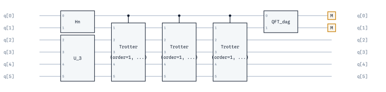

Primitives
------------

``qarp.blocks`` holds the blocks that can be used as part of
measurements or algorithms. These blocks are natively backed by qarpx (the compiled
``qx.Block`` command buffer described above); interop
with other frameworks is available at the edges via :py:meth:`~qarp.blocks.SimpleBlock.to_pytket`
/ :py:meth:`~qarp.blocks.SimpleBlock.from_pytket` and :py:meth:`~qarp.blocks.SimpleBlock.to_qasm3`. As a
block, all primitive blocks inherit ``n_qubits`` and ``target_qubits`` as optional arguments;
control them with ``ControlledBlock``.

AGate Block
^^^^^^^^^^^^^^^^^^^^^^^^^^^^^^^

``AGateBlock`` implements the A gate, a two-qubit entangling gate. In the qarpx LSB-first
basis ordering :math:`|q_1 q_0\rangle` (qubit 0 is the least-significant bit, see
:doc:`endianness`) its matrix representation is:

.. math::

   A = \begin{pmatrix}
   1 & 0 & 0 & 0 \\
   0 & -\cos(\theta) & e^{-i\phi}\sin(\theta) & 0 \\
   0 & e^{i\phi}\sin(\theta) & \cos(\theta) & 0 \\
   0 & 0 & 0 & 1
   \end{pmatrix}

This gate is useful when spanning states after a one-particle excitation, such as in
quantum-chemistry applications. For more details, the user is referred to the original
paper: Gard et al., `npj Quantum Information 6, 10 (2020) <https://www.nature.com/articles/s41534-019-0240-1>`_.

``AGateBlock`` requires arguments ``theta`` and ``phi`` which define the angles within the A gate. 

An example implementation is as follows:

.. code-block:: python

   from qarp.blocks import AGateBlock
   import numpy as np

   a_gate = AGateBlock(theta=0.5 / np.pi, phi=0.3 / np.pi).build()

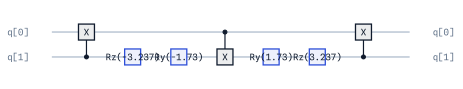

Brickwork Entangling Block
^^^^^^^^^^^^^^^^^^^^^^^^^^^

The ``BrickworkEntanglingBlock`` entangles qubit :math:`i` with qubit :math:`i+1` for even values of :math:`i`, then for odd values of :math:`i`. It corresponds to the
implementation in QURI Parts and to the 'pairwise' option in Qiskit, which also does even before odd. 

The arguments
permit a circular structure (:code:`circular=True`) in which the last qubit is also entangled with the first ones,
and to choose between CZ (:code:`use_cz=True`) or CX (:code:`use_cz=False`) for the entanglement. Additionally, the argument ``n_qubits`` is required and determines the number of qubits. 

An implementation is as follows:

.. code-block:: python

   from qarp.blocks import BrickworkEntanglingBlock

   n_qubits = 5
   block = BrickworkEntanglingBlock(n_qubits=n_qubits, circular=True, use_cz=False).build()

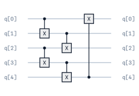

SimpleBlock (ad-hoc circuit construction)
^^^^^^^^^^^^^^^^^^^^^^^^^^^^^^^^^^^^^^^^^

For ad-hoc circuit construction, use :class:`~qarp.blocks.SimpleBlock` directly: build the gates inline by calling the inherited C++ gate-builder methods.

.. code-block:: python

   from qarp.blocks import SimpleBlock

   block = SimpleBlock(2, name="HnYn")
   block.h(0)
   block.h(1)
   block.y(0)
   block.y(1)
   block.build()

Cost Operator Block
^^^^^^^^^^^^^^^^^^^

``CostOperatorBlock`` is one of the primitive blocks (besides ``MixedOperatorBlock``) that constitute
the QAOA ansatz for finding approximate solutions to combinatorial optimisation problems. Specifically,
``CostOperatorBlock`` implements the unitary operator :math:`U_P(C, \gamma) = e^{-i\gamma C}`, for a given
angle :math:`\gamma` and Hamiltonian :math:`C` corresponding to the cost function of the optimisation
problem. Since this block is designed for graph-based problems, problem instances are defined in terms of 
:code:`qarp.graphs.Graph` instances.

This block takes as mandatory inputs ``n_qubits`` - number of qubits and ``problem`` - the graph. 
Optional inputs are ``linear_terms`` - dictionary of single qubit terms in the cost function and ``symbol_idx`` - index for symbolic parameter.

An implementation is as follows:

.. code-block:: python

   from qarp.blocks import CostOperatorBlock
   import networkx as nx

   n_nodes = 3
   my_graph = nx.erdos_renyi_graph(n=n_nodes, p=0.5)
   block = CostOperatorBlock(n_qubits=n_nodes, problem=my_graph).build()

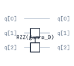

DOS-QPE Block
^^^^^^^^^^^^^^^^^^^^^^^^^^^^^^^^^^^^^^^^^^^^^^^^^^^^^^^^^

``DOSQPEBlock`` constructs the purification-based circuit used by
:ref:`Density of States Quantum Phase Estimation (DOS-QPE) <dos-qpe-section>`.
Whereas ordinary QPE estimates the phase associated with one prepared eigenstate,
DOS-QPE estimates a phase distribution from a mixed probe state. For a maximally mixed
probe, the weight of each eigenphase is proportional to its degeneracy.

For ``n_state`` system qubits and ``n_ancilla`` phase qubits, the block uses
``n_ancilla + 2 * n_state`` qubits, arranged as follows:

- ancillas ``0`` through ``n_ancilla - 1``;
- the state register, on which the preparation block and unitary act; and
- a same-size purification register.

The block applies Hadamards to the ancillas, prepares the probe on the state register,
and applies one CNOT from each state qubit to its partner in the purification register.
It then performs the controlled-unitary phase-estimation ladder and an inverse QFT on
the ancillas. The purification qubits are not measured; disregarding them produces the
mixed probe state. In particular, preparing ``HnBlock(n_state)`` makes this reduced
state the maximally mixed state. A different preparation block instead weights the
computational-basis components by its squared amplitude magnitudes.

Pass built blocks that both act on ``n_state`` qubits: ``eigenstate`` prepares the
probe and ``unitary`` supplies the phase evolution. Set ``measure=True`` to append a
measurement to each ancilla; sampling and phase-distribution processing are provided by
the higher-level :code:`DOSQPE` algorithm. The controlled unitary must preserve its
global phase exactly, because that phase becomes observable under control.

.. code-block:: python

   from qarp.operators import JordanWigner
   from qarp.operators.models import fermi_hubbard
   from qarp.blocks import TrotterBlock, DOSQPEBlock, HnBlock

   # Define the number of state and phase-estimation qubits.
   n_state = 2
   n_ancilla = 3

   # Build the unitary evolution for a two-qubit Fermi-Hubbard Hamiltonian.
   qham = JordanWigner().encode_operator(fermi_hubbard((1,), t=0.14, U=0.231))
   evolution = TrotterBlock(n_qubits=n_state, operator=qham).build()

   # Together with the purification CNOTs, this prepares a maximally mixed probe.
   probe = HnBlock(n_state).build()

   # Create and build the DOS-QPE block
   dosqpe_block = DOSQPEBlock(
       eigenstate=probe,
       unitary=evolution,
       n_ancilla=n_ancilla,
       n_state=n_state,
       measure=True,
   ).build()

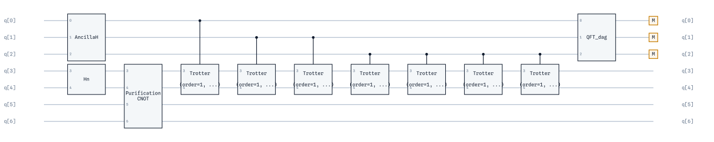

The ancilla register resolves phase bins of width :math:`2^{-n_\mathrm{ancilla}}`.

Givens Block
^^^^^^^^^^^^^^^^^^^^^^^^^^^^^^^

``GivensBlock`` implements the Givens rotation gate, a two-qubit gate that performs a rotation.
In the qarpx LSB-first basis ordering :math:`|q_1 q_0\rangle` (qubit 0 is the least-significant
bit, see :doc:`endianness`) its matrix representation is:

.. math::
   G = \begin{pmatrix}
   1 & 0 & 0 & 0 \\
   0 & \cos(\theta/2) & -\sin(\theta/2) & 0 \\
   0 & \sin(\theta/2) & \cos(\theta/2) & 0 \\
   0 & 0 & 0 & 1
   \end{pmatrix}

It is equivalent to the circuit displayed in Fig. 1.C of Nam et al, `npj Quantum Information (2020) 6, 33 <https://www.nature.com/articles/s41534-020-0259-3>`_, for bosonic excitations.

``GivensBlock`` requires input ``theta``, the angle of rotation in **radians**. 

An example implementation is as follows:

.. code-block:: python

   from qarp.blocks import GivensBlock
   import numpy as np

   # Givens rotation gate with rotation angle theta, in radians
   givens_gate = GivensBlock(theta=0.5 / np.pi).build()

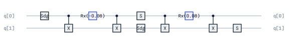

Orbital Rotation Block
^^^^^^^^^^^^^^^^^^^^^^^

``OrbitalRotationBlock(u)`` implements the many-body unitary :math:`U(u)` of a
real orthogonal single-particle (mode) rotation :math:`u`,

.. math::

   U(u)^\dagger a^\dagger_p U(u) = \sum_q u_{qp}\, a^\dagger_q,
   \qquad U(u)|0\ldots0\rangle = |0\ldots0\rangle,

as an exact — not Trotterized — chain of adjacent-mode ``GivensBlock`` gates
plus a trailing layer of ``Z`` gates absorbing the :math:`\pm1` diagonal
remainder of the Givens QR decomposition of :math:`u`. Because every
eliminated pair is adjacent, its Jordan-Wigner parity string is empty, so
each two-mode rotation is already a plain two-qubit ``GivensBlock`` and the
construction never needs parity-string uncomputation (Kivlichan et al.,
`Phys. Rev. Lett. 120, 110501 (2018) <https://arxiv.org/abs/1711.04789>`_).

Mode :math:`p` is qubit :math:`p` under Jordan-Wigner, so the block is
JW-only: the same :math:`u` under ``bravyi_kitaev`` or ``parity_transform``
needs different gates. Rows of :math:`u` are spin orbitals in interleaved
abab order (§1): row :math:`2\cdot\mathrm{spatial}` is the :math:`\alpha`
spin orbital, row :math:`2\cdot\mathrm{spatial}+1` its :math:`\beta` partner.
Expand a spatial-orbital rotation with
:func:`qarp.operators.integrals.spatial_to_spin_orbital` before use — the
same rotation then acts on both spin sublattices.

``OrbitalRotationBlock`` requires the real orthogonal matrix ``u``. Optional
``dagger`` emits :math:`U(u)^\dagger` (the reversed chain with negated
angles — the direction needed to rotate *into* a measurement basis). The
block accepts the standard ``target_qubits`` and ``name`` options; ``det(u)
= -1`` is absorbed by the sign layer rather than rejected.

The following three-mode example rotates into a basis derived from a random
orthogonal matrix:

.. code-block:: python

   import numpy as np

   from qarp.blocks import OrbitalRotationBlock

   rng = np.random.default_rng(0)
   q, r = np.linalg.qr(rng.normal(size=(3, 3)))
   u = q @ np.diag(np.sign(np.diag(r)))  # real orthogonal

   orbital_rotation = OrbitalRotationBlock(u).build()
   assert orbital_rotation.n_qubits == 3

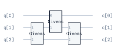

Haar Random Block
^^^^^^^^^^^^^^^^^^

``HaarRandomBlock`` produces Haar-random unitary circuits.

A Haar-random unitary is a unitary matrix drawn uniformly at random from the unitary group
:math:`U(d)` with respect to the Haar measure, the unique left- and right-invariant probability
measure on :math:`U(d)`. For :math:`d = 2^n`, this gives a uniformly random :math:`n`-qubit
unitary. The exact sampling uses the QR decomposition of a random Gaussian matrix
(`Mezzadri, Notices of the AMS 54, 592 (2007) <https://arxiv.org/abs/math-ph/0609050>`_).

.. warning::

   Implementing a generic Haar-random unitary as a quantum circuit requires
   :math:`\mathcal{O}(4^n)` CNOT gates (`Knill, arXiv:quant-ph/9508006
   <https://arxiv.org/abs/quant-ph/9508006>`_; `Shende, Bullock & Markov, IEEE Trans. CAD 25,
   1000 (2006) <https://arxiv.org/abs/quant-ph/0406176>`_). Exact Haar-random synthesis
   should only be used for small qubit counts. For larger systems, use the approximate
   t-design construction instead.

A unitary :math:`t`-design is an ensemble of unitaries :math:`\{U_i\}` that reproduces the first
:math:`t` moments of the Haar measure (`Gross, Audenaert & Eisert, J. Math. Phys. 48, 052104
(2007) <https://arxiv.org/abs/quant-ph/0611002>`_). That is, for any polynomial :math:`f` of
degree at most :math:`t` in the entries of :math:`U` and :math:`U^\dagger`:

.. math::

   \frac{1}{|S|}\sum_{U_i \in S} f(U_i) = \int_{U(d)} f(U)\, d\mu(U)

Local random circuits of depth :math:`\mathcal{O}(n \cdot t)` on a 1-D chain form approximate
unitary :math:`t`-designs (`Brandao, Harrow & Horodecki, Commun. Math. Phys. 346, 397 (2016)
<https://arxiv.org/abs/1208.0692>`_), making them substantially more efficient on a quantum
computer than exact Haar-random synthesis for most practical applications.

It supports two construction strategies:

1. **Exact Haar random** (default): samples a unitary from the Haar measure and synthesises a circuit implementing it exactly.
2. **Approximate t-design** (``t_design=t``): builds a local random circuit of alternating Haar-random single-qubit gates and nearest-neighbour CX layers, approximating a unitary t-design.

The block requires ``n_qubits``. Optional arguments are ``t_design`` (if set, uses approximate construction),
``depth`` (number of layers for t-design, defaults to ``n_qubits * t_design``), ``seed`` for reproducibility,
and ``real`` (if True, samples from the orthogonal group instead of the unitary group, exact mode only).

Use ``get_haar_state()`` to extract the state :math:`U|0\dots0\rangle`, and ``reseed()`` to generate independent
random circuits from the same specification.

**Example 1: Exact Haar-random unitary**

.. code-block:: python

   from qarp.blocks import HaarRandomBlock

   block = HaarRandomBlock(n_qubits=3, seed=42).build()
   state = block.get_haar_state()

**Example 2: Approximate t-design**

.. code-block:: python

   from qarp.blocks import HaarRandomBlock

   block = HaarRandomBlock(n_qubits=4, t_design=2, seed=0).build()

Hadamard Test Block
^^^^^^^^^^^^^^^^^^^^

The ``HadamardTestBlock`` implements the Hadamard test circuit, which is commonly used to evaluate overlaps, expectation values and transition amplitudes.
Which circuit you obtain from the ``HadamardTestBlock`` object depends on the input arguments. 

The required input arguments are: ``state`` - initial state preparation block and
``unitary`` - the unitary operator U to test. Optional arguments are: ``unitary_dagger`` - unitary to apply for backward evolution, ``estimate_imaginary`` - estimate imaginary part if True, real part if False, 
and ``measure`` - whether to add measurement of the ancilla qubit. The standard Block kwarg ``target_qubits``
is also accepted.

An example implementation for the real part of an overlap value is shown below:

.. code-block:: python

   from qarp.blocks import HadamardTestBlock, IdentityBlock, HnBlock, XnBlock

   id = IdentityBlock(n_qubits=4)
   u0 = HnBlock(n_qubits=4)
   u1 = XnBlock(n_qubits=4)
   block = HadamardTestBlock(state=id, unitary=u0, unitary_dagger=u1).build()

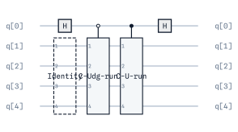

Interferometric State and Measurement Blocks
^^^^^^^^^^^^^^^^^^^^^^^^^^^^^^^^^^^^^^^^^^^^^^

``InterferometricStateBlock`` prepares the measurement-free interferometric
transition state

.. math::

   \frac{1}{\sqrt{2}}\bigl(|0\rangle|\phi\rangle + |1\rangle|\psi\rangle\bigr),

where ``bra`` prepares :math:`|\phi\rangle` and ``ket`` prepares
:math:`|\psi\rangle` on the same number of qubits. Qubit 0 is the
interferometric ancilla and qubits ``1..n`` are the state register. The
branch synthesis is delegated to ``HadamardTestBlock`` (including its
branch-sharing optimization for similar state-preparation circuits), and the
optional ``estimate_imaginary`` selects which quadrature the ancilla
encodes. No basis rotations or measurements are appended, so the block can
be embedded in a larger circuit or measured by a caller-specific primitive —
for example a custom observable, amplitude estimation, or tomography.

``InterferometricMeasurementBlock`` wraps the same construction with local
basis rotations and terminal measurements for a qubit-wise-commuting (QWC)
Pauli group. ``basis`` maps state-register qubits (indexed from zero,
excluding the ancilla) to one of ``"X"``, ``"Y"``, ``"Z"``; qubits omitted
from ``basis`` stay in the computational ``Z`` basis. Both blocks require
``bra`` and ``ket`` to act on the same number of qubits and accept the
standard ``name`` option (neither accepts ``target_qubits``: the ancilla is
always the block's own qubit 0).

.. code-block:: python

   from qarp.blocks import IdentityBlock, InterferometricStateBlock, XnBlock

   bra = IdentityBlock(n_qubits=2)
   ket = XnBlock(n_qubits=2)

   block = InterferometricStateBlock(bra=bra, ket=ket).build()

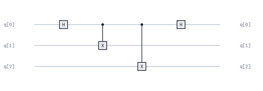

.. code-block:: python

   from qarp.blocks import IdentityBlock, InterferometricMeasurementBlock, XnBlock

   bra = IdentityBlock(n_qubits=2)
   ket = XnBlock(n_qubits=2)

   # Measure qubit 0 of the state register in the X basis, qubit 1 in Z.
   block = InterferometricMeasurementBlock(
       bra=bra, ket=ket, basis={0: "X", 1: "Z"}
   ).build()

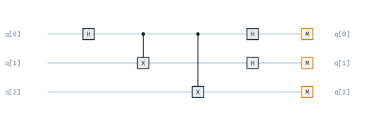

Hn Block
^^^^^^^^^

``HnBlock`` implements a superposition state among all the possible quantum basis states, by applying a Hadamard
gate in each of the qubits. 

It takes ``n_qubits`` - number of qubits as an input. 

An implementation is as follows:

.. code-block:: python

   from qarp.blocks import HnBlock

   n_qubits = 4
   block = HnBlock(n_qubits=n_qubits).build()

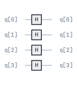

Identity Block
^^^^^^^^^^^^^^^^^^^^^

The ``IdentityBlock`` object applies an identity to some number of qubits, not impacting their state. This block requires the argument ``n_qubits`` - number of qubits.
It emits **no gates at all** — ``build()`` produces an empty command list, so the
block is a placeholder that reserves a register width (and can be given controls
or target qubits like any other) rather than something that draws on the circuit.
An example implementation is as follows:

.. code-block:: python

   from qarp.blocks import IdentityBlock

   identity = IdentityBlock(n_qubits=4).build()
   assert len(list(identity.flatten())) == 0

Layer Block
^^^^^^^^^^^^^

``LayerBlock`` constructs a layer of identical gates across a register of qubits. It supports single-qubit, two-qubit, and three-qubit gates,
including both static gates (e.g. ``H``, ``CX``, ``CCX``) and parameterised gates (e.g. ``Rx``, ``Ry``, ``U``).

**Required arguments:**

- ``gate_type``: A ``qarpx.GateType`` specifying which gate to use.
- ``n_qubits``: Total number of qubits in the circuit.

**Optional arguments:**

- ``qubit_indices``: List of qubit indices where gates are applied (defaults to all qubits).
- ``overlapping``: Number of qubits shared between consecutive multi-qubit gates (default ``0``). For example, with 2-qubit gates and ``overlapping=1``, gates are applied to qubits ``(0,1), (1,2), (2,3), ...``.
- ``periodic_boundary``: If ``True``, wraps around so the last qubit connects back to the first (default ``False``).
- ``parameters``: Parameter values or ``sympy`` symbols for parameterised gates. Can be either a single set of parameters (reused for all gates) or a flattened list with parameters for each gate. Angles are in **radians**.

**Example 1: Layer of Hadamard gates**

.. code-block:: python

   from qarp.blocks import LayerBlock
   import qarpx as qx

   # Apply H gate to all 4 qubits
   h_layer = LayerBlock(gate_type=qx.GateType.H, n_qubits=4).build()

**Example 2: Layer of parameterised Ry gates**

.. code-block:: python

   from qarp.blocks import LayerBlock
   from sympy import Symbol
   import qarpx as qx

   # Create symbolic parameters for each qubit
   params = [Symbol(f"theta_{i}") for i in range(4)]
   ry_layer = LayerBlock(gate_type=qx.GateType.Ry, n_qubits=4, parameters=params).build()

**Example 3: Overlapping 3-qubit gates with periodic boundary**

.. code-block:: python

   from qarp.blocks import LayerBlock
   import qarpx as qx

   # CCX gates with 2-qubit overlap and periodic wrapping
   block = LayerBlock(gate_type=qx.GateType.CCX, n_qubits=5, overlapping=2, periodic_boundary=True).build()

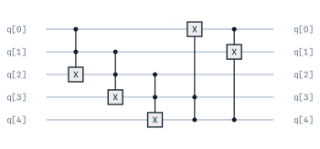

HEA Block
^^^^^^^^^^^^^^^^^^
``HEABlock`` constructs a Hardware-Efficient Ansatz by stacking rotation and entangling layers, as in
Kandala et al (`Kandala et al., Nature, 549, 242–246 (2017) <https://www.nature.com/articles/nature23879>`_).

This block takes the following arguments:
``n_qubits`` - number of qubits, ``n_layers`` - number of HEA layers, ``real`` - if True, use only RY rotations,
``linear`` - whether to use linear entanglement (True) or brickwork entanglement (False), ``circular`` - whether to use periodic boundary conditions for entanglement layers (True)
and ``use_cz`` - whether to use CZ gates for entanglement (True) or CNOT (False).

An implementation is as follows:

.. code-block:: python

   from qarp.blocks import HEABlock

   hea = HEABlock(n_qubits=4, n_layers=2, real=True, linear=False, circular=True, use_cz=True).build()

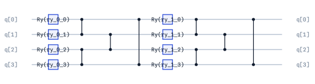

   Two layers, each an ``Ry`` rotation on every qubit followed by a circular
   brickwork entangling layer. ``HEABlock`` emits these gates directly rather
   than as one box per layer, so the repeating structure is visible in the
   figure.

Brickwork PCE Block
^^^^^^^^^^^^^^^^^^^^^^^^^^^^^^^^^^^^

``BrickworkPCEBlock`` constructs the brickwork ansatz used in the original
:ref:`Pauli Correlation Encoding (PCE) <pce-section>` paper
(`Sciorilli et al., Nature Communications 16, 476 (2025)
<https://doi.org/10.1038/s41467-024-55346-z>`_), by stacking
``n_layers`` PCE layers. Each layer applies three single-qubit
rotation sublayers (``Rx``, ``Ry``, ``Rz``) interleaved with brickwork
:math:`R_{xx}(\theta) = e^{-i\theta X \otimes X / 2}` entangling sublayers
(native ``RXX`` gate). Following
:class:`~qarp.blocks.BrickworkEntanglingBlock`'s tiling, entangling sublayers
alternate between even pairs :math:`(0,1),(2,3),\dots` and odd pairs
:math:`(1,2),(3,4),\dots` — even pairs after ``Rx``, odd pairs after ``Ry``,
even pairs again after ``Rz``.

This block takes ``n_qubits`` - number of qubits and ``n_layers`` - number of PCE
layers to stack. It also accepts the standard ``target_qubits`` and ``name`` options.

An implementation is as follows:

.. code-block:: python

   from qarp.blocks import BrickworkPCEBlock

   n_qubits = 5
   block = BrickworkPCEBlock(n_qubits=n_qubits, n_layers=1).build()

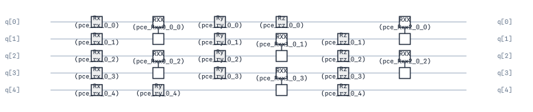

Symmetry Preserving Ansatz Block
^^^^^^^^^^^^^^^^^^^^^^^^^^^^^^^^^^^^^^^^^^^

``SPABlock`` builds a layered symmetry-preserving ansatz from two-qubit
separable-pair gates. These gates leave the zero- and two-excitation basis states
unchanged while mixing the one-excitation subspace, making the ansatz useful when the
corresponding excitation-number symmetry should be retained.

Choose the gate family with ``real``:

- ``real=True`` uses one-parameter ``RSPBlock`` gates and keeps the circuit
  real-valued;
- ``real=False`` uses two-parameter ``AGateBlock`` gates, adding a phase
  parameter to the variational freedom.

Each of the ``n_layers`` layers applies an entangler to adjacent qubit pairs. With
``linear=True``, the pairs are ``(0, 1), (1, 2), ...``. With ``linear=False``, the
block uses brickwork ordering: odd pairs first, followed by even pairs. Setting
``circular=True`` additionally applies the closing pair ``(n_qubits - 1, 0)`` in
every layer. For an even number of qubits, a non-circular layer contains
``n_qubits - 1`` pair gates and a circular layer contains ``n_qubits``.

The block carries one symbolic ``spa_theta_<layer>_<i>_<j>`` parameter per pair in
real mode, and both ``spa_theta`` and ``spa_phi`` parameters per pair otherwise.
It also accepts the standard ``target_qubits`` and ``name`` options.

The following example builds a two-layer, circular brickwork ansatz of A-gates:

.. code-block:: python

   from qarp.blocks import SPABlock

   spa = SPABlock(
       n_qubits=4,
       n_layers=2,
       real=False,
       linear=False,
       circular=True,
   ).build()

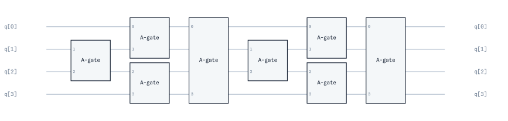

Linear Combination of Unitaries and Block Encoding
^^^^^^^^^^^^^^^^^^^^^^^^^^^^^^^^^^^^^^^^^^^^^^^^^^^

``LinearCombinationUnitaries`` decomposes a dense matrix into Pauli strings,

.. math::

   A = \sum_i c_i P_i,

where each :math:`P_i` is a tensor product of ``I``, ``X``, ``Y``, and ``Z``. A matrix
whose dimensions are not a power of two is zero-padded to the next square power-of-two
dimension by default. The decomposition preserves complex coefficients. Strings are
qubit-ordered like ``QubitOperator`` terms — character :math:`k` acts on qubit :math:`k`,
and ``A`` is read in the qarpx LSB basis (row/column bit :math:`k` is qubit :math:`k`),
so ``'XI'`` is :math:`X_0` and ``'IX'`` is :math:`X_1`. The full LCU API is covered in
:doc:`operators`.

``BlockEncodingBlock`` turns that LCU into a unitary circuit. It first prepares the
ancilla amplitudes :math:`\sqrt{|c_i|/\lambda}`, applies the selected Pauli term and its
coefficient phase, then unprepares the ancillas. Here
:math:`\lambda = \sum_i |c_i|`, available as ``lambda_norm`` (or
``lambda_factor()`` for compatibility). Consequently, the all-zero ancilla sector obeys

.. math::

   (\langle 0|_\mathrm{anc} \otimes I) U (|0\rangle_\mathrm{anc} \otimes I)
   = A / \lambda.

Pass either a dense ``numpy.ndarray``, a ``QubitOperator``, or explicit keyword-only
``coefficients`` and ``unitaries``. The LCU requires
``max(1, ceil(log2(number_of_terms)))`` ancilla qubits; the remaining qubits form the
target register.

The following example uses a two-qubit, Hamiltonian-like matrix with four Pauli terms.
It therefore uses two LCU ancillas and two target qubits, then checks the projected
sector:

.. code-block:: python

   import numpy as np
   import qarpx as qx

   from qarp.blocks import BlockEncodingBlock
   from qarp.operators import LinearCombinationUnitaries

   identity = np.eye(2, dtype=complex)
   x = np.array([[0, 1], [1, 0]], dtype=complex)
   y = np.array([[0, -1j], [1j, 0]], dtype=complex)
   z = np.diag([1, -1]).astype(complex)

   # A = 0.35 XX - 0.20 YY + 0.15 ZI + 0.10 IZ.
   A = (
       0.35 * np.kron(x, x)
       - 0.20 * np.kron(y, y)
       + 0.15 * np.kron(z, identity)
       + 0.10 * np.kron(identity, z)
   )
   decomposition = LinearCombinationUnitaries(A).decomposition()
   assert {pauli for pauli, _ in decomposition} == {"XX", "YY", "ZI", "IZ"}

   block_encoding = BlockEncodingBlock(A, name="Block encoding").build()
   assert block_encoding.num_controls == 2
   assert block_encoding.n_qubits == 4
   full_unitary = np.asarray(
       qx.QarpSimulator().unitary_matrix(
           block_encoding.flatten(), block_encoding.n_qubits
       )
   )

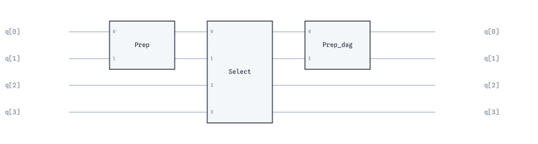

The ancilla register occupies qubits ``0`` through ``num_controls - 1`` in qarpx's
LSB convention, so the ``ancilla = 0`` sector is strided, not the contiguous top-left
corner. No bit reversal is involved: ``A`` is read in the same LSB basis the circuit
uses (see :doc:`endianness`). Extract the sector as follows:

.. code-block:: python

   n_anc = block_encoding.num_controls
   n_target = block_encoding.n_qubits - n_anc
   idx = [i * 2**n_anc for i in range(2**n_target)]
   recovered = full_unitary[np.ix_(idx, idx)] * block_encoding.lambda_norm

   assert np.allclose(recovered, A, atol=1e-12)

Linear Entangling Block
^^^^^^^^^^^^^^^^^^^^^^^^

``LinearEntanglingBlock`` entangles qubit :math:`i` with the next qubit :math:`i+1` for all values
of :math:`i`. Similar to :code:`BrickworkEntanglingBlock`, ``LinearEntanglingBlock`` allows two optional
parameters: (:code:`circular=True`), to entangle the first and last qubit, and (:code:`use_cz=True`)
or (:code:`use_cz=False`), to use CZ or CX respectively as the entangling gate. The parameter ``n_qubits``
is not optional and determines the number of qubits. 

An implementation is as follows:

.. code-block:: python

   from qarp.blocks import LinearEntanglingBlock

   n_qubits = 5
   block = LinearEntanglingBlock(n_qubits=n_qubits, circular=False, use_cz=True).build()

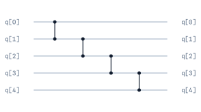

Readout Block
^^^^^^^^^^^^^^^^^^

``ReadoutBlock`` is a type of ``SimpleBlock`` for appending measurements to a circuit of
a given number of qubits ``n_qubits``.

Let's just create a very simple circuit to demonstrate:

.. code-block:: python

   from qarp.blocks import ReadoutBlock, ComputationalBasisStateBlock, CompositeBlock

   state = ComputationalBasisStateBlock([1, 1, 0, 0]).build()
   meas = ReadoutBlock(n_qubits=4)

   block = CompositeBlock([state, meas]).build()

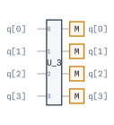

Mixed Operator Block
^^^^^^^^^^^^^^^^^^^^^

``MixedOperatorBlock`` is part of the QAOA ansatz, and it applies a layer of :math:`R_x`
rotation gates to :math:`n` qubits. Specifically, ``MixedOperatorBlock`` implements the
unitary operator :math:`U_M(X, \beta) = \bigotimes_{i=1}^n e^{-i\beta X_i / 2}`, where
the rotation angle  :math:`\beta` is given in **radians**.

The block parameters are ``n_qubits``, for the number of qubits, and ``symbol_idx``, as an
optional parameter specifying the layer index of :math:`\beta`.

Example:

.. code-block:: python

   from qarp.blocks import MixedOperatorBlock

   n_nodes = 3
   block = MixedOperatorBlock(n_qubits=n_nodes).build()

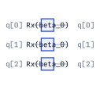

Paired Unitary Coupled Cluster Doubles (UPCCD) Block
^^^^^^^^^^^^^^^^^^^^^^^^^^^^^^^^^^^^^^^^^^^^^^^^^^^^^^
``UPCCDBlock`` implements the paired unitary coupled-cluster doubles (UPCCD) ansatz
for closed-shell fermionic systems under an interleaved Jordan--Wigner encoding. For
spatial orbital :math:`p`, qubits ``2 * p`` and ``2 * p + 1`` represent the alpha and
beta spin orbitals, respectively. The block applies Givens rotations between occupied
and virtual alpha orbitals, then CNOTs from every alpha qubit to its beta partner to
restore the paired occupation.

``basis_state`` defines the *closed-shell* reference (a plain list of 0s and 1s) that
determines the allowed paired excitations. It must have an even number of entries, equal
alpha/beta occupations, and an Aufbau ordering; for example, ``[1, 1, 0, 0, 0, 0]``
represents one occupied pair in three spatial orbitals. It is not the state-preparation
input to the circuit. Instead, prepare the alpha-only reference (``[1, 0, 0, 0, 0, 0]``
in this example) before applying the UPCCD block, because its final CNOT layer copies
alpha occupations to beta qubits.

Without ``t2``, one symbolic parameter ``pd<i>_<j>`` is created for each allowed
occupied-to-virtual pair. Supply ``t2`` with shape
``(number_of_electron_pairs, number_of_virtual_spatial_orbitals)`` to initialize those
parameters. Entries smaller than ``threshold`` are omitted. The block also accepts the
standard ``target_qubits`` and ``name`` options.

The following six-qubit example has one occupied pair and two virtual orbitals:

.. code-block:: python

   import numpy as np

   from qarp.blocks import CompositeBlock, ComputationalBasisStateBlock, UPCCDBlock

   closed_shell_reference = [1, 1, 0, 0, 0, 0]
   alpha_reference = [1, 0, 0, 0, 0, 0]
   t2 = np.array([[0.12, -0.07]])

   upccd = UPCCDBlock(basis_state=closed_shell_reference, t2=t2).build()
   reference = ComputationalBasisStateBlock(alpha_reference)
   ansatz = CompositeBlock([reference, upccd], n_qubits=6).build()

   # Substitute the supplied paired-double amplitudes in the composite circuit.
   ansatz_with_amplitudes = ansatz.set_symbols(upccd.symbol_parameter_map)

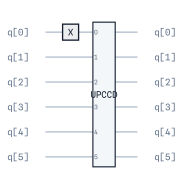

Pauli Block
^^^^^^^^^^^^^^^^^^^^^^^^^^^^

``PauliBlock`` encapsulates a Pauli string (a tensor product of Pauli operators) into a reusable block.
This is useful for applying Pauli operators in algorithms, preparing measurement bases, or constructing Hamiltonian terms.

**Required arguments:**

- ``pauli_string``: The Pauli operators to apply. Can be specified in two formats:

  - **String format**: A string like ``"XYZZ"`` where each character corresponds to a qubit (e.g. qubit 0 gets X, qubit 1 gets Y, etc.). Use ``"I"`` for identity.
  - **Dictionary format**: A dict mapping qubit indices to operators, e.g. ``{0: "X", 2: "Z"}`` applies X to qubit 0 and Z to qubit 2 (other qubits unchanged).

**Optional arguments:**

- ``coefficient``: Complex coefficient for the Pauli term. The phase of the coefficient is applied as a global phase.
- ``phase``: Global phase in radians (mutually exclusive with ``coefficient``).
- ``n_qubits``: Total number of qubits (required for dictionary format if indices don't cover all qubits).
- ``change_basis``: If ``True``, emits basis-change gates for measurement (H for X-basis, Sdg then H for Y-basis, nothing for Z) **instead of** the Pauli operators themselves, so ``PauliBlock("XZ", change_basis=True)`` yields a single ``H`` rather than ``X``, ``Z``.
- ``measure``: If ``True``, appends measurements to all qubits.

**Example 1: Simple Pauli string**

.. code-block:: python

   from qarp.blocks import PauliBlock

   # Apply X⊗Y⊗Z⊗Z to 4 qubits
   pauli_block = PauliBlock("XYZZ").build()

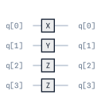

**Example 2: Sparse Pauli string using dictionary format**

.. code-block:: python

   from qarp.blocks import PauliBlock

   # Apply Z to qubits 1 and 3 only (in a 5-qubit system)
   pauli_block = PauliBlock({1: "Z", 3: "Z"}, n_qubits=5).build()

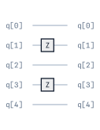

**Example 3: Pauli term with coefficient (for Hamiltonian simulation)**

.. code-block:: python

   from qarp.blocks import PauliBlock

   # Pauli term with complex coefficient 0.5j
   pauli_block = PauliBlock("XY", coefficient=0.5j).build()

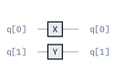

**Example 4: Measurement in the Pauli basis**

.. code-block:: python

   from qarp.blocks import PauliBlock

   # Prepare measurement in the X⊗Z basis
   measurement_block = PauliBlock("XZ", change_basis=True, measure=True).build()

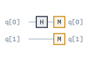

Phase Shift Block
^^^^^^^^^^^^^^^^^^^^^^^
``PhaseShiftBlock`` implements the single-qubit phase gate

.. math::

   P(\theta) = \begin{pmatrix}1 & 0 \\ 0 & e^{i\theta}\end{pmatrix}.

It leaves :math:`|0\rangle` unchanged and multiplies :math:`|1\rangle` by
:math:`e^{i\theta}`. It is therefore a relative phase, not a global phase. The required
``phase`` angle is in radians. Use ``target_qubits`` to place the one-qubit block within
a larger circuit; wrap it in ``ControlledBlock`` for a controlled version.

For example:

.. code-block:: python

   import numpy as np
   import qarpx as qx

   from qarp.blocks import PhaseShiftBlock

   phase = np.pi / 3
   block = PhaseShiftBlock(phase=phase).build()

   unitary = np.asarray(qx.QarpSimulator().unitary_matrix(block.flatten(), block.n_qubits))
   expected = np.diag([1.0, np.exp(1j * phase)])
   assert np.allclose(unitary, expected)

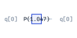

Projected Control Phase Block
^^^^^^^^^^^^^^^^^^^^^^^^^^^^^^^^^^^

``ProjectedControlPhaseBlock`` implements a diagonal, subspace-selective phase
operation. For a ``dim``-dimensional prefix of the computational basis, it realizes

.. math::

   D(\phi, d) = \operatorname{diag}(\underbrace{e^{i\phi}, \ldots,
   e^{i\phi}}_{d}, \underbrace{e^{-i\phi}, \ldots,
   e^{-i\phi}}_{2^n-d}).

Here ``phase`` is :math:`\phi` in radians, ``dim`` is :math:`d`, and ``n_qubits`` is
:math:`n`. The prefix contains computational-basis indices ``0`` through ``dim - 1``;
these indices follow qarpx's LSB qubit convention. ``dim`` may range from ``0`` to
``2**n_qubits``. At either endpoint the operation is only a global phase; otherwise the
two subspaces acquire a relative phase :math:`e^{2 i \phi}`.

The block uses diagonal-unitary synthesis, so numerical comparisons should disregard an
overall global phase. It also accepts the standard ``target_qubits`` and ``name``
options. For two qubits with ``dim=1``, the ideal
diagonal is

.. math::
   R = \begin{pmatrix}
   e^{i \phi} & 0 & 0 & 0 \\
   0 & e^{-i\phi} & 0 & 0 \\
   0 & 0 & e^{-i\phi} & 0 \\
   0 & 0 & 0 & e^{-i\phi}
   \end{pmatrix}

The following three-qubit example phases the first three basis states:

.. code-block:: python

   import numpy as np
   import qarpx as qx

   from qarp.blocks import ProjectedControlPhaseBlock

   phase = np.pi / 5
   dim = 3
   n_qubits = 3
   block = ProjectedControlPhaseBlock(phase=phase, dim=dim, n_qubits=n_qubits).build()

   unitary = np.asarray(qx.QarpSimulator().unitary_matrix(block.flatten(), n_qubits))
   expected = np.array(
       [np.exp(1j * phase)] * dim
       + [np.exp(-1j * phase)] * (2**n_qubits - dim)
   )

   # The synthesis is exact, global phase included.
   assert np.allclose(unitary, np.diag(expected))

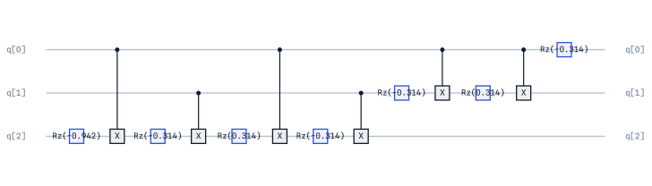

.. _projector-blocks-section:

Projector Blocks
^^^^^^^^^^^^^^^^

OpenQARP provides at the moment four symmetry-projector blocks:

- ``ParticleNumberProjectorBlock(n_qubits, Npart)`` selects the sector with
  exactly ``Npart`` occupied spin orbitals, where ``Npart`` is an integer from
  zero through ``n_qubits``.
- ``SzProjectorBlock(n_qubits, Ms)`` selects an eigenvalue ``Ms`` of total
  :math:`S_z`. Spin orbitals use the alternating convention in which even
  qubits are alpha orbitals and odd qubits are beta orbitals.
- ``SyProjectorBlock(n_qubits, My)`` selects an eigenvalue ``My`` of total
  :math:`S_y`. It uses adjacent alpha/beta pairs and therefore requires an
  even number of system qubits.
- ``SpinSquaredProjectorBlock(n_qubits, S, Ms=...)`` selects both the
  :math:`S^2=S(S+1)` and :math:`S_z=M_s` sectors. It requires an even number
  of system qubits and valid integer or half-integer spin quantum numbers.

These blocks implement the LCU symmetry-projector constructions described by
Khinevich and Mizukami in `Symmetry-Adapted State Preparation for Quantum
Chemistry on Fault-Tolerant Quantum Computers
<https://arxiv.org/pdf/2601.08533>`_, using equivalent OpenQARP phase conventions. OpenQARP extends that
construction with a standalone :math:`S_y` projector and explicit support for
half-integer-spin sectors. The classes documented here use the LCU
route with internal implementations; not the alternative GQSP or GQSVT projector
constructions.

These are unitary **block encodings** of non-unitary projectors. If :math:`P`
denotes the desired projector and :math:`U_P` the complete circuit, then

.. math::

   \langle 0\ldots0|_{\mathrm{anc}} U_P
   |0\ldots0\rangle_{\mathrm{anc}} = \frac{P}{\lambda}.

The LCU ancillas are the lowest-index qubits and the system register is exposed
as ``system_qubits``. ``num_controls`` gives the number of LCU ancillas and
``lambda_norm`` (also returned by ``lambda_factor()``) is :math:`\lambda`.
Consequently, applying the full unitary does not deterministically project a
state: the projector is obtained from the all-zero ancilla branch, with
success probability :math:`\|P|\psi\rangle\|^2/\lambda^2`.

The particle-number, :math:`S_z`, and :math:`S_y` blocks use exact
roots-of-unity filters with ``n_qubits + 1`` LCU terms. The spin-squared block
uses an Euler-angle quadrature with ``n_alpha * n_beta * n_gamma`` terms; its
positive grid sizes may be overridden when a different accuracy/resource
trade-off is required. All projector blocks expose ``n_terms``,
``lcu_coefficients``, and ``unitaries`` for inspecting the decomposition.

The following two-system-qubit example extracts the one-particle projector
from the all-zero ancilla block and checks it against its exact matrix:

.. code-block:: python

   import numpy as np
   import qarpx as qx

   from qarp.blocks import ParticleNumberProjectorBlock

   projector = ParticleNumberProjectorBlock(
       n_qubits=2, Npart=1, name="P1"
   ).build()
   unitary = np.asarray(
       qx.QarpSimulator().unitary_matrix(projector.flatten(), projector.n_qubits)
   )

   # qarpx is LSB-first, so fixing the low ancilla bits to zero gives
   # strided system-register indices.
   zero_ancilla = [
       system_state * 2**projector.num_controls
       for system_state in range(2**projector.n_system_qubits)
   ]
   encoded = unitary[np.ix_(zero_ancilla, zero_ancilla)]
   recovered_projector = projector.lambda_norm * encoded

   expected = np.diag([0.0, 1.0, 1.0, 0.0])
   assert np.allclose(recovered_projector, expected, atol=1e-10)

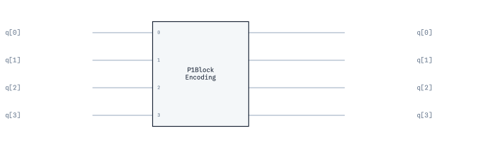

QAOABlock
^^^^^^^^^

``QAOABlock`` is a type of ``CompositeBlock`` that constructs an ansatz for the Quantum Approximate
Optimization Algorithm (QAOA) with :math:`p` layers. It consists of an ``HnBlock`` block across all
qubits to initially create a superposition between all computational basis states, followed by
:math:`p` layers of ``CostOperatorBlock`` and ``MixedOperatorBlock`` blocks. The resulting circuit
contains a total of :math:`2p` parameters, which are optimized during the algorithm's execution.

Required parameters of ``QAOABlock`` are as follows: ``n_qubits``, the number of qubits; ``n_layers``,
the number of QAOA layers :math:`p`; and, ``problem``, a graph defining the optimisation problem
instance. Optional parameters are as follows: ``linear_terms``, a dictionary of linear
(single-qubit) terms in the cost function; and, ``use_rzz``, to emit each cost term as a native
``RZZ`` rotation (``use_rzz=True``) or as its ``CX·Rz·CX`` decomposition (``use_rzz=False``).

The example below shows how to create a ``QAOABlock`` from a graph, where the number of qubits
corresponds to the number of nodes in the graph.

First, we create a random graph using NetworkX:

.. code-block:: python

   import networkx as nx

   n_nodes = 5
   n_edges = 20
   seed = 1234

   G = nx.gnm_random_graph(n_nodes, n_edges, seed=seed)
   for u, v in G.edges:
       G[u][v]['weight'] = 2

Next, we construct the ``QAOABlock`` based on the graph and visualize it using OpenQARP's built-in plotting functionality:

.. code-block:: python

   from qarp.blocks import QAOABlock

   block = QAOABlock(n_qubits=n_nodes, n_layers=3, problem=G, use_rzz=True).build()
   block.plot()

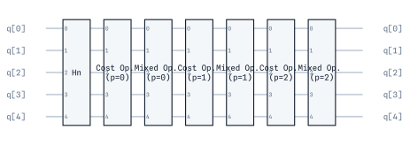

QFT Block
^^^^^^^^^^^^^^^^^^^^^^^^^^^

``QFTBlock`` implements the quantum fourier transform (QFT):

.. math::

   |j\rangle \longrightarrow \frac{1}{\sqrt{N}} \sum_{k=0}^{N-1} e^{2\pi i j k / N} |k\rangle

The inverse quantum fourier transform can be found by taking the dagger of the QFT. 

For inputs the block takes ``n_qubits`` - number of qubits. 

An example implementation is as follows:

.. code-block:: python

   from qarp.blocks import QFTBlock

   n_qubits = 4
   qft = QFTBlock(n_qubits).build()

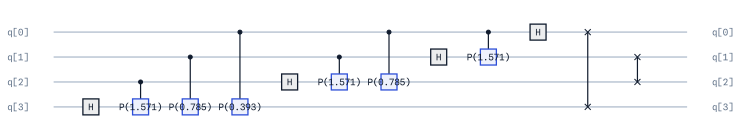

QPE Block
^^^^^^^^^^^^^^^^^^^^^^^^^^^^^^^

``QPEBlock`` builds the circuit underlying quantum phase estimation. Given an
eigenstate :math:`|\psi\rangle` of a unitary :math:`U`,

.. math::

   U|\psi\rangle = e^{2\pi i\phi}|\psi\rangle,

it writes an :math:`n_\mathrm{ancilla}`-bit estimate of :math:`\phi` into an
ancilla register. The block itself builds a circuit; sampling and selecting the most
probable phase are handled by the higher-level ``QPE`` algorithm.

For ``n_state`` system qubits and ``n_ancilla`` phase qubits, the layout is
``n_ancilla + n_state`` qubits:

- ancillas ``0`` through ``n_ancilla - 1``;
- a state register containing the remaining qubits.

The block applies Hadamards to the ancillas, prepares ``eigenstate`` on the state
register, applies controlled :math:`U^{2^i}` for each ancilla :math:`i`, and finishes
with an inverse QFT. Set ``measure=True`` to append measurements to the ancillas only.
The phase-bin spacing is :math:`2^{-n_\mathrm{ancilla}}`; phases not on that grid are
returned as a distribution over nearby bins.

Both ``eigenstate`` and ``unitary`` must act on ``n_state`` qubits. The unitary must
also preserve its global phase exactly: a global phase becomes observable when the
unitary is controlled.

The following example uses an exactly representable phase, :math:`\phi=3/8`:

.. code-block:: python

   import numpy as np

   from qarp.blocks import ComputationalBasisStateBlock, PhaseShiftBlock, QPEBlock

   phase = 3 / 8
   n_state = 1
   n_ancilla = 3

   # P(2πφ)|1> = exp(2πiφ)|1>.
   eigenstate = ComputationalBasisStateBlock([1]).build()
   unitary = PhaseShiftBlock(phase=2 * np.pi * phase).build()

   qpe_block = QPEBlock(
       eigenstate=eigenstate,
       unitary=unitary,
       n_ancilla=n_ancilla,
       n_state=n_state,
       measure=True,
   ).build()

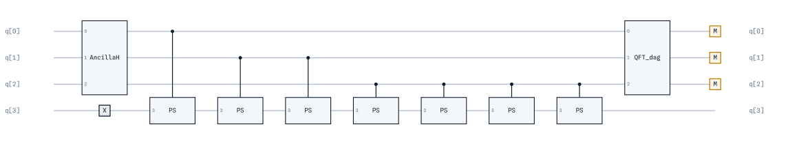

Modular Multiplication Block
^^^^^^^^^^^^^^^^^^^^^^^^^^^^^^^

``ModularMultiplicationBlock(m, N)`` implements reversible multiplication
modulo a small integer as an exact basis permutation on
:math:`n=\lceil\log_2 N\rceil` LSB-indexed work qubits:

.. math::

   |x\rangle \longrightarrow
   \begin{cases}
      |m x \bmod N\rangle, & x < N,\\
      |x\rangle, & x \geq N.
   \end{cases}

Fixing the labels :math:`x \geq N` is part of the contract, since a block must
define a unitary on the whole register.  The multiplier must be coprime to the
modulus so that the map is a bijection.  The block is phase-exact and therefore
safe under ``ControlledBlock``.

.. code-block:: python

   from qarp.blocks import ModularMultiplicationBlock

   multiply_by_two_mod_five = ModularMultiplicationBlock(2, 5).build()

.. warning::

   The synthesizer enumerates computational-basis labels and lowers each
   adjacent swap to a wide multi-controlled gate, so its gate count is
   exponential in the work width.  ``MAX_REFERENCE_WORK_QUBITS`` caps the width
   at six (:math:`N \le 64`); larger moduli raise ``ValueError``.

Order Finding Block
^^^^^^^^^^^^^^^^^^^^^^^^^^^^^^^

``OrderFindingBlock(a, N)`` is the measurement-free circuit behind Shor's
algorithm.  Its LSB register layout is ``counting`` (qubits ``0 .. t-1``)
followed by ``work`` (qubits ``t .. t+n-1``), with ``t = 2n`` by default.  It
applies Hadamards to the counting register, prepares the work register in
:math:`|1\rangle`, applies one controlled ``ModularMultiplicationBlock`` with
multiplier :math:`a^{2^j} \bmod N` per counting qubit :math:`j`, and finishes
with the inverse ``QFTBlock`` on the counting register.  Measuring the
counting register samples phases :math:`s/r` where :math:`r` is the
multiplicative order of :math:`a` modulo :math:`N`.  No measurement is
embedded; a ``Sampler`` with ``measured_qubits=block.counting_qubits``
marginalises the work register.

.. code-block:: python

   import qarp
   from qarp.algorithms import Sampler
   from qarp.blocks import OrderFindingBlock
   from qarp.engines import QarpEngine

   block = OrderFindingBlock(2, 15).build()
   sampler = Sampler(ket=block, n_shots=qarp.EXACT, measured_qubits=block.counting_qubits)
   engine = QarpEngine()
   engine.build([sampler])
   distribution = engine.run()[0]

The block inherits the six-work-qubit reference limit of
``ModularMultiplicationBlock``.  See :ref:`the Shor section <shor-section>` of
the algorithms page for the full factoring workflow.

Quantum Signal Processing Block
^^^^^^^^^^^^^^^^^^^^^^^^^^^^^^^^^^

``QSPBlock`` implements a one-qubit quantum-signal-processing sequence for a
real signal value :math:`a\in[-1,1]`. Its signal rotation is
:math:`W(a)=\exp(i\arccos(a)X)` and the supplied phases insert ``Z`` rotations
between successive signal rotations. For phases synthesized for a feasible
polynomial :math:`P`, the real part of the upper-left matrix element of the
resulting unitary approximates :math:`P(a)`. See `Wang et al.
<https://arxiv.org/abs/2105.02859>`_ for the phase conventions used here.

``QSPBlock`` is useful
for inspecting or composing a QSP sequence after its phase angles have been
obtained. ``P_angles`` are in radians. ``QSPAngleFinder`` numerically
finds phases for a polynomial specified by its coefficients in ascending
order; as in standard QSP, the requested polynomial must satisfy the relevant
parity and boundedness conditions.

The following example synthesizes :math:`P(x)=x` and verifies the encoded
matrix element:

.. code-block:: python

   import numpy as np
   import qarpx as qx
   from qarp.blocks import QSPBlock, QSPAngleFinder

   a = 0.4
   phases = QSPAngleFinder([0, 1]).QSP()  # P(x) = x
   qsp = QSPBlock(a=a, P_angles=phases).build()

   unitary = np.asarray(qx.QarpSimulator().unitary_matrix(qsp.flatten(), qsp.n_qubits))
   assert np.isclose(unitary[0, 0].real, a, atol=1e-8)

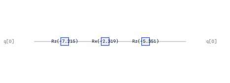

Qubitization Block
^^^^^^^^^^^^^^^^^^^^^^^^^^^^

``QubitizationBlock`` constructs the qubitization walk from the LCU block
encoding of an operator :math:`A` and a reflection on that block encoding's
ancilla register. In OpenQARP, the reflection is applied first in circuit time,
so the resulting unitary is

.. math::

   W = \operatorname{BE}(A) R_0,
   \qquad R_0=2|0\ldots0\rangle\langle0\ldots0|-I.

``A`` may be an ``np.ndarray`` or a ``QubitOperator``. The
underlying ``BlockEncodingBlock`` encodes :math:`A/\lambda`, and its
normalization is exposed as ``lambda_factor``. For Hermitian
:math:`A` with eigenvalue :math:`E`, the walk has eigenphases
:math:`\exp(\mathord{\pm}i\arccos(E/\lambda))`. Therefore, if phase
estimation reports a phase :math:`\theta` in :math:`[0,1)`, then
:math:`E=\lambda\cos(2\pi\theta)`. The two signs give conjugate phases and
the same energy, so the corresponding phase distribution is symmetric about
0 and 0.5.

For example, a two-term one-qubit Hamiltonian needs one LCU ancilla qubit:

.. code-block:: python

   from qarp.blocks import QubitizationBlock
   from qarp.operators import QubitOperator

   hamiltonian = 0.7 * QubitOperator("X0") - 0.3 * QubitOperator("Z0")
   walk = QubitizationBlock(hamiltonian, operator_name="H").build()

   assert walk.BE.num_controls == 1
   assert walk.lambda_factor == 1.0

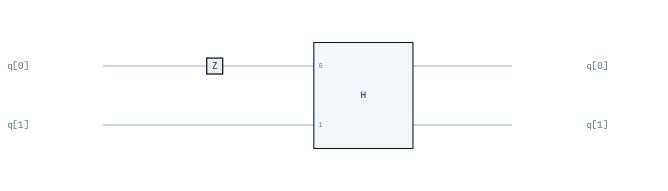

QSVTBlock
^^^^^^^^^

``QSVTBlock`` implements quantum singular value transformation by alternating a
block encoding of :math:`A` (and its adjoint) with phases conditioned on the
LCU ancilla being :math:`|0\ldots0\rangle`. The phase layers apply
:math:`e^{+i\phi}` on that subspace and :math:`e^{-i\phi}` elsewhere. A phase
list of length :math:`d+1` specifies a degree-:math:`d` transformation.

The current implementation accepts an ``np.ndarray`` or a ``QubitOperator``.
Array inputs must be square and Hermitian, and the generated block encoding
must be real. OpenQARP automatically rescales the input by the block-encoding
normalization :math:`\lambda`; consequently, phase angles transform
:math:`A/\lambda`, not an unnormalised input :math:`A`. ``P_angles`` are in
radians and can be obtained with ``QSPAngleFinder(...).QSVT()`` for a
feasible polynomial.

This example applies :math:`P(x)=x^2-1` to a real symmetric two-by-two
matrix. It normalizes the matrix explicitly to make the expected projected
block unambiguous:

.. code-block:: python

   import numpy as np
   import qarpx as qx
   from qarp.blocks import BlockEncodingBlock, QSVTBlock, QSPAngleFinder

   A = np.array([[0.5, 0.3], [0.3, -0.5]])
   A /= BlockEncodingBlock(A).lambda_factor()
   phases = QSPAngleFinder([-1, 0, 1]).QSVT()
   qsvt = QSVTBlock(A, phases).build()

   # Extract the block on the |0…0>_ancilla subspace. The ancillas are the low
   # qubits (qarpx LSB), so its indices are strided (0, N_anc, 2·N_anc, …), not
   # the literal top-left corner; A itself is read in the same LSB basis.
   unitary = np.asarray(qx.QarpSimulator().unitary_matrix(qsvt.flatten(), qsvt.n_qubits))
   n_ancilla = qsvt.n_qubits - 1
   zero_ancilla = [i * 2**n_ancilla for i in range(2)]
   transformed_A = unitary[np.ix_(zero_ancilla, zero_ancilla)].real
   assert np.allclose(transformed_A, A @ A - np.eye(2), atol=1e-8)

The same strided extraction works for a target register wider than one qubit;
see the Block Encoding example above.

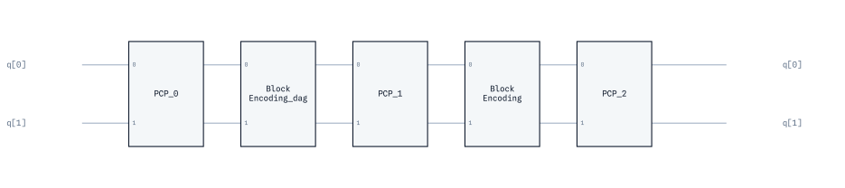

Reflection Block
^^^^^^^^^^^^^^^^^^^^^^^

``ReflectionBlock(n_qubits)`` implements the exact Grover-style reflection

.. math::

   R_0=2|0\ldots0\rangle\langle0\ldots0|-I.

It gives :math:`+1` to :math:`|0\ldots0\rangle` and :math:`-1` to every
other computational-basis state. ``n_qubits`` must be at least one. The
multi-qubit implementation includes the global sign needed for this exact
definition, which matters when the reflection is controlled or composed in a
qubitization walk.

The following verifies the diagonal action for three qubits:

.. code-block:: python

   import numpy as np
   import qarpx as qx
   from qarp.blocks import ReflectionBlock

   block = ReflectionBlock(n_qubits=3).build()
   unitary = np.asarray(qx.QarpSimulator().unitary_matrix(block.flatten(), block.n_qubits))
   assert np.allclose(unitary, np.diag([1] + [-1] * 7))

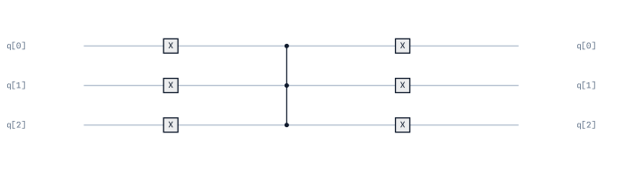

Amplitude Amplification Block
^^^^^^^^^^^^^^^^^^^^^^^^^^^^^^

``AmplitudeAmplificationBlock`` implements the phase-exact
amplitude-amplification iterate

.. math::

   Q = A R_0 A^\dagger O_\mathrm{good},

built from a state-preparation unitary ``A`` and a good-state phase oracle
``oracle`` implementing exactly :math:`O_\mathrm{good} = I - 2\Pi_\mathrm{good}`,
with :math:`R_0` supplied by ``ReflectionBlock``. This convention is Eq. (1)
of Brassard, Høyer, Mosca and Tapp, `Quantum Amplitude Amplification and
Estimation, arXiv:quant-ph/0005055 <https://arxiv.org/abs/quant-ph/0005055>`_.
A raw ``ReflectionBlock`` about the good subspace implements the exact
*negative* of a good-state oracle; compose it with a ``gphase(pi)`` block to
restore the sign before using it here.

``state_preparation`` and ``oracle`` must act on the same number of qubits,
and ``state_preparation`` must be deterministic (``ancilla_postselection is
None``), since :math:`R_0` reflects about :math:`|0\ldots0\rangle` on the
*whole* register. Both inputs are deep-copied at construction, so building
this block never mutates either. The keyword-only ``power`` (default ``1``)
repeats the iterate as :math:`Q^\mathrm{power}`; ``power=0`` is the identity.
The oracle's phase convention is the caller's promise — the constructor
checks type and register width but cannot verify the phase semantics without
an exponential-size matrix.

.. code-block:: python

   from qarp.blocks import AmplitudeAmplificationBlock, HnBlock, SimpleBlock

   def phase_oracle(n_qubits, marked_labels):
       # I - 2 Pi_good: flips the sign of each marked computational basis label.
       block = SimpleBlock(n_qubits, name="O_good")
       qubits = list(range(n_qubits))
       for label in marked_labels:
           zero_qubits = [q for q in qubits if not (label >> q) & 1]
           block.x(zero_qubits)
           block.mcz(qubits)
           block.x(zero_qubits)
       return block

   state_preparation = HnBlock(n_qubits=2).build()
   oracle = phase_oracle(2, [3]).build()  # marks |11>
   iterate = AmplitudeAmplificationBlock(state_preparation, oracle).build()

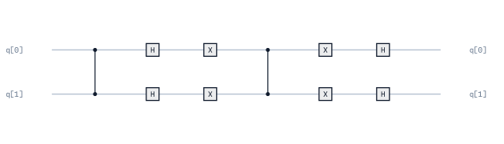

Amplitude Estimation Block
^^^^^^^^^^^^^^^^^^^^^^^^^^^

``AmplitudeEstimationBlock`` builds the canonical (measurement-free) quantum
amplitude estimation circuit. For ``A|0...0> = sqrt(1-a)|psi_bad> +
sqrt(a)|psi_good>`` and a phase-exact oracle as above, the embedded
``AmplitudeAmplificationBlock`` iterate has eigenphases :math:`\pm2\theta`
with :math:`\sin^2\theta = a`; this block applies ``QPEBlock`` to that
iterate without appending measurements, following Brassard, Høyer, Mosca and
Tapp (arXiv:quant-ph/0005055).

For a positive number of estimation qubits ``n_ancilla``, the layout is
``n_ancilla + n_state`` qubits: the estimation register occupies qubits ``0
.. n_ancilla - 1`` and the state register follows it. ``state_preparation``
and ``oracle`` are subject to the same contract as
``AmplitudeAmplificationBlock`` (equal width, deterministic preparation, an
exact phase oracle) and are likewise deep-copied and never built, retargeted,
or otherwise mutated by the constructor.

.. code-block:: python

   from qarp.blocks import AmplitudeEstimationBlock, HnBlock, SimpleBlock

   def phase_oracle(n_qubits, marked_labels):
       block = SimpleBlock(n_qubits, name="O_good")
       qubits = list(range(n_qubits))
       for label in marked_labels:
           zero_qubits = [q for q in qubits if not (label >> q) & 1]
           block.x(zero_qubits)
           block.mcz(qubits)
           block.x(zero_qubits)
       return block

   state_preparation = HnBlock(n_qubits=2).build()
   oracle = phase_oracle(2, [3]).build()
   qae = AmplitudeEstimationBlock(state_preparation, oracle, n_ancilla=2).build()
   assert qae.n_qubits == 4

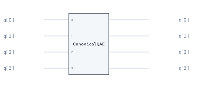

Grover Block
^^^^^^^^^^^^

``GroverBlock`` builds uniform-state Grover search for a known number of
marked states. It prepares ``HnBlock`` across the oracle's register, then
applies the integer number of ``AmplitudeAmplificationBlock`` iterates that
maximizes :math:`\sin^2\bigl((2k+1)\theta\bigr)` around the first optimum,
where :math:`\theta=\arcsin\sqrt{t/N}`, :math:`N=2^{n_\mathrm{qubits}}` and
:math:`t` is ``n_marked`` — the uniform-search construction of Grover
(arXiv:quant-ph/9605043) with the known-multiple-solution iteration count of
Boyer, Brassard, Høyer and Tapp (arXiv:quant-ph/9605034).

``oracle`` must implement exactly :math:`I - 2\Pi_\mathrm{good}` (the same
contract as ``AmplitudeAmplificationBlock``'s oracle) and is deep-copied at
construction; it is not inferred from ``n_marked``. After building, the
block exposes ``n_iterations`` (the chosen iterate count) and
``predicted_success_probability``.

.. code-block:: python

   from qarp.blocks import GroverBlock, SimpleBlock

   def phase_oracle(n_qubits, marked_labels):
       block = SimpleBlock(n_qubits, name="O_good")
       qubits = list(range(n_qubits))
       for label in marked_labels:
           zero_qubits = [q for q in qubits if not (label >> q) & 1]
           block.x(zero_qubits)
           block.mcz(qubits)
           block.x(zero_qubits)
       return block

   oracle = phase_oracle(2, [3]).build()  # searches for |11>
   grover = GroverBlock(oracle, n_marked=1).build()
   assert grover.n_iterations == 1

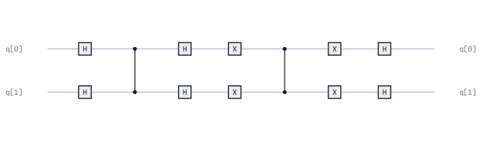

RSP Block
^^^^^^^^^^^^^^^^^^^^^^^^^^^^^^^

``RSPBlock`` implements the real-valued, symmetry-preserving two-qubit gate
used by the real symmetry-preserving ansatz. It preserves excitation number:
it leaves :math:`|00\rangle` and :math:`|11\rangle` unchanged and acts on the
single-excitation subspace. In OpenQARP's LSB qubit convention, its matrix is

.. math::
   \operatorname{RSP}(\theta)=
   \begin{pmatrix}
   1 & 0 & 0 & 0 \\
   0 & -\sin\theta & \cos\theta & 0 \\
   0 & \cos\theta & \sin\theta & 0 \\
   0 & 0 & 0 & 1
   \end{pmatrix}

This is the LSB-basis representation of the circuit in Fig. 1 of Ibe et al.,
`Physical Review Research 4, 013173 (2022) <https://journals.aps.org/prresearch/abstract/10.1103/PhysRevResearch.4.013173>`_. At :math:`\theta=0`, it is
the two-qubit SWAP gate. ``theta`` is in radians and may be a number, a
SymPy symbol, or a linear expression in one symbol.

For example:

.. code-block:: python

   import numpy as np
   import qarpx as qx
   from qarp.blocks import RSPBlock

   theta = np.pi / 4
   s, c = np.sin(theta), np.cos(theta)
   rsp_gate = RSPBlock(theta=theta).build()
   unitary = np.asarray(qx.QarpSimulator().unitary_matrix(rsp_gate.flatten(), rsp_gate.n_qubits))
   expected = np.array([[1., 0., 0., 0.], 
                        [0., -s, c, 0.], 
                        [0., c, s, 0.], 
                        [0., 0., 0., 1.]])

   assert np.allclose(unitary.real, expected, atol=1e-8)

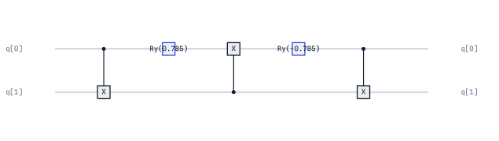

Select Block
^^^^^^^^^^^^^^^^^^^^^^^^^^^^^^^

``SelectBlock`` applies one unitary to a target register conditional on a
selector register. The selector qubits occupy local indices
``[0, ..., num_controls - 1]`` and the target qubits follow them. Entries in
``unitaries`` are assigned positionally to selector states in lexicographic
order of the tuple ``(q0, q1, ...)``: with two qubits, the order is
``00, 01, 10, 11``. This ordering is distinct from ascending integer order
because OpenQARP uses ``q0`` as the least-significant qubit.

An entry may be a unitary ``Block``, ``(phase, Block)``, or the convenient
``(phase, pauli_string_or_dict)`` form. ``phase`` is in radians and realizes
:math:`e^{i\,\mathrm{phase}}U`; it is preserved even when SELECT is later
controlled. All full-width blocks and Pauli strings must have the same target
width. Fewer than :math:`2^{\mathtt{num\_controls}}` entries are allowed:
unlisted selector states apply the identity.

This one-control example applies ``H`` for selector :math:`|0\rangle` and
:math:`e^{i\pi/5}Z` for selector :math:`|1\rangle`:

.. code-block:: python

   import numpy as np
   from qarp.blocks import SelectBlock, SimpleBlock

   hadamard = SimpleBlock(1, name="H")
   hadamard.h(0)
   hadamard.build()

   select_block = SelectBlock(
       unitaries=[hadamard, (np.pi / 5, "Z")], num_controls=1
   ).build()
   assert select_block.n_qubits == 2  # q0 is selector; q1 is target

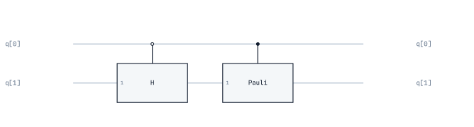

QROM Block
^^^^^^^^^^^^^^^^^^^^^^^^^^^^^^^

``QROMBlock`` is reversible classical data loading, :math:`|l\rangle|0\ldots0\rangle \mapsto
|l\rangle|\text{data}[l]\rangle` — a read-only lookup table addressed by a quantum index register,
XOR-loading each entry's bits into a separate output register. Applied to an index register already
in superposition (after ``H`` on every index qubit, say) it entangles the two:
:math:`\sum_l |l\rangle|0\rangle \mapsto \sum_l |l\rangle|\text{data}[l]\rangle`. It is valid for
*any* index-register state, not only :math:`|0\ldots0\rangle` — a general oracle like
``SelectBlock``, not a ``PreparesKnownState`` declarer.

The index qubits occupy local indices ``[0, ..., index_qubits - 1]`` and the output register
follows them. ``data`` is a dict mapping each populated index ``l`` (``0 <= l < 2**index_qubits``)
to its output bit-tuple, LSB-first (§1: tuple element ``j`` is output qubit ``index_qubits + j``);
all tuples share one length, the output width, and indices absent from ``data`` are implicitly
all-zero.

**Cost** (measured on ``clifford_t_rz_gateset``): the constructions this block is named after
(Babbush et al., PRX **8**, 041015 (2018) §III.D; Low, Kliuchnikov & Schaeffer, arXiv:1812.00954)
use *unary iteration* to amortise the address decode to ≈ :math:`4N` Toffolis across all
:math:`N = 2^k` entries, with :math:`k - 1` clean work qubits. This block instead applies one
ancilla-free :math:`k`-controlled X per set bit per nonzero entry, which decomposes quadratically
in :math:`k`: 312 CNOTs for 8 entries × 3 bits (:math:`k = 3`), 16 400 for 32 × 5 (:math:`k = 5`),
179 944 for 128 × 4 (:math:`k = 7`), against ≈ 130 / 510 Toffolis for unary iteration at
:math:`k = 5` / :math:`7`. Right only for small tables; unary iteration, with the work qubits
placed through ``target_qubits`` like every other composite's ancillas, is the declared follow-up.

.. code-block:: python

   from qarp.blocks import QROMBlock

   # 2 index qubits, 3-bit entries; indices 1 and 3 load zeros
   qrom = QROMBlock(index_qubits=2, data={0: (1, 0, 1), 2: (0, 1, 1)}).build()
   assert qrom.n_qubits == 5  # q0, q1 index; q2..q4 output

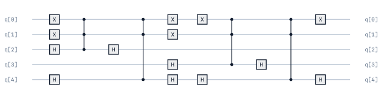

SWAP Test Block
^^^^^^^^^^^^^^^

The SWAP test circuit is commonly used to evaluate the square of the modulus of an inner product. To obtain the SWAPTest circuit, we can simply use
the ``SWAPTestBlock`` object.

This block takes the following arguments: ``bra`` - the bra preparation unitary, ``ket`` - the ket preparation unitary 
and (optional) ``measure`` - whether to measure the ancilla. Note, however, the preferred way to use measurement in OpenQARP is via a ``ReadoutBlock``,
or via `Primitives`. An example implementation is:

.. code-block:: python

   from qarp.blocks import ComputationalBasisStateBlock, SWAPTestBlock

   u0 = ComputationalBasisStateBlock([1, 1, 0, 0]).build()
   u1 = ComputationalBasisStateBlock([1, 0, 0, 1]).build()
   swap = SWAPTestBlock(bra=u0, ket=u1).build()

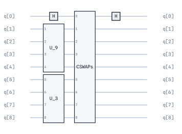

SynthesizedTimeEvolutionBlock
^^^^^^^^^^^^^^^^^^^^^^^^^^^^^

The ``SynthesizedTimeEvolutionBlock`` creates a quantum circuit that implements exact time evolution under a Hamiltonian operator. 
Unlike ``TrotterBlock`` which approximates time evolution (:math:`\exp(-iHt)`) using Trotterization, this block synthesizes the exact unitary 
by computing the matrix exponential and then decomposing it into quantum gates using our in-house Quantum Shannon Decomposition implementation.

**Mathematical Background:**

Given a Hamiltonian operator :math:`H` and time parameter :math:`t`, the block implements:

.. math::

   U(t) = \exp(-iHt)

This is the exact time-evolution operator without Trotter approximation errors.

**When to Use:**

- **High precision required**: When Trotter errors are unacceptable
- **Small systems**: Works best for systems with few qubits (≤ 5-6 qubits) due to exponential circuit depth scaling
- **Benchmarking**: To compare against Trotterized circuits and assess Trotter error
- **QMEGS and similar algorithms**: When exact time evolution is needed for eigenvalue estimation

**Required Arguments:**

- ``operator``: The Hamiltonian as a ``QubitOperator`` (must be Hermitian)
- ``n_qubits``: Number of qubits the operator acts on

**Optional Arguments:**

- ``time``: Evolution time parameter :math:`t`. Can be set during initialization or later via ``set_time()``
- ``target_qubits``: Indices of qubits to apply the evolution to (default: ``[0, 1, ..., n_qubits-1]``)
- ``name``: Custom name for the block (default: ``"SynthTimeEvoBlock"``)

**Example 1: Basic Time Evolution**

.. code-block:: python

   from qarp.operators import QubitOperator
   from qarp.blocks import SynthesizedTimeEvolutionBlock

   # Define a simple Hamiltonian
   hamiltonian = QubitOperator("Z0 X1") + QubitOperator("Y0 Y1")
   
   # Create the time evolution block
   time_evo = SynthesizedTimeEvolutionBlock(
       operator=hamiltonian,
       n_qubits=2,
       time=0.5
   ).build()
   
   # Visualize the circuit
   time_evo.plot()

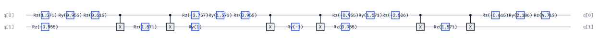

**Example 2: Dynamic Time Parameter**

The time parameter can be set or updated after initialization, which is useful when you need to evaluate 
the same Hamiltonian at multiple time points:

.. code-block:: python

   from qarp.operators import QubitOperator
   from qarp.blocks import SynthesizedTimeEvolutionBlock

   hamiltonian = QubitOperator("Z0", 1.0)

   # Create block without specifying time
   time_evo = SynthesizedTimeEvolutionBlock(
       operator=hamiltonian,
       n_qubits=1
   )

   # set_time() returns a new, rebuilt block rather than mutating in place —
   # capture the return value.
   time_evo = time_evo.set_time(0.5)

   # Update to a different time (returns a freshly-rebuilt block again)
   time_evo = time_evo.set_time(1.0)

   # Get the unitary matrix
   import qarpx as qx
   unitary = qx.QarpSimulator().unitary_matrix(time_evo.flatten(), time_evo.n_qubits)

**Example 3: Fermi-Hubbard Model Evolution**

.. code-block:: python

   from qarp.operators import JordanWigner
   from qarp.operators.models import fermi_hubbard
   from qarp.blocks import SynthesizedTimeEvolutionBlock

   # Create a Fermi-Hubbard Hamiltonian with a genuine hopping term (one site
   # has none, since there is nowhere to hop to, and Trotter is then exact
   # regardless of step count) — use two sites so the comparison below is
   # non-trivial, and so the operator spans the four qubits used below.
   fham = fermi_hubbard((2,), t=0.14, U=0.231)
   qham = JordanWigner().encode_operator(fham)

   # Build exact time evolution
   exact_evo = SynthesizedTimeEvolutionBlock(
       operator=qham,
       n_qubits=4,
       time=5.0,
   ).build()

   # Compare with Trotter approximation
   from qarp.blocks import TrotterBlock
   trotter_evo = TrotterBlock(
       n_qubits=4,
       operator=qham,
       steps=10,
       time=5.0
   ).build()

   # Check error. Both circuits carry the exact global phase, so a direct
   # matrix difference measures the Trotter error too; the process infidelity
   # below is the phase-insensitive measure.
   import numpy as np
   import qarpx as qx
   sim = qx.QarpSimulator()
   exact_u = np.array(sim.unitary_matrix(exact_evo.flatten(), exact_evo.n_qubits))
   trotter_u = np.array(sim.unitary_matrix(trotter_evo.flatten(), trotter_evo.n_qubits))
   dim = exact_u.shape[0]
   fidelity = np.abs(np.trace(exact_u.conj().T @ trotter_u)) / dim
   print(f"Trotter infidelity (1 - process fidelity): {1 - fidelity:.6f}")

.. _synth-time-evo-phase:

**Global Phase:**

``SynthesizedTimeEvolutionBlock`` synthesizes the circuit via qarpx's Quantum Shannon Decomposition, which
reproduces :math:`e^{-iHt}` exactly, global phase included. The global phase has no effect on measurement
statistics of the bare block, but it becomes a relative phase once the block is controlled (for example
inside QPE), so the synthesis keeps it. A synthesized circuit's unitary can therefore be compared with
another one directly; process fidelity (:math:`|\mathrm{Tr}(U_1^\dagger U_2)| / d`) is the choice when the
other circuit is only defined up to a global phase.

**Performance Considerations:**

- **Circuit depth**: Scales exponentially with number of qubits due to unitary synthesis
- **Build time**: Matrix exponentiation and synthesis can be slow for larger systems
- **Use cases**: Best suited for small systems (≤ 6 qubits) or when exact evolution is critical
- **Alternative**: Use ``TrotterBlock`` for larger systems where approximation is acceptable

.. note::
   The operator must be Hermitian (as required for physical time evolution). The block validates 
   this during initialization and raises a ``ValueError`` if the operator is non-Hermitian.

.. warning::
   While this block provides exact time evolution without Trotter error, the resulting circuit 
   depth grows exponentially with the number of qubits. For systems with more than 5-6 qubits, 
   ``TrotterBlock`` is typically more practical despite the approximation error.

SynthesizedUnitaryBlock
^^^^^^^^^^^^^^^^^^^^^^^^^^
 
The :code:`SynthesizedUnitaryBlock` is a block which can create an arbitrary unitary, :math:`U`, as a block to act in a circuit.
This is a very useful primitive for research purposes, for example we can use it to generate random unitaries in a circuit.
However, care should be taken when using this block as it will lead to exponentially deep circuits in the number of qubits,
since it makes no assumptions about the structure of the unitary.

It takes as its main argument ``unitary_matrix`` - the unitary matrix to synthesize (the synthesized circuit
matches it exactly, global phase included; see :ref:`the note above <synth-time-evo-phase>`).
An example implementation is as follows:
 
.. code-block:: python
 
   from scipy.stats import unitary_group
   from qarp.blocks import SynthesizedUnitaryBlock
 
   random_unitary = unitary_group.rvs(2**2)
   print(random_unitary)
 
   unitary_block = SynthesizedUnitaryBlock(random_unitary).build()

   import qarpx as qx
   circuit_unitary = qx.QarpSimulator().unitary_matrix(unitary_block.flatten(), unitary_block.n_qubits)
   print(circuit_unitary)
 
   unitary_block.plot()
 
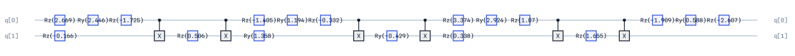

Trotter Block
^^^^^^^^^^^^^^^^^

``TrotterBlock`` implements the Suzuki-Trotter decomposition of the exponent of a Hamiltonian. Given a general Hamiltonian 
written as a sum of Pauli strings:

.. math::

   H = \sum^N_i \theta_i P_i, \\

the exponent can be approximated using the Suzuki-Trotter approximation as:

.. math::

   \exp(-iHt) \approx \left( \exp\left(-i \theta_0 P_0 \frac{t}{M}\right) \exp\left(-i \theta_1 P_1 \frac{t}{M}\right) \cdots \exp\left(-i \theta_N P_N \frac{t}{M}\right)\right)^M.

``TrotterBlock`` requires ``n_qubits`` - number of qubits and ``operator`` - the Hamiltonian to Trotterise as inputs. 
Additional optional inputs are: ``steps`` - number of Trotter steps, ``time`` - length of time evolution (can be a float or a ``sympy.Symbol`` for parametric circuits), 
``order`` - order of expansion (must be 1 or even integer), 
``grouping`` - a ``GroupingStrategy`` partitioning terms into sets that are exponentiated together (default ``FullyCommuting()``; use ``NoGrouping()`` for the
termwise circuit) and ``imaginary`` - whether to use the imaginary part of operator coefficients
(True) or not (False).

An example implementation which trotterises and constructs the exponential of the
Fermi-Hubbard chain Hamiltonian is as follows:

.. code-block:: python

   from qarp.operators import JordanWigner
   from qarp.operators.models import fermi_hubbard
   from qarp.blocks import TrotterBlock

   fham = fermi_hubbard((2,), t=0.14, U=0.231)
   qham = JordanWigner().encode_operator(fham)

   trotter = TrotterBlock(n_qubits=4, operator=qham, steps=1, time=1.)

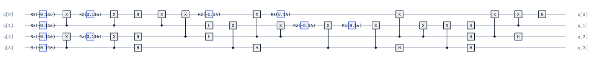

.. note::

   It is worth noting that while most applications of the Suzuki-Trotter approximation are limited to one step, this is still an approximation and only
   in the limit of infinitely many steps it becomes exact. However, we can easily increase the number of Trotter steps in OpenQARP by changing the
   step argument in the constructor.

To see how the Trotter error scales for this example with the number of steps, see the log-plot below.

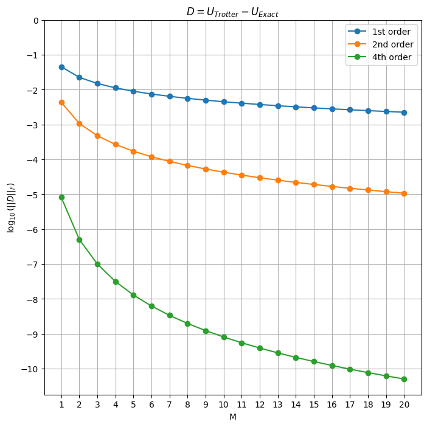

**Symbolic Time Parameter**

``TrotterBlock`` supports symbolic time parameters using ``sympy.Symbol``. This is useful when you want to build a parametric circuit 
where the evolution time can be substituted later without rebuilding the circuit. To substitute the time value, use the ``set_time()`` method, 
which handles the internal :math:`\pi` normalization correctly.

.. code-block:: python

   from sympy import Symbol
   from qarp.operators import JordanWigner
   from qarp.operators.models import fermi_hubbard
   from qarp.blocks import TrotterBlock

   fham = fermi_hubbard((2,), t=0.14, U=0.231)
   qham = JordanWigner().encode_operator(fham)

   # Create a symbolic time parameter
   t = Symbol("t")
   trotter = TrotterBlock(n_qubits=4, operator=qham, steps=1, time=t).build()

   # The block now contains the symbolic parameter. `.symbols` is a sorted
   # tuple (see the note on Block.symbols above), not a set.
   print(trotter.symbols)  # (t,)

   # Substitute the time value using set_time()
   trotter_t1 = trotter.set_time(1.0)
   trotter_t05 = trotter.set_time(0.5)

   # The substituted blocks no longer contain the symbol
   print(trotter_t1.symbols)  # ()

   # Plot the circuit
   trotter.plot(scrollable=True)
   trotter_t05.plot(scrollable=True)
   trotter_t1.plot(scrollable=True)

.. warning::

   When substituting time values, prefer the ``set_time()`` method over the generic ``set_symbols()`` method.
   ``set_time()`` is a thin wrapper that calls ``set_symbols()`` with the block's internal time symbol; using ``set_symbols()`` directly works but you must reference the same ``Symbol`` instance the block was built with.

Trotter Ansatz Block
^^^^^^^^^^^^^^^^^^^^^^

``TrotterAnsatzBlock`` constructs a parametric Trotterized circuit from a list of qubit operators and their associated symbols. 
Unlike ``TrotterBlock`` which takes a fixed operator, ``TrotterAnsatzBlock`` allows each term in the Hamiltonian to have its own 
variational parameter, making it suitable for variational quantum algorithms like VQE.

This block requires the following arguments:

- ``n_qubits``: The number of qubits the circuit acts on.
- ``qubit_exponents``: A list of ``QubitOperator`` objects representing the terms in the ansatz.
- ``symbols``: A list of ``sympy.Symbol`` objects, one for each qubit exponent.

Optional arguments include: ``steps`` - number of Trotter steps, ``time`` - global time scaling factor (can be a float or ``sympy.Symbol``),
``order`` - order of the Trotter expansion (must be 1 or even integer), ``grouping`` - the ``GroupingStrategy`` used to partition terms into
commuting sets, and ``imaginary`` - whether to use the imaginary part of operator coefficients.

Grouping is applied *within* each ``(symbol, operator)`` pair, never across them: the ansatz is the ordered product
``∏_k exp(θ_k G_k)``, so the generator order is meaningful and must not be permuted. Since a generator's own Pauli terms
commute, each generator is emitted as a single exact exponential.

An example implementation using the UCC ansatz operators:

.. code-block:: python

   from sympy import Symbol
   from qarp.blocks import TrotterAnsatzBlock
   from qarp.operators import JordanWigner, NoGrouping
   from qarp.operators.ucc import ucc_singles_and_doubles

   # Generate UCC operators
   onv = [1, 1, 0, 0]
   uccsd, symbols = ucc_singles_and_doubles(onv, spin_conserving=True, generalised=False)
   quccsd = JordanWigner().encode_operator(uccsd)

   # Build the ansatz block
   ansatz = TrotterAnsatzBlock(
       n_qubits=4,
       qubit_exponents=quccsd,
       symbols=symbols,
       steps=1,
       order=1,
       grouping=NoGrouping(),
       imaginary=True,
   ).build()

   # Substitute parameter values
   param_map = {s: 0.1 * i for i, s in enumerate(symbols)}
   ansatz_substituted = ansatz.set_symbols(param_map)

   # Plot the circuit
   ansatz.plot(scrollable=True)
   ansatz_substituted.plot(scrollable=True)

A single-generator instance (for illustration) keeps the circuit small enough to show in full:

.. code-block:: python

   from sympy import Symbol
   from qarp.blocks import TrotterAnsatzBlock
   from qarp.operators import QubitOperator

   theta = Symbol("theta")
   small_ansatz = TrotterAnsatzBlock(
       n_qubits=2, qubit_exponents=[QubitOperator("Y0 X1", 1.0)], symbols=[theta]
   ).build()

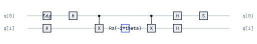

**Symbolic Time in TrotterAnsatzBlock**

Similar to ``TrotterBlock``, the ``TrotterAnsatzBlock`` also supports symbolic time parameters. When the ``time`` argument 
is a ``sympy.Symbol``, the time symbol is automatically added to the block's symbol list. Use the ``set_time()`` method to 
substitute the time value:

.. code-block:: python

   from sympy import Symbol
   from qarp.blocks import TrotterAnsatzBlock
   from qarp.operators import JordanWigner
   from qarp.operators.ucc import ucc_singles_and_doubles

   onv = [1, 1, 0, 0]
   uccsd, symbols = ucc_singles_and_doubles(onv, spin_conserving=True, generalised=False)
   quccsd = JordanWigner().encode_operator(uccsd)

   # Create with symbolic time
   t = Symbol("t")
   ansatz = TrotterAnsatzBlock(
       n_qubits=4,
       qubit_exponents=quccsd,
       symbols=symbols,
       time=t,  # Symbolic time parameter
       imaginary=True,
   ).build()

   # The time symbol joins the block's symbols
   print(t in ansatz.symbols)  # True

   # Substitute time using set_time()
   ansatz_evolved = ansatz.set_time(0.5)

   # Other parameters can still be substituted separately
   param_map = {s: 0.1 for s in symbols}
   ansatz_final = ansatz_evolved.set_symbols(param_map)

   # Plot the circuit
   ansatz.plot(scrollable=True)
   ansatz_evolved.plot(scrollable=True)
   ansatz_final.plot(scrollable=True)

Unitary Coupled Cluster Block
^^^^^^^^^^^^^^^^^^^^^^^^^^^^^^^

The ``UCCBlock`` constructs a parameterized quantum circuit representing the UCC ansatz,
which approximates the electronic structure wavefunction through exponentials of
particle-hole excitation operators. The block generates single and/or double excitations
from a reference occupation, transforms them to qubit operators via fermion-to-qubit
mappings, and implements the unitary via Trotterization. This provides a chemically-inspired
ansatz for VQE that respects particle number and spin symmetries.

This block requires the argument ``occupation_number_vector`` - occupation number vector defining the initial state
(a plain abab list of 0s and 1s), and takes the following optional arguments:
``singles`` - whether to include single excitation operators, ``doubles`` - whether to include double excitation operators,
``paired_doubles`` - whether to restrict doubles to paired excitations, ``generalised`` - whether to use generalized excitation operators,
``spin_conserving`` - if True, only includes spin-conserving excitations, ``mapping`` - Fermion-to-qubit mapping (default: Jordan-Wigner),
``order`` - Trotter decomposition order, ``time`` - evolution time parameter, ``steps`` - number of Trotter steps and
``grouping`` - the ``GroupingStrategy`` forwarded to the inner ``TrotterAnsatzBlock``.

For example, to construct the block representing the UCCSD unitary:

.. code-block:: python

   from qarp.blocks import UCCBlock
   from qarp.operators import JordanWigner

   onv = [1, 1, 0, 0]
   ucc = UCCBlock(occupation_number_vector=onv, mapping=JordanWigner(), singles=True, doubles=True, generalised=False)
   ucc.build()

To construct the generalised UCCSD unitary, set the ``generalised`` flag to True.

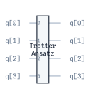

.. note::

   The reference state is not encoded on the circuit! Only the UCC portion is added to the block. This is to simplify usage with some of the algorithms.
   To include the reference state, first generate the ``UCCBlock`` similarly to above, then use something like ``my_ansatz = CompositeBlock([MappedONVStateBlock(onv, JordanWigner()).build(), ucc]).build()``.

Xn Block
^^^^^^^^^^

``XnBlock`` applies an X gate to each of the qubits, flipping them all to the :math:`|1\rangle` state. 

It takes ``n_qubits`` - number of qubits as an input. 

An implementation is as follows:

.. code-block:: python

   from qarp.blocks import XnBlock

   n_qubits = 4
   block = XnBlock(n_qubits=n_qubits).build()

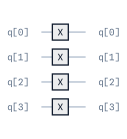

Yoshida-Trotter composition
^^^^^^^^^^^^^^^^^^^^^^^^^^^^

``TrotterBlock`` supports Trotterization at orders ``6`` and ``8`` at significantly lower depth than its default ``"suzuki"`` recursion, via ``composition="yoshida"``.
For details of 6th order Trotter see `this publication by Yoshida et al <https://doi.org/10.1016/0375-9601(90)90092-3>`_. For 8th order Trotter,
see `this publication by Morales et al <https://arxiv.org/abs/2210.15817>`_.

To construct a Yoshida-composed ``TrotterBlock``:

.. code-block:: python

   from qarp.operators import JordanWigner
   from qarp.operators.models import fermi_hubbard
   from qarp.blocks import TrotterBlock

   # A single Fermi-Hubbard site (two spin orbitals) keeps the order-6
   # expansion small enough to read; the composition is the point, not the
   # system size.
   fham = fermi_hubbard((1,), t=0.14, U=0.231)
   qham = JordanWigner().encode_operator(fham)

   trotter = TrotterBlock(n_qubits=2, operator=qham, steps=1, time=1.0, order=6, composition="yoshida")

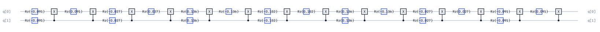

Tensor Network Blocks
^^^^^^^^^^^^^^^^^^^^^^^^^^^^^^^^^^^^^^^

VUMPO Brickwork Block
"""""""""""""""""""""""""""""""""""""""

The ``VUMPOBrickworkBlock`` implements a brickwork‑structured layer of the
Variational Unitary Matrix Product Operator (VUMPO) ansatz, introduced by
Pollmann *et al.* in **Efficient variational diagonalization of fully many-body
localized Hamiltonians**, *Phys. Rev. B* **94**, 041116(R) (2016),
https://doi.org/10.1103/PhysRevB.94.041116.

A VUMPO layer consists of alternating even‑ and odd‑indexed two qubit unitaries
arranged in a brickwork pattern. Each gate is generated via the internal
parameterization of a ``VUMPO`` object, representing a low bond dimension
unitary tensor network operator. If optimal parameters are not passed, the block builds the vumpo 
(via ``vumpo.build()``) internally before splitting into gates and applies
the resulting two qubit unitaries to qubit pairs :math:`(n, n+1)` with offset
:math:`m % 2` for layer :math:`m`.

Optionally, an initial computational basis state block may be prepended when an
``initial_state`` is supplied, enabling computational basis state preparation before the variational
brickwork layers. 

See ``qarp.operators.VUMPO`` for more details on the actual VUMPO tensor networks construction.

The two qubit unitaries come out of quimb in the opposite qubit ordering to qarpx, so the
block conjugates each one with a two qubit SWAP before applying it (see :doc:`endianness`).
That conversion is what makes the circuit act on the register qarpx actually uses; without it
the layer silently acts on the wrong qubit ordering.

Both ``VUMPO`` and ``VUMPOBrickworkBlock`` need the ``[mps]`` extra (``quimb``) installed.

An example VUMPO configuration (for illustration) is shown below:

.. code-block:: python

   import numpy as np
   from qarp.blocks import VUMPOBrickworkBlock
   from qarp.operators import VUMPO
   from quimb.tensor import MatrixProductOperator

   L = 4
   rng = np.random.default_rng(0)   # seeded so the circuit below is reproducible

   A = (rng.standard_normal((2**L, 2**L)) + 1j*rng.standard_normal((2**L, 2**L)))
   ham_mat = (A + A.conj().T) / 2
   # quimb's from_dense is kron-ordered (site 0 = leftmost factor = qubit L-1 of a
   # qarpx-LSB matrix); VUMPO puts site n on qubit n.  A random matrix has no
   # qubit meaning, so no reversal is needed here — for an operator matrix use
   # from_dense(lsb_to_msb_matrix(op.sparse_matrix().toarray()), ...).
   H_mpo = MatrixProductOperator.from_dense(ham_mat, dims=(2,)*L)

   vumpo = VUMPO(
         H_mpo=H_mpo,
         n_layers=3,
         n_sweeps=2,
         maxiter_local=2,
         mode="diag",
         opt="local",
   )
   initial_state = np.array([1] * (2) + [0] * (2))

   params = vumpo.build()
   vumpo_block = VUMPOBrickworkBlock(
      vumpo=vumpo, initial_state=initial_state, optimized_params=params
   )
   vumpo_block.build()

The resulting brickwork circuit, with the basis-state preparation prepended:

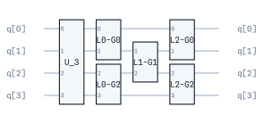

State preparation
-----------------

State-preparation blocks define circuits encoding initial wavefunctions for certain algorithms.

Declaring the prepared state
^^^^^^^^^^^^^^^^^^^^^^^^^^^^

A primitive is specified by its whole unitary; a block that *prepares* a state is specified by a
single column of it, :math:`U|0\ldots0\rangle`, with the remaining columns free.
``AmplitudeAmplificationBlock`` shows why: :math:`Q = A S_0 A^\dagger S_\chi` is correct for *any*
unitary :math:`A` whose zeroth column is :math:`|\psi\rangle`, since
:math:`A S_0 A^\dagger = 2|\psi\rangle\langle\psi| - I` no matter what the other columns hold. Two
blocks preparing the same state can therefore have entirely different matrices and both be right,
so there is no unitary oracle to test them against.

``PreparesKnownState`` is that column, declared. Attach it with the ``prepares_known_state``
decorator:

.. code-block:: python

   from qarp.blocks import SimpleBlock, prepares_known_state

   @prepares_known_state
   class MyStateBlock(SimpleBlock):
       def build_vanilla(self):
           ...

       def target_statevector(self):
           """The state this block leaves on |0…0⟩ — derived from the maths, not the circuit."""
           ...

The declaration carries six members:

``state_qubits``
   Block-local indices carrying the prepared state, ascending. Defaults to the whole register;
   override it when the block sizes itself larger than the state it prepares, as the QRAM blocks
   do — ``CVOQRAMStateBlock`` reports ``n_qubits = 2n`` but prepares an :math:`n`-qubit state.

``ancilla_qubits``
   The complement, derived.

``ancilla_postselection``
   The condition under which the prepared state appears, as a :class:`~qarp.PostSelection`, or
   ``None``. ``None`` means every ancilla returns to :math:`|0\rangle` with probability 1 — the
   block is deterministic and safe under ``ControlledBlock``. A returned condition means the state
   exists only on that branch; hand it straight to a ``Sampler`` result.

``target_statevector()``
   The declared state, ``2**len(state_qubits)`` amplitudes, LSB, **including global phase**.
   Standalone a global phase is unobservable, but under ``ControlledBlock`` it becomes a physical
   relative phase — and ``AmplitudeEstimationBlock`` controls its state-preparation block.

``is_exact``
   ``True`` by default: the built circuit is asserted to match ``target_statevector()`` exactly
   (elementwise, ``atol=1e-10``). Override to ``False`` for a block whose construction is
   inherently approximate — a fixed-precision discretization, a truncated low-rank/MPS
   expansion — alongside ``error_bound``.

``error_bound``
   Upper bound on ``1 - |⟨target|prepared⟩|²`` (infidelity); only meaningful when ``is_exact``
   is ``False``, in which case the conformance suite checks infidelity against this bound instead
   of exact equality. Should be computable from the block's own construction (a discarded Schmidt
   weight, a discretization precision), not fitted after the fact.

The counterpart ``prepared_statevector()`` returns what the built circuit actually leaves, together
with the probability of the declared condition, so the two can be compared directly:

.. code-block:: python

   from qarp.blocks import CVOQRAMStateBlock
   import numpy as np

   block = CVOQRAMStateBlock({(1, 0, 1): 0.6, (0, 1, 0): -0.8}).build()

   block.n_qubits                  # 6 — the block's full register
   block.state_qubits              # (3, 4, 5) — only these carry the state
   block.ancilla_postselection     # None: the ancillas are restored, so it is control-safe

   prepared, probability = block.prepared_statevector()
   np.allclose(prepared, block.target_statevector())   # True, phase included

Declaring is opt-in and independent of where a block lives: a leaf ``SimpleBlock`` and a
``CompositeBlockBase`` tree declare it the same way. Parameterized ansätze must not — ``UCCBlock``,
``HEABlock``, ``SPABlock`` and ``QAOABlock`` have no fixed column, because their output depends on
symbol values and on the reference state they are applied to. ``declaring_blocks()`` lists every
block that has declared it.

One limit worth stating plainly: the declaration is checked against the circuit, not proved
correct by it. A ``target_statevector()`` that is wrong in the same way as the circuit passes that
check. The independent oracle (§18) remains a per-block obligation.

Computational Basis State
^^^^^^^^^^^^^^^^^^^^^^^^^^^^^^^^^^^^^^^

The ``ComputationalBasisStateBlock`` is a simple circuit that prepares a specific basis state on a given set of qubits. It simply is a sequence of X gates applied to the qubits
that are set to 1 in ``basis_state``.

It requires input ``basis_state`` - a list of 0s and 1s representing the basis state to prepare,
LSB-first: entry ``q`` is qubit ``q``, not a binary literal (see :doc:`endianness`).

The syntax to apply the Basis State block in OpenQARP is as follows:

.. code-block:: python

   from qarp.blocks import ComputationalBasisStateBlock

   n_qubits = 4
   state = [1, 1, 0, 0]  # qubits 0 and 1 occupied -> X on each
   basis_state_block = ComputationalBasisStateBlock(state, target_qubits=list(range(n_qubits))).build()

CV-QRAM and CVO-QRAM Block
^^^^^^^^^^^^^^^^^^^^^^^^^^^^^^

This :code:`Block` implements CV-QRAM and CVO-QRAM (de Veras, T. M. et al. (2022) Quantum Information Processing) state
preparation method, where the latter is an improved version of the former in which the number of 2-qubit gates are drastically
reduced. 

This block takes the argument ``dataset`` - a dictionary specifying the data to be loaded with tuples as keys and amplitudes as values.

An example implementation is as follows:

.. code-block:: python

   from qarp.blocks import CVOQRAMStateBlock
   import numpy as np

   dataset = {(1, 0, 0): np.sqrt(0.5), (0, 0, 0): np.sqrt(0.5)}

   cvoqram_block = CVOQRAMStateBlock(dataset, target_qubits=list(range(6))).build()
   cvoqram_block.plot()

Dicke State
^^^^^^^^^^^^^^^^^^^^^^^^^^^^^^^^^^^^^^^

The ``DickeStateBlock`` prepares a superposition of all basis states with a given Hamming weight.
It is useful, for example, for preparing states with a fixed number of fermions under the Jordan-Wigner mapping, such as in quantum-chemistry applications.

It requires inputs ``n_qubits`` - number of qubits and ``hamming_weight``- the Hamming weight of each term in the dicke state.

We use the method of Bärtschi, A., Eidenbenz, S. -  `Fundamentals of Computation Theory. FCT 2019, vol 11651 <https://dl.acm.org/doi/10.1007/978-3-030-25027-0_9>`_

An example of a Dicke state on :math:`4` qubits in a Hamming weight :math:`2` subspace

.. math::
   |\psi\rangle = \frac{1}{\sqrt{\binom{4}{2}}}\left(|1100\rangle + |1010\rangle + |1001\rangle + |0110\rangle + |0101\rangle + |0011\rangle\right)

   
.. code-block:: python

   from qarp.blocks import DickeStateBlock

   # Create a Dicke state of 4 qubits with Hamming weight 2 
   # (that is, equal superposition of |1100⟩, |1010⟩, |1001⟩, |0110⟩, |0101⟩, |0011⟩)
   dicke_block = DickeStateBlock(n_qubits=4, hamming_weight=2).build()
   dicke_block.plot()

GHZ Like State
^^^^^^^^^^^^^^^^^^^^^^^^^^^^^^^^^^^^^^^

The ``GHZLikeStateBlock`` prepares a multi-qubit entangled state resembling a GHZ state but
localized to specific basis states. It creates entanglement by applying a Hadamard
gate to the first qubit marked as :math:`|1\rangle` in the basis state, then cascading CNOT gates
to entangle subsequent :math:`|1\rangle`-marked qubits.

It requires arguments ``basis_state`` - a list of 0s and 1s representing which qubits participate in the GHZ-like state,
and ``dephase`` - if True, applies :math:`S^{\dagger}` gate to introduce phase factor :math:`i` in the superposition.

The GHZ states are maximally-entangled quantum states defined for :math:`N` qubits as 

.. math:: 

   |\rm{GHZ}\rangle = \frac{1}{\sqrt{2}} (|0\rangle^{\otimes N} + |1\rangle^{\otimes N})

A GHZ-like state is a similar :math:`N`-qubits state but maximally-entangled only in a subset of the qubits. For example, 

.. math:: 

   |000\rangle + |101\rangle

is a GHZ-like state for the first and third qubits. 

An example implementation is as follows:

.. code-block:: python

   from qarp.blocks import GHZLikeStateBlock

   state = [1, 1, 0, 1]
   ghz_like_block = GHZLikeStateBlock(state).build()

Hypergraph State
^^^^^^^^^^^^^^^^^^^^^^^^^^^^^^^^^^^^^^^

``HypergraphStateBlock`` prepares quantum states defined by hypergraphs, where vertices
represent qubits and hyperedges encode multi-qubit entangling operations. Starting
from an equal superposition (:math:`H^{\otimes n}|0\rangle^{\otimes n}`), controlled-Z gates are applied according
to the hypergraph structure, creating states with higher-order correlations beyond
pairwise entanglement.

This block takes as arguments ``hypergraph`` - a Hypergraph object defining the state structure, 
``n_qubits`` - number of qubits and ``edges`` - list of hyperedges, each a tuple of qubit indices.
Either ``hypergraph`` or both ``n_qubits`` and ``edges`` must be provided.
An example implementation is as follows:

.. code-block:: python

   from qarp.blocks import HypergraphStateBlock
   import hypernetx as hnx

   edges = [(1, 2), (2, 3), (1, 2, 3)]

   HPG = hnx.Hypergraph(edges)
   hnx.draw(HPG)

   block = HypergraphStateBlock(edges=edges, n_qubits=4).build()
   block.plot()

On this ``edges`` path the block's ``hypergraph`` attribute is the equivalent ``Hypergraph`` when the
``[hypergraph]`` extra is installed and ``None`` otherwise; the block itself does not need hypernetx.
The graph types build it for you: ``Hypergraph.to_state_block()`` and, for a graph state (order-2
hyperedges only), ``Graph.to_graph_state_block()`` — see :doc:`graphs`.

The block can also take a OpenQARP ``Hypergraph`` object directly. For more detail on OpenQARP Hypergraphs see ``qarp.graphs.Hypergraph``.
When constructing the ``Hypergraph`` this way, vertex labels must be non-negative integers (qubit indices);
``n_qubits`` is inferred as the highest vertex index plus one, so a sparse labelling (e.g. skipping a qubit
index, as vertex ``4`` is skipped below) still reserves every qubit up to the highest one used.

.. code-block:: python

   import hypernetx as hnx

   from qarp.blocks import HypergraphStateBlock
   from qarp.graphs import Hypergraph

   edges = {
      "e0": [0, 1, 2],
      "e1": [2, 3],
      "e2": [2, 3, 5],
      "e3": [0, 6],
   }

   HPG = Hypergraph(edges)
   hnx.draw(HPG)

   block = HypergraphStateBlock(hypergraph=HPG).build()
   block.plot()

Mapped Onv State
^^^^^^^^^^^^^^^^^^^^^^^^^^^^^^^^^^^^^^^

``MappedONVStateBlock`` prepares the basis state corresponding to the input occupation number vector given a mapping.

This block takes as arguments ``occupation_number_vector`` - the ONV in Fock space and ``mapping`` - the mapping to use to obtain the relevant basis state.
An example implementation is as follows:

.. code-block:: python

   from qarp.blocks import MappedONVStateBlock
   from qarp.operators import JordanWigner

   onv = [1, 1, 0, 0]
   MappedONVStateBlock(occupation_number_vector=onv, mapping=JordanWigner())

Synthesized State
^^^^^^^^^^^^^^^^^^^^^^^^^^^^^^^^^^^^^^^

``SynthesizedStateBlock`` prepares an arbitrary quantum state defined by a set of amplitudes. Note, care should be taken as this is a method for _generic_
state preparation - in general the circuit will have exponentially many gates and depth.

This block takes the arguments ``n_qubits`` - number of qubits and ``amplitudes`` - amplitudes defining the quantum state, either a list for all basis states 
or a dictionary mapping basis state tuples to complex amplitudes.

For example, we can prepare the uniform superposition state on two qubits as follows:

.. math::

   |\psi\rangle = \frac{1}{\sqrt{2^2}} \left(|00\rangle + |01\rangle + |10 \rangle + |11\rangle \right)

.. code-block:: python

   import numpy as np
   from qarp.blocks import SynthesizedStateBlock

   amps = np.array([1 / np.sqrt(4), 1 / np.sqrt(4), 1 / np.sqrt(4), 1 / np.sqrt(4)])
   state_block = SynthesizedStateBlock(2, amps)

To be a valid quantum state, the amplitudes should be normalised. If amplitudes are passed which are not normalised, 
the block also normalised them before preparing. For example, with the below state.

.. code-block:: python

   from qarp.blocks import SynthesizedStateBlock

   amps = [0.1 + 0.2j, 0, 0, 0.2 + 0.1j]
   state_block = SynthesizedStateBlock(2, amps).build()

   import qarpx as qx
   print(qx.QarpSimulator().statevector(state_block.flatten(), state_block.n_qubits))

We can also pass a dictionary of amplitudes as follows. Basis-state tuples are written **qubit-``n_qubits-1`` first,
qubit-0 last** (like a bitstring literal, e.g. ``"q1 q0"`` for 2 qubits) — the *last* tuple entry is qubit 0, which is
the least-significant index in the qarpx command-level convention. For example, ``(0, 1)`` (qubit 1 = 0, qubit 0 = 1)
and ``(1, 1)`` and ``(0, 0)`` below reproduce the same two basis states as the list-based example above, since only
the symmetric ``(0, 0)``/``(1, 1)`` entries are populated:

.. code-block:: python

   amps = [0.1 + 0.2j, 0, 0, 0.2 + 0.1j]
   norm_amps = sum(abs(a) ** 2 for a in amps) ** 0.5

   amps_dict = {(0, 0): (0.1 + 0.2j) / norm_amps, (0, 1): 0, (1, 0): 0, (1, 1): (0.2 + 0.1j) / norm_amps}
   state_block = SynthesizedStateBlock(2, amps_dict).build()

   print(qx.QarpSimulator().statevector(state_block.flatten(), state_block.n_qubits))

Sparse State
^^^^^^^^^^^^^^^^^^^^^^^^^^^^^^^^^^^^^^^

``SparseStateBlock`` prepares a state given by only a handful of nonzero amplitudes, ancilla-free.
Unlike ``SynthesizedStateBlock``, which builds every one of the :math:`2^n` computational-basis
branches regardless of how many are actually populated, this block only builds gates for the
branches its ``s`` nonzero amplitudes touch — and unlike ``CVQRAMStateBlock`` /
``CVOQRAMStateBlock``, it does not widen the register with ancilla qubits. It cites Gleinig &
Hoefler (DAC 2021) and Malvetti, Iten & Colbeck (*Quantum* **5**, 412 (2021)) for the ancilla-free
:math:`O(s\,n)`-CNOT merge procedure, which it does **not** yet implement.

**Cost**, measured as CNOTs after decomposition on ``clifford_t_rz_gateset`` at ``O0``: each
multi-controlled rotation is a Barenco cascade over an ancilla-free ``mcx``, so the total
scales as roughly :math:`O(s\,n^4)`. For :math:`s = 2` it is 500 CNOTs at :math:`n = 6` (dense
``SynthesizedStateBlock``: 124), 9 908 at :math:`n = 10` (≈ 2 048), 118 274 at :math:`n = 16`
(≈ 131 072 — the crossover, ratio 0.90), 262 516 at :math:`n = 20` (ratio 0.13) and 568 098 at
:math:`n = 24` (ratio 0.02). Below :math:`n \approx 16` it is therefore *more* expensive than dense
synthesis and only wins above; the cited merge would need ≈ 100 CNOTs at :math:`n = 16, s = 2`. The
rewrite to that construction is a declared follow-up.

This block takes the arguments ``n_qubits`` and ``amplitudes`` — a dictionary mapping basis-state
tuples (LSB-first, tuple element ``i`` is qubit ``i``, §1) to complex amplitudes. Unlisted basis
states are implicitly zero; listed amplitudes are normalised internally, and entries whose
normalised modulus is below ``1e-15`` are dropped.

.. code-block:: python

   from qarp.blocks import SparseStateBlock

   amplitudes = {
       (1, 0, 0): 1 / np.sqrt(2),
       (0, 1, 1): 1 / np.sqrt(2),
   }
   state_block = SparseStateBlock(3, amplitudes).build()

   import qarpx as qx
   print(qx.QarpSimulator().statevector(state_block.flatten(), state_block.n_qubits))

Multi-ONV State
^^^^^^^^^^^^^^^^^^^^^^^^^^^^^^^^^^^^^^^

``MultiONVStateBlock`` generalises ``MappedONVStateBlock`` from a single occupation-number vector
to a superposition of several — a CI-vector reference (e.g. a CASCI or CISD ground state) rather
than a single Hartree-Fock determinant, for use as a QPE or ADAPT reference state. Each ONV is
mapped independently through the given ``mapping`` (default ``JordanWigner()``), and the resulting
basis states are loaded with the same ancilla-free construction as ``SparseStateBlock`` — so the
cost is ``SparseStateBlock``'s, with ``s`` the number of determinants (see the measured numbers
and the declared follow-up there). Under Bravyi–Kitaev pass ``BravyiKitaev(n_qubits=len(onv))``
so the operator transform and ``encode_state`` agree on the register width.

The determinant sign convention: the coefficient of ONV ``b`` multiplies
:math:`a^\dagger_{p_1} a^\dagger_{p_2} \cdots a^\dagger_{p_k}|\text{vac}\rangle` with
:math:`p_1 < p_2 < \cdots < p_k` the occupied spin-orbital indices in abab order (``2·spatial``
for α, ``+1`` for β) — exactly what products of ``FermionOperator`` creation operators give.

This block takes ``onv_coefficients`` — a dictionary mapping occupation-number vectors (as tuples
of 0/1, abab order) to complex CI coefficients — and an optional ``mapping``.

.. code-block:: python

   from qarp.blocks import MultiONVStateBlock
   from qarp.operators import JordanWigner

   onv_coefficients = {
       (1, 1, 0, 0): 0.6,
       (1, 0, 0, 1): 0.8,
   }
   state_block = MultiONVStateBlock(onv_coefficients, mapping=JordanWigner()).build()

pyscf CI vectors use an αα…ββ… string order that needs a per-determinant sign to reach this
convention; :func:`qarp.operators.pyscf.onv_coefficients_from_civec` applies it (see
:doc:`operators`). pyscf is optional and imported lazily:

.. code-block:: python

   from pyscf import fci, gto, scf
   from qarp.operators.pyscf import onv_coefficients_from_civec

   mf = scf.RHF(gto.M(atom="H 0 0 0; H 0 0 1.5", basis="sto3g")).run()
   energy, civec = fci.FCI(mf).kernel()
   state_block = MultiONVStateBlock(onv_coefficients_from_civec(civec, 2, mf.mol.nelec)).build()

Slater Determinant
^^^^^^^^^^^^^^^^^^^^^^^^^^^^^^^^^^^^^^^

``SlaterDeterminantBlock`` prepares a Slater determinant of orbitals that are a *rotation* of the
qubit orbitals, exact and ancilla-free — a Givens-rotation network (Kivlichan et al., PRL **120**,
110501 (2018); Jiang et al., PR Applied **9**, 044036 (2018)) built on top of the existing
``GivensBlock`` / ``OrbitalRotationBlock``. In the qubit basis this is a superposition of up to
:math:`\binom{N}{M}` occupation-number states — the natural-orbital or localised-orbital reference
that ``MappedONVStateBlock`` cannot express. When the two bases coincide (``Q`` a slice of the
identity up to column order and signs) the state *is* a single ONV: use ``MappedONVStateBlock``,
or rely on this block's short-circuit, which then emits only the ``X`` layer (plus a
``gphase(π)`` when the signed permutation is odd, so the declared phase is kept exactly).

This block takes ``orbital_coefficients`` — a real ``(n_modes, n_occupied)`` matrix ``Q`` with
orthonormal columns, describing :math:`b^\dagger_1 \cdots b^\dagger_M |\text{vac}\rangle` where
:math:`b^\dagger_i = \sum_p Q_{pi} a^\dagger_p`. Mode ``p`` is qubit ``p`` under Jordan-Wigner, the
same convention ``OrbitalRotationBlock`` uses, and rows of ``Q`` are *spin* orbitals in abab order
(§1): row ``2·spatial`` is the α spin orbital, row ``2·spatial + 1`` its β. An RHF caller holding
a spatial matrix interleaves it themselves — each occupied spatial column becomes an α column on
the even rows and a β column on the odd rows; a ``(C_alpha, C_beta)`` spatial-blocks constructor is
a declared follow-up. ``Q`` is accepted to
:math:`\|Q^T Q - I\| \le 10^{-8}` and re-orthonormalised. Complex orbital coefficients are not
supported — ``GivensBlock`` has no phase parameter.

**Cost** (measured): the block completes ``Q`` to a full orthogonal ``U`` and applies the
:math:`N(N-1)/2` Givens QR of ``OrbitalRotationBlock`` — 22 Givens rotations, 88 CNOTs on
``clifford_t_rz_gateset``, at :math:`N = 8, M = 4`, against Kivlichan's :math:`M(N-M) = 16`
bound. Within a factor 1.4 of optimal; the rectangular decomposition is the other declared
follow-up in the plan.

.. code-block:: python

   from qarp.blocks import SlaterDeterminantBlock
   import numpy as np

   # Any real matrix with orthonormal columns — e.g. from a QR decomposition
   # of the occupied-orbital block of a Hartree-Fock coefficient matrix.
   orbital_coefficients, _ = np.linalg.qr(np.random.default_rng(0).normal(size=(4, 4)))
   state_block = SlaterDeterminantBlock(orbital_coefficients[:, :2]).build()

CSF (Spin-Adapted) State
^^^^^^^^^^^^^^^^^^^^^^^^^^^^^^^^^^^^^^^

``CSFStateBlock`` prepares a configuration state function directly, exact and ancilla-free —
unlike the LCU projector blocks above (``SzProjectorBlock`` / ``SpinSquaredProjectorBlock``, which
succeed only with some probability), this builds the target linear combination of determinants
classically (via the genealogical/Yamanouchi-Kotani spin-coupling scheme, using
:func:`sympy.physics.quantum.cg.CG`) and loads it deterministically with
``MultiONVStateBlock`` — no postselection.

This block takes ``n_spatial_orbitals``, ``core_orbitals`` (doubly occupied), ``open_shell_orbitals``
(singly occupied, in coupling order), ``Ms``, and exactly one of ``S`` (keyword-only, the total
spin) or ``coupling_path`` (the intermediate total spins reached after coupling each open-shell
electron in turn). ``S`` selects the canonical path — couple upwards by :math:`1/2` at every step
until the largest intermediate spin needed, then downwards to ``S``: ``[1/2, 0]`` for the
two-electron singlet, ``[1/2, 1, 1/2]`` for the three-electron doublet. For :math:`k \ge 3`
open-shell electrons more than one linearly independent CSF shares the same final ``S`` (two
doublets for :math:`k = 3`, the allyl-radical case), and ``coupling_path`` picks a specific one —
``[1/2, 0, 1/2]`` is the other doublet.

The block emits every determinant with creation operators in ascending spin-orbital index (the
``MultiONVStateBlock`` convention), whereas the textbook CSF is written in coupling order; the two
differ by the same permutation for every determinant, so a textbook CSF may appear with an overall
:math:`-1` while relative signs are unaffected.

**Cost**: the CSF expands into :math:`\binom{k}{k/2 + M_s}` determinants — exponential in
:math:`k` — each riding the sparse-state construction above, so this is fine for :math:`k \le 6`
or so. A direct CSF circuit (Sugisaki et al., JCTC 2019: sequential spin-coupling gates, no
determinant expansion) is the declared follow-up.

.. code-block:: python

   from qarp.blocks import CSFStateBlock

   # The textbook 2-electron singlet: (|up down> - |down up>) / sqrt(2)
   state_block = CSFStateBlock(
       n_spatial_orbitals=2,
       core_orbitals=[],
       open_shell_orbitals=[0, 1],
       S=0,
       Ms=0,
   ).build()

   # Three open-shell electrons: two doublets share S = 1/2, so pick one by path
   doublet = CSFStateBlock(
       n_spatial_orbitals=3,
       core_orbitals=[],
       open_shell_orbitals=[0, 1, 2],
       coupling_path=[0.5, 0, 0.5],
       Ms=0.5,
   ).build()

   Decomposed into its underlying ``MultiONVStateBlock`` gates: the two-determinant
   singlet :math:`(|{\uparrow\downarrow}\rangle - |{\downarrow\uparrow}\rangle)/\sqrt{2}`.

Low-Rank (Schmidt-Truncated) State
^^^^^^^^^^^^^^^^^^^^^^^^^^^^^^^^^^^^^^^

``LowRankStateBlock`` is an ε-dial for ``SynthesizedStateBlock``: it approximates an arbitrary
dense state by truncating its Schmidt rank across a chosen qubit bipartition (Araujo et al.,
*Sci. Rep.* **11**, 6329 (2021)). This is the first block to use the ``is_exact`` /
``error_bound`` members of ``PreparesKnownState`` (see "Declaring the prepared state" above):
``is_exact`` is ``True`` exactly when ``max_schmidt_rank`` is left at the full rank (the default),
and ``error_bound`` is the discarded Schmidt weight, which is the exact infidelity to the
un-truncated target, not merely an upper bound on it.

**Cost**, measured as CNOTs on ``clifford_t_rz_gateset`` at ``O0``: truncation currently buys
*no* circuit saving, because a full :math:`2^{\text{cut}} \times 2^{\text{cut}}` unitary is
synthesised per side. At :math:`n = 8, \text{cut} = 4` rank 1 costs 336, rank 2 costs 337 and
full rank 16 costs 568, against 508 for the dense ``SynthesizedStateBlock``; at :math:`n = 6` rank
1 costs 72, full rank 111, dense 124. Araujo's saving comes from synthesising only the ``rank``
constrained columns (an isometry), and rank 1 should be two plain state preparations (≈ 30 CNOTs
at :math:`n = 8`); both are declared follow-ups. Until they land, use this block for the ε-dial,
not for cost.

This block takes ``n_qubits``, ``amplitudes`` (a dense list or dict, same convention as
``SynthesizedStateBlock``), ``cut`` (splitting the register into ``A = [0, cut)`` and
``B = [cut, n)`` — defaults to the middle), and ``max_schmidt_rank`` (defaults to the full rank,
i.e. exact reconstruction).

.. code-block:: python

   from qarp.blocks import LowRankStateBlock
   import numpy as np

   amplitudes = np.random.default_rng(0).normal(size=16) + 1j * np.random.default_rng(1).normal(size=16)
   state_block = LowRankStateBlock(4, list(amplitudes), cut=2, max_schmidt_rank=2).build()

   state_block.is_exact   # False: rank 2 of a full rank 4
   print(f"infidelity to the exact target <= {state_block.error_bound:.4f}")

   LowRankStateBlock(4, list(amplitudes), cut=2).build().is_exact   # True at the default (full) rank

Matrix Product State
^^^^^^^^^^^^^^^^^^^^^^^^^^^^^^^^^^^^^^^

``MPSStateBlock`` prepares a state given as an open-boundary matrix product state, exact — the
"I ran DMRG, give me a circuit" case (Schön et al., PRL **95**, 110503 (2005), "exact sequential").
Unlike ``VUMPOBrickworkBlock`` (a variational ansatz whose parameters are optimized against a
target), this takes an already-known MPS and emits an exact circuit for whatever it represents; it
needs no approximation dial, since a valid MPS reproduces exactly (any inaccuracy from how *that*
MPS was obtained — a DMRG bond-dimension truncation, say — is a property of the input, not of the
block). A bond register of :math:`\lceil\log_2\chi\rceil` qubits threads through the chain and is
returned to :math:`|0\ldots0\rangle` deterministically by the trivial right boundary, so
``ancilla_postselection`` is ``None``.

**Cost**, measured as CNOTs on ``clifford_t_rz_gateset`` at ``O0``: this is the one block on this
page whose measured cost already scales well — one :math:`(2\chi) \times (2\chi)` unitary per
site, so linear in :math:`N`. For :math:`\chi = 2` it is 24 at :math:`N = 4` (dense
``SynthesizedStateBlock``: 28), 36 at :math:`N = 6` (124) and 48 at :math:`N = 8` (508), plus the
:math:`\lceil\log_2\chi\rceil` bond-register ancillas. The ancilla-free sliding-window form (Ran,
PRA **101**, 032310 (2020)) removes those, and synthesising each site as an isometry rather than a
full unitary trims the constant; both are declared follow-ups.

This block takes ``tensors`` — a list of site tensors, each of shape ``(chi_left, 2, chi_right)``,
with ``chi_left = 1`` for the first site and ``chi_right = 1`` for the last (open boundary
conditions). Site ``k`` maps to qubit ``k`` (LSB, §1). The tensors need not already be canonical or
have minimal bond dimension.

.. note::

   Converting from a third-party MPS library's own tensors may need an endianness fix —
   ``quimb``'s ``from_dense`` is kron/MSB-ordered (``qarp/endianness.py``), the opposite of this
   block's LSB convention; reverse the site order and swap each tensor's bond axes when converting.

.. code-block:: python

   from qarp.blocks import MPSStateBlock
   import numpy as np

   # 0.6|00> + 0.8|11>, as a 2-site MPS with bond dimension 2
   tensors = [
       np.array([[[0.6, 0.0], [0.0, 0.8]]]),
       np.array([[[1.0], [0.0]], [[0.0], [1.0]]]),
   ]
   state_block = MPSStateBlock(tensors).build()

Uniform Superposition (Non-Power-of-Two)
^^^^^^^^^^^^^^^^^^^^^^^^^^^^^^^^^^^^^^^^

``UniformSuperpositionBlock`` prepares :math:`\frac{1}{\sqrt{M}}\sum_{j=0}^{M-1}|j\rangle` for
arbitrary integer ``M`` — not just a power of two — exact and ancilla-free, with
:math:`L = \lceil\log_2 M\rceil`. Constantly needed for constrained QAOA, counting, and
non-power-of-two lattices. It cites Shukla & Vedula, *Quantum Inf. Process.* **23**, 38 (2024),
whose Algorithm 1 costs :math:`O(L)` single-control gates — which this block does **not** yet
implement: it writes ``M`` in binary and threads ``popcount(M)`` dyadic blocks with
multi-controlled rotations.

**Cost**, measured as CNOTs on ``clifford_t_rz_gateset`` at ``O0``: every multi-controlled
rotation is a Barenco cascade over an ancilla-free ``mcx``, so the total scales as roughly
:math:`O(L^4)`. For :math:`M = 2^L - 1` it is 4 816 at :math:`L = 8` (dense
``SynthesizedStateBlock``: 508), 82 920 at :math:`L = 12` (≈ 8 k), 527 136 at :math:`L = 16`
(ratio 4.0) and 2 031 736 at :math:`L = 20` (ratio 0.97) — *more* expensive than dense synthesis
up to :math:`L \approx 20` and only marginally cheaper beyond, where the cited Algorithm 1 needs
≈ 60 gates. The rewrite to that construction is a declared follow-up.

This block takes ``M`` and an optional ``n_qubits`` (defaults to the minimum :math:`\lceil\log_2
M\rceil` that fits; a wider register leaves the extra high qubits at :math:`|0\rangle`).

.. code-block:: python

   from qarp.blocks import UniformSuperpositionBlock

   # Uniform superposition over 11 basis states, on the minimum 4 qubits
   state_block = UniformSuperpositionBlock(11).build()

A smaller instance, ``M = 5`` on the minimum 3 qubits, keeps the multi-controlled-rotation
structure legible:

.. code-block:: python

   from qarp.blocks import UniformSuperpositionBlock

   small_block = UniformSuperpositionBlock(5).build()

Piecewise-Linear Payoff Operator
^^^^^^^^^^^^^^^^^^^^^^^^^^^^^^^^^^^^^^^

``PiecewiseLinearStateBlock`` is the piecewise-linear "payoff operator" of Woerner & Egger,
*npj Quantum Inf.* **5**, 15 (2019): from :math:`|0\rangle^{\otimes n}|0\rangle` it puts the
domain register in uniform superposition and rotates a flag qubit by an angle linear in
:math:`x` within each piece,

.. math::

   |0\ldots0\rangle \;\mapsto\; 2^{-n/2}\sum_{x=0}^{2^n-1}
   |x\rangle\bigl(\cos(\theta(x)/2)|0\rangle + \sin(\theta(x)/2)|1\rangle\bigr),
   \qquad \theta_i(x) = \text{slopes}_i\, x + \text{intercepts}_i \text{ for } x \text{ in piece } i.

The flag's :math:`|1\rangle` amplitude is what amplitude estimation reads out: with this block as
the state-preparation operator, the estimated probability is :math:`2^{-n}\sum_x
\sin^2(\theta(x)/2)`. The angle is linear in ``x``, not the amplitude or the probability — callers
wanting :math:`\sin^2(\theta/2) \approx f(x)` choose slopes/intercepts under the small-angle
convention of the amplitude-estimation literature themselves; the block is exact for whatever
piecewise-linear :math:`\theta` it is given.

The block is deterministic and control-safe: ``state_qubits`` are the domain qubits plus the flag,
``target_statevector()`` is the full column above on ``(domain..., flag)`` (LSB, index
:math:`x + 2^n f`), and the :math:`P - 1` comparator ancillas that select the piece are uncomputed
and return to :math:`|0\rangle` with probability 1, so ``ancilla_postselection`` is ``None``. It is
therefore ready for ``AmplitudeEstimationBlock`` and safe under ``ControlledBlock``. Whoever wants
the *postselected* state :math:`\propto \sum_x \sin(\theta(x)/2)|x\rangle` on the domain applies a
``PostSelection`` on the flag to a sampler result; the block itself never postselects.

**Cost**, measured as CNOTs on ``clifford_t_rz_gateset``: 6 at :math:`n = 3, P = 1`; 100 at
:math:`n = 3, P = 2`; 630 at :math:`n = 4, P = 3`; 5 970 at :math:`n = 6, P = 4`; 13 000–23 000
at :math:`n = 8, P = 4` depending on the breakpoints' bit patterns. Every rotation is controlled
on all :math:`P - 1` comparator bits plus a domain bit, and the prefix-match comparator is
:math:`O(n^2)` Toffolis per breakpoint. Woerner & Egger's per-piece *delta* form (rotate by
:math:`\text{slope}_i - \text{slope}_{i-1}` controlled on comparator :math:`i` alone, ≈ 700 CNOTs
at :math:`n = 8, P = 4`) and a ripple-carry comparator are declared follow-ups.

This block takes ``n_domain_qubits``, ``breakpoints`` (the ``P - 1`` interior breakpoints —
integers, strictly ascending — splitting the domain into ``P`` pieces), and ``slopes``/``intercepts``
(length ``P`` each, radians).

.. code-block:: python

   from qarp import PostSelection
   from qarp.blocks import PiecewiseLinearStateBlock

   # Two pieces over an 8-value domain, split at x=3
   state_block = PiecewiseLinearStateBlock(
       n_domain_qubits=3,
       breakpoints=[3],
       slopes=[0.1, 0.3],
       intercepts=[0.0, -0.2],
   ).build()

   state_block.state_qubits              # the 3 domain qubits and the flag; the comparator is the ancilla
   prepared, probability = state_block.prepared_statevector()
   np.isclose(probability, 1.0)          # deterministic: nothing to postselect on

   # The sin(theta/2)-weighted domain state is one postselection away
   flag = state_block.state_qubits[-1]
   payoff_branch = PostSelection({flag: 1})

A smaller instance, one breakpoint on a 2-qubit domain, keeps the comparator and
controlled-rotation structure legible:

.. code-block:: python

   from qarp.blocks import PiecewiseLinearStateBlock

   small_block = PiecewiseLinearStateBlock(
       n_domain_qubits=2,
       breakpoints=[1],
       slopes=[0.1, 0.3],
       intercepts=[0.0, -0.2],
   ).build()

