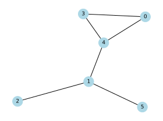
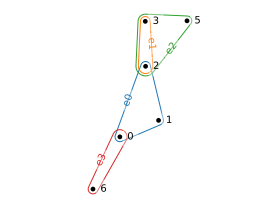
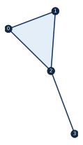
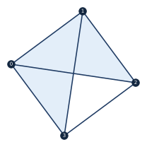
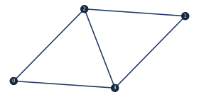

Graphs
==================

OpenQARP contains some functionality for dealing with graphs, hypergraphs and simplicial complexes, which appear in many places in quantum algorithms and applications.
Each native type wraps a standard library object (NetworkX, HyperNetX) and adds the quantum constructions a workflow reaches for — a cost Hamiltonian, a state-preparation block, the sparse matrices behind spectral methods — plus plotting that mimics the plotting of :code:`Blocks`.

The Graph object
----------------------------------

The :code:`Graph` object is a wrapper for :code:`NetworkX` :code:`Graph` objects, that may contain extra functionality which is useful 
in OpenQARP when building quantum algorithms. For example, OpenQARP graphs have built in plotting function to mimic the plotting of :code:`Blocks`.

.. code-block:: python

    import matplotlib.pyplot as plt
    import networkx as nx
    from qarp.graphs import Graph as QarpGraph

    n_nodes = 6
    G = nx.erdos_renyi_graph(n=n_nodes, p=0.5, seed=0)   # seeded for a reproducible figure

    qarp_G = QarpGraph(G)

    fig, ax = plt.subplots()
    nx.draw(qarp_G, ax=ax)

    qarp_G.plot(pos=nx.spring_layout(G, seed=0))

Cost Hamiltonian and graph state
^^^^^^^^^^^^^^^^^^^^^^^^^^^^^^^^^^^^^^^

Node labels are qubit indices wherever a quantum object is built from a graph, so they must be
non-negative integers; they need not be contiguous, and :code:`n_qubits` is the highest label plus
one rather than the node count. :code:`to_cost_hamiltonian` returns the Ising cost Hamiltonian
:math:`\sum_e w_e Z_i Z_j` (edge weight from the ``weight`` attribute, 1 when absent) — the form
:code:`QAOA` minimises, **not** the MaxCut objective :math:`\sum_e w_e (1 - Z_i Z_j)/2`. The two
differ by a sign and an offset, so minimising the Hamiltonian maximises the cut, with
:math:`\text{cut} = (\sum_e w_e - \langle H \rangle)/2`. :code:`to_graph_state_block` returns the
graph-state preparation block (a Hadamard on every qubit, then a :code:`CZ` per edge) and does not
need the ``[hypergraph]`` extra.

.. code-block:: python

    from qarp.algorithms import QAOA
    from qarp.graphs import Graph

    graph = Graph()
    graph.add_edge(0, 1, weight=2.0)
    graph.add_edge(1, 2)                          # no weight attribute: counts 1.0

    H = graph.to_cost_hamiltonian()               # 2 Z0 Z1 + Z1 Z2
    print(graph.n_qubits)                         # 3

    qaoa = QAOA(graph, n_layers=2).build()        # QAOA builds the same Hamiltonian
    state = graph.to_graph_state_block().build()  # H on every qubit, then CZ per edge

Linear :math:`Z_i` terms ride along as the per-node attribute ``linear``, or as an explicit mapping
passed as :code:`linear=`, which replaces the attributes. That is also what makes the operator
round trip close: :code:`Graph.from_qubit_operator` (equal to :code:`qubit_operator_to_graph`)
turns :math:`Z_i Z_j` terms into weighted edges and :math:`Z_i` terms into ``linear`` attributes,
so :code:`to_cost_hamiltonian` recovers the operator up to its constant term, which has no home on
a graph. The module-level helper :code:`graph_to_cost_hamiltonian` accepts a plain
:code:`networkx.Graph` too.

.. code-block:: python

    from qarp.graphs import Graph
    from qarp.operators import QubitOperator

    H = QubitOperator("Z0 Z1", 1.5) + QubitOperator("Z1", 0.3) + QubitOperator("", 2.0)
    graph = Graph.from_qubit_operator(H)
    print(graph[0][1]["weight"], graph.nodes[1]["linear"])   # 1.5 0.3
    print(graph.to_cost_hamiltonian() == H - QubitOperator("", 2.0))   # True

Matrices
^^^^^^^^^^^^^^^^^^^^^^^^^^^^^^^^^^^^^^^

The sparse matrices behind spectral partitioning and community detection are methods on the
graph: :code:`adjacency_matrix`, :code:`degree_matrix`, :code:`laplacian_matrix`,
:code:`normalized_laplacian_matrix` and the unsigned :code:`incidence_matrix`, all weighted by the
``weight`` attribute, all indexed in node insertion order and all returning a SciPy sparse array
(append :code:`.toarray()` for a dense one). :code:`max_modularity_eigenvector` returns the
leading eigenvector of the modularity matrix; it raises a :code:`ValueError` on a graph with no
edges, where that matrix is undefined, and inherits NetworkX's convention of ignoring edge weights.

.. code-block:: python

    from qarp.graphs import Graph

    graph = Graph([(0, 1), (1, 2), (2, 3), (3, 0)])
    print(graph.laplacian_matrix().toarray())
    print(graph.incidence_matrix().toarray())
    print(graph.max_modularity_eigenvector())

The Hypergraph object
-----------------------------

Similarly, the :code:`Hypergraph` object is a wrapper for :code:`HyperNetX` :code:`Hypergraph` objects, also with native plotting functionality.
It needs the ``[hypergraph]`` extra.

.. code-block:: python

    import matplotlib.pyplot as plt
    import hypernetx as hnx
    from qarp.graphs import Hypergraph as QarpHypergraph

    edges = {
        "e0": [0, 1, 2],
        "e1": [2, 3],
        "e2": [2, 3, 5],
        "e3": [0, 6],
    }
    fig, ax = plt.subplots()

    HPG = hnx.Hypergraph(edges)
    qarp_HPG = QarpHypergraph(edges)

    pos = hnx.drawing.rubber_band.layout_node_link(HPG)
    hnx.draw(HPG, pos=pos, ax=ax)
    plt.show()

    qarp_HPG.plot()

The quantum use of a hypergraph is defining a *hypergraph state*: a Hadamard on every qubit, then
a :math:`C^{k-1}Z` per hyperedge of order :math:`k`. :code:`to_state_block` returns that
:code:`HypergraphStateBlock`, and :code:`n_qubits` is the highest vertex index over all edges plus
one (vertices are qubit indices, so a sparse labelling still reserves every qubit up to the highest
one used). Incidence, dual and adjacency matrices are inherited from HyperNetX; there is no Pauli
operator for a hypergraph state, whose stabilisers are non-Pauli for any hyperedge of order three
or more.

.. code-block:: python

    from qarp.graphs import Hypergraph

    HPG = Hypergraph([(0, 1), (1, 2, 3)])
    print(HPG.n_qubits)                       # 4
    block = HPG.to_state_block().build()      # H^4, then CZ(0, 1) and CCZ(1, 2, 3)

The SimplicialComplex object
-----------------------------

We also have :code:`SimplicialComplex` objects - structures consisting of points, edges, triangles etc., with all their respective faces.
This structure is useful for topological data analysis, studying higher-order networks, and defining quantum states with complex correlation patterns
beyond pairwise interactions. We can create an initial complex as a list of simplices, add or remove the simplices as needed and plot the complex.

A simplicial complex is closed under faces: every face of a simplex in the complex is
itself in the complex. Both the constructor and :code:`add_simplex` enforce this by
adding any missing faces for you, which is why the listing below contains simplices
that were never passed in.

.. code-block:: python

    from qarp.graphs import SimplicialComplex

    simplicial_complex = [
        (0,), (1,), (2,), (3,),  # vertices
        (0, 1), (1, 2), (2, 3),  # edges
        (0, 1, 2),  # triangle
    ]

    qarp_simplicial_complex = SimplicialComplex(simplicial_complex)
    print(qarp_simplicial_complex.get_simplices())
    qarp_simplicial_complex.plot()

   The starting complex: the filled triangle ``(0, 1, 2)`` and the pendant edge ``(2, 3)``.

Adding a simplex also adds all of its faces:

.. code-block:: python

    # Add (0, 1, 3) and all faces, including (0, 1), (0, 3) and (1, 3).
    qarp_simplicial_complex.add_simplex((0, 1, 3))
    print(qarp_simplicial_complex.get_simplices())
    qarp_simplicial_complex.plot()

   After adding ``(0, 1, 3)``, which also brings in ``(0, 3)`` and ``(1, 3)``: two
   filled triangles sharing the edge ``(0, 1)``.

Removing a simplex also removes every simplex that contains it — that is what keeps the
complex closed under faces. Its own faces stay:

.. code-block:: python

    # Remove (0, 1).  Both triangles built on it, (0, 1, 2) and (0, 1, 3), go with
    # it; the vertices (0,) and (1,) and the other edges stay.
    qarp_simplicial_complex.remove_simplex((0, 1))
    qarp_simplicial_complex.plot()

   After removing ``(0, 1)``.  Both triangles that contained it are gone, so nothing
   is filled any more: what is left is the five remaining edges.

Accessors and cheap topology
^^^^^^^^^^^^^^^^^^^^^^^^^^^^^^^^^^^^^^^

The complex is a container (:code:`len`, iteration in ``(order, vertices)`` order, membership
that accepts a list in any vertex order) with accessors for its vertices, the neighbours of a
vertex, the cofaces of a simplex (every simplex containing it — exactly what
:code:`remove_simplex` deletes), the :math:`k`-skeleton and the 1-skeleton as a native
:code:`Graph`. Counts come as :code:`num_simplices` and the :code:`f_vector`, and the Euler
characteristic :math:`\chi = \sum_k (-1)^k f_k` is the cheap topological invariant that tells a
filled triangle (:math:`\chi = 1`) from a hollow one (:math:`\chi = 0`).

.. code-block:: python

    from qarp.graphs import SimplicialComplex

    sc = SimplicialComplex([(0, 1, 2), (2, 3)])
    print(len(sc), (0, 1) in sc, [2, 0] in sc)   # 9 True True
    print(sc.vertices(), sc.neighbors(2))          # [0, 1, 2, 3] [0, 1, 3]
    print(sc.cofaces((0, 1)))                      # [(0, 1), (0, 1, 2)]
    print(sc.skeleton(1).get_simplices())          # vertices and edges only
    print(sc.f_vector(), sc.euler_characteristic())   # [4, 4, 1] 1
    graph = sc.to_graph()                          # the 1-skeleton, a qarp Graph

The boundary operators :math:`\partial_k` and the combinatorial Hodge Laplacians
:math:`L_k = \partial_k^{\mathsf T} \partial_k + \partial_{k+1} \partial_{k+1}^{\mathsf T}` are
available as sparse integer matrices. Rows of :math:`\partial_k` index the :math:`(k-1)`-simplices
and columns the :math:`k`-simplices, both in :code:`get_simplices` order, with the sign
:math:`(-1)^i` on the face obtained by deleting the :math:`i`-th vertex of the sorted simplex;
:math:`L_0` is the graph Laplacian of the 1-skeleton. Only the matrices are built — their spectra
(Betti numbers, harmonic representatives) are left to the caller.

.. code-block:: python

    from qarp.graphs import SimplicialComplex

    sc = SimplicialComplex([(0, 1, 2), (2, 3)])
    d1 = sc.boundary_matrix(1)                     # 4 vertices x 4 edges, entries in {-1, 0, 1}
    d2 = sc.boundary_matrix(2)                     # 4 edges x 1 triangle
    print((d1 @ d2).count_nonzero())               # 0: the boundary of a boundary vanishes
    print(sc.hodge_laplacian(0).toarray())         # the graph Laplacian of the 1-skeleton
    print(sc.hodge_laplacian(1).toarray())
