Plotting
============

OpenQARP provides a custom plotting function built on top of Matplotlib. It accepts any OpenQARP block (``SimpleBlock``, ``CompositeBlock``, …) directly, and
renders the circuit in a layered, customisable layout suited to the qarpx command stream. A flat list of ``qx.Command``
objects is also supported, but not directly — wrap it first with
``qarp.plotting.CircuitAdapter(commands, n_qubits=N)`` (``n_qubits`` is required for a plain command
list, since unlike a ``Block`` it carries no qubit count of its own) and pass that to ``plot()``.

Quick Start
-----------

The plotting function is called ``plot`` and can be used as follows:

.. code-block:: python

   from qarp.blocks import SimpleBlock
   from qarp.plotting import plot

   block = SimpleBlock(4, name="demo")
   block.h(0)
   block.h(1)
   block.x(2)
   block.cx(0, 1)
   block.rz(2, 0.123456789)
   block.cx(2, 3)
   block.h(3)
   block.measure([(q, q) for q in range(4)])
   block = block.build()

   plot(block)
   # or equivalently using the Block method
   # block.plot()

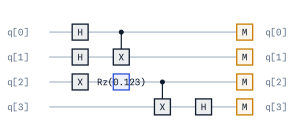

    Example circuit plot.

This circuit is deliberately a mixed bag — ``H``, ``X``, ``CX``, a parameterised
``Rz`` and a measurement layer — because every option below is easier to judge
when there is more than one kind of gate on the page. The rest of this page
reuses it.

.. note::
   All OpenQARP Block objects have a ``plot()`` method that calls the plotting function on the block's flat command stream.

Parameters Reference
--------------------

The ``plot`` function accepts the following parameters:

**Basic Parameters:**

* ``circ``: The circuit or Block to be plotted.
* ``figsize``: The size of the figure in inches (width, height). If ``None``, the size is auto-calculated.
* ``save_fig``: The path to save the figure. If ``None``, the figure is not saved.
* ``color_scheme``: Color scheme for gates. See :ref:`color-schemes` section.
* ``spacing``: Horizontal spacing between gates. If ``None``, uses default from config.

**Layout Parameters:**

* ``flatten_layers``: If ``True``, all gates are displayed in optimized horizontal positions. If ``False``, gates are displayed in their original layer structure.
* ``invert_order``: If ``True``, the order of the qubits is inverted (highest index at top). If ``False``, lowest index is at top.
* ``decompose_boxes``: If ``True``, container-style sub-blocks (composites, controlled blocks) are decomposed into their constituent gates before rendering.

**Display Parameters:**

* ``scrollable``: If ``True``, the plot is displayed in a scrollable HTML container (useful for large circuits in Jupyter).
* ``use_latex``: If ``True``, uses LaTeX for rendering text. Requires LaTeX installation.
* ``verbose``: If ``True``, prints additional information about the plotting process.

**Label and Inspection Parameters:**

* ``label_mode``: How to handle gate labels. See :ref:`label-modes` section.
* ``show_gate_indices``: If ``True``, displays small index numbers near each gate for identification.
* ``return_plotter``: If ``True``, returns the ``CircuitPlotter`` instance for querying gate information.
* ``inner_index``: Index or path to zoom into box gates. See :ref:`inspecting-box-gates` section.

Basic Plotting Examples
-----------------------

The examples below reuse the ``block`` built in `Quick Start`_ above.

**Default Plot:**

.. code-block:: python
   
   # Simple plot with default settings
   plot(block)

    Default plot output.

**Custom Figure Size:**

.. code-block:: python

   # Specify figure size (width, height) in inches
   plot(block, figsize=(10, 4))

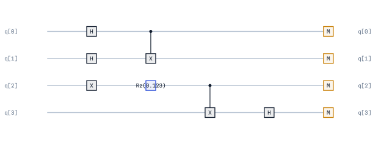

    Plot with custom figure size ``(10, 4)``.

**Adjusting Spacing:**

.. code-block:: python

   # Default spacing
   plot(block, spacing=0.25)
   
   # Tighter spacing
   plot(block, spacing=0.15)
   
   # Wider spacing
   plot(block, spacing=0.5)

    Default spacing (0.25).

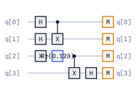

    Tight spacing (0.15).

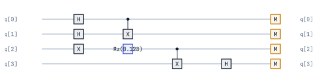

    Wide spacing (0.5).

Layout Options
--------------

**Flatten Layers:**

When ``flatten_layers=True`` (default), gates are positioned to minimize horizontal space.
When ``False``, gates maintain their original layer structure.

.. code-block:: python

   # Flattened layout (default) - optimizes horizontal positions
   plot(block, flatten_layers=True)
   
   # Consecutive layers - preserves original structure
   plot(block, flatten_layers=False)

    Flattened layers (``flatten_layers=True``).

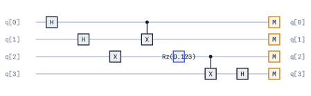

    Consecutive layers (``flatten_layers=False``).

**Invert Qubit Order:**

Control whether qubit 0 appears at the top or bottom of the plot.

.. code-block:: python

   # Default order - qubit 0 at top
   plot(block, invert_order=False)
   
   # Inverted order - qubit 0 at bottom
   plot(block, invert_order=True)

    Default qubit order (``invert_order=False``).

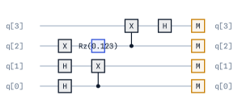

    Inverted qubit order (``invert_order=True``).

**Decompose Box Gates:**

Container-style sub-blocks (composite blocks, controlled blocks) can be shown as boxes or decomposed into their constituent gates.

This is the one option that needs a circuit with structure to show: ``block``
above is a flat list of gates and has no boxes to open, so the example below
composes a sub-block first.

.. code-block:: python

   from qarp.blocks import CompositeBlock, HypergraphStateBlock, ReadoutBlock

   state = HypergraphStateBlock(edges=[(0, 1), (2, 3), (1, 2, 3)], n_qubits=4).build()
   boxed_block = CompositeBlock([state, ReadoutBlock(n_qubits=4)], n_qubits=4).build()

   # Show box gates as boxes
   plot(boxed_block, decompose_boxes=False)

   # Decompose box gates into constituent gates
   plot(boxed_block, decompose_boxes=True)

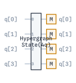

    Box gates shown as boxes (``decompose_boxes=False``).

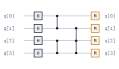

    Box gates decomposed (``decompose_boxes=True``).

.. _label-modes:

Label Modes
-----------

The ``label_mode`` parameter controls how gate labels are displayed. This is useful for managing label overlaps in complex circuits.

.. code-block:: python

   from qarp.plotting import plot
   from qarp.plotting import LabelMode

**Truncate Mode:**

Shows only gate names without parameters. Safest option to avoid overlaps.

.. code-block:: python

   # e.g., "Ry(0.123456789*pi + theta)" becomes "Ry"
   plot(block, label_mode=LabelMode.TRUNCATE)

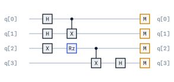

    Truncate mode - gate names only.

**Smart Mode (Default):**

Intelligently positions labels to avoid overlaps, breaking long labels into multiple lines if needed.

.. code-block:: python

   plot(block, label_mode=LabelMode.SMART)

    Smart mode - intelligent label positioning.

**Full Mode:**

Displays full labels without any adjustment. May cause overlaps in dense circuits.

.. code-block:: python

   plot(block, label_mode=LabelMode.FULL)

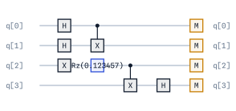

    Full mode - complete labels (may overlap).

Gate Indexing and Inspection
----------------------------

The plotting module provides tools to identify and inspect individual gates in a circuit. A
multi-gate ``SimpleBlock`` embedded in a ``CompositeBlock`` renders as one "box" gate rather
than being inlined — this section builds a two-level nested example (a box containing more
boxes) to demonstrate that:

.. code-block:: python

   from qarp.blocks import SimpleBlock, CompositeBlock

   # Innermost boxes: two 2-gate leaf blocks.
   bell = SimpleBlock(2, name="bell")
   bell.h(0)
   bell.cx(0, 1)
   bell.build()

   extra = SimpleBlock(2, name="extra")
   extra.z(0)
   extra.z(1)
   extra.build()

   # Middle box: wraps both of the above, so it is itself a multi-gate sub-block.
   middle = CompositeBlock([bell, extra], n_qubits=2, name="middle").build()

   prep = SimpleBlock(4, name="prep")
   prep.h(2)
   prep.h(3)
   prep.build()

   # Outer circuit: two box gates, [prep, middle].
   nested_block = CompositeBlock([prep, middle], n_qubits=4, name="outer").build()

**Displaying Gate Indices:**

Use ``show_gate_indices=True`` to display small index numbers near each gate:

.. code-block:: python

   plot(nested_block, show_gate_indices=True)

**Querying Gate Information:**

Use ``return_plotter=True`` to get a plotter object that can be used to query gate details:

.. code-block:: python

   plotter = plot(nested_block, show_gate_indices=True, return_plotter=True)

   # List all gates
   plotter.list_gates()
   # Output:
   # Total gates: 2
   # Gate[0]: Block on [q[0], q[1], q[2], q[3]]   (prep)
   # Gate[1]: Block on [q[0], q[1]]                (middle)

   # Query a specific gate for full information
   gate = plotter.query_gate(1)
   print(f"Gate type: {gate.gate_type}")      # "Block"
   print(f"Full label: {gate.full_label}")    # "Block"
   print(f"Qubits: {gate.qubits}")            # ["q[0]", "q[1]"]

.. _inspecting-box-gates:

Inspecting Box Gates
--------------------

For container-style sub-blocks (composite blocks, controlled blocks), you can extract and plot their inner circuits using the ``inner_index`` parameter. Continuing with ``nested_block`` from above:

**Single Level Inspection:**

.. code-block:: python

   # Plot the inner circuit of the box at index 1 (middle)
   plot(nested_block, inner_index=1)

**Nested Box Inspection:**

For circuits with nested box gates, you can provide a path as a list of indices to recursively zoom into nested structures:

.. code-block:: python

   # Zoom into nested boxes: box at index 1 (middle) -> box at index 0 inside it (bell)
   plot(nested_block, inner_index=[1, 0])

This will:

1. Get the box gate at index 1 from the main circuit (``middle``)
2. Get the box gate at index 0 from that inner circuit (``bell``)
3. Plot the final inner circuit — the 2-gate Bell pair (H, CX)

**Using Plotter Methods:**

For more control, use the plotter's methods directly:

.. code-block:: python

   plotter = plot(nested_block, show_gate_indices=True, return_plotter=True)

   # Get the inner circuit (the sub-block / commands at index 1, i.e. `middle`)
   inner_circuit = plotter.get_inner_circuit(1)

   # Or plot it directly with options
   inner_plotter = plotter.plot_inner(1, show_gate_indices=True)
   inner_plotter.list_gates()
   # Output:
   # Total gates: 2
   # Gate[0]: Block on [q[0], q[1]]   (bell)
   # Gate[1]: Block on [q[0], q[1]]   (extra)

.. _color-schemes:

Color Schemes
-------------

The ``color_scheme`` parameter allows you to customize gate colors. OpenQARP provides several built-in color schemes, including options optimized for different types of color vision deficiency (CVD).

A colour scheme assigns one colour per *gate type*, so the examples below reuse the
mixed-gate ``block`` from `Quick Start`_ — ``H``, ``X``, ``CX``, ``Rz`` and
measurements all take a different colour.

**Default Scheme:**

.. code-block:: python

   plot(block, color_scheme='default')

    Default color scheme.

**Colorblind-Friendly Schemes:**

.. code-block:: python

   # General colorblind-friendly palette (Wong palette)
   # Recommended for publications
   plot(block, color_scheme='colorblind')

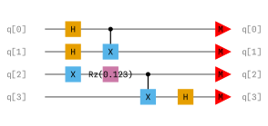

    Colorblind-friendly scheme (Wong palette).

.. code-block:: python

   # Deuteranopia (green-blind) - most common CVD type
   plot(block, color_scheme='deuteranopia')

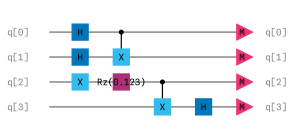

    Deuteranopia-friendly scheme.

.. code-block:: python

   # Protanopia (red-blind)
   plot(block, color_scheme='protanopia')

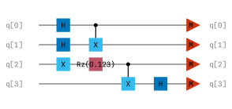

    Protanopia-friendly scheme.

.. code-block:: python

   # Tritanopia (blue-blind) - rare
   plot(block, color_scheme='tritanopia')

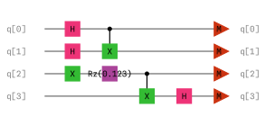

    Tritanopia-friendly scheme.

**High Contrast and Grayscale:**

.. code-block:: python

   # High contrast for presentations
   plot(block, color_scheme='high_contrast')

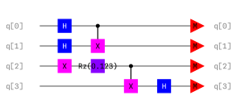

    High contrast scheme for presentations.

.. code-block:: python

   # Grayscale for black-and-white printing
   plot(block, color_scheme='grayscale')

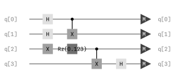

    Grayscale scheme for printing.

**Custom Color Schemes:**

You can provide a custom dictionary mapping gate names (lowercase) to hex colors:

.. code-block:: python

   custom_colors = {
       'h': '#FF6B6B',
       'x': '#4ECDC4',
       'cx': '#45B7D1',
       'rz': '#96CEB4',
       'measure': '#FF8579',
       'box': '#EFEFEF',
       # Add other gates as needed
   }
   plot(block, color_scheme=custom_colors)

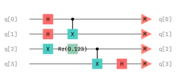

    Custom color scheme.

**Accessing Color Palettes Directly:**

You can import and modify the color dictionaries:

.. code-block:: python

   from qarp.plotting.styles import (
       DEFAULT_COLORS,
       COLORBLIND_COLORS,
       PROTANOPIA_COLORS,
       DEUTERANOPIA_COLORS,
       TRITANOPIA_COLORS,
       HIGH_CONTRAST_COLORS,
       GRAYSCALE_COLORS,
       COLOR_SCHEMES,  # Dictionary of all schemes
   )

   # Customize a scheme
   my_colors = COLORBLIND_COLORS.copy()
   my_colors['measure'] = '#FF0000'  # Override measure color
   plot(block, color_scheme=my_colors)

Display Options
---------------

**Scrollable Output:**

For large circuits in Jupyter notebooks, use the scrollable option:

.. code-block:: python

   # Standard output
   plot(block, scrollable=False)
   
   # Scrollable HTML container (useful for large circuits)
   plot(block, scrollable=True)

**LaTeX Rendering:**

Enable LaTeX for mathematical text rendering (requires LaTeX installation):

.. code-block:: python

   plot(block, use_latex=True)

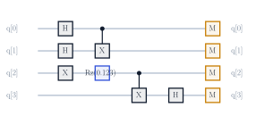

    Circuit with LaTeX rendering enabled.

**Verbose Output:**

Print additional information about the circuit:

.. code-block:: python

   plot(block, verbose=True)
   # Output:
   # Circuit information:
   #   Qubits: 4
   #   Operations (measurements excluded): 7
   #   Global phase: 0.0

Saving Figures
--------------

Save plots to files in various formats:

.. code-block:: python

   # Save as SVG (recommended for documentation)
   plot(block, save_fig="my_circuit.svg")
   
   # Save as PNG
   plot(block, save_fig="my_circuit.png")
   
   # Save as PDF
   plot(block, save_fig="my_circuit.pdf")
   
   # Combine with other options
   plot(block, 
        color_scheme='colorblind',
        spacing=0.4,
        save_fig="publication_figure.svg")

Features
--------

OpenQARP's plotting offers:

* Drastically better performance for large circuits
* Customisable colour schemes including colourblind-friendly options
* Gate indexing and inspection features (non-interactive)
* Several layout control options
* Native rendering of qarpx-IR commands
